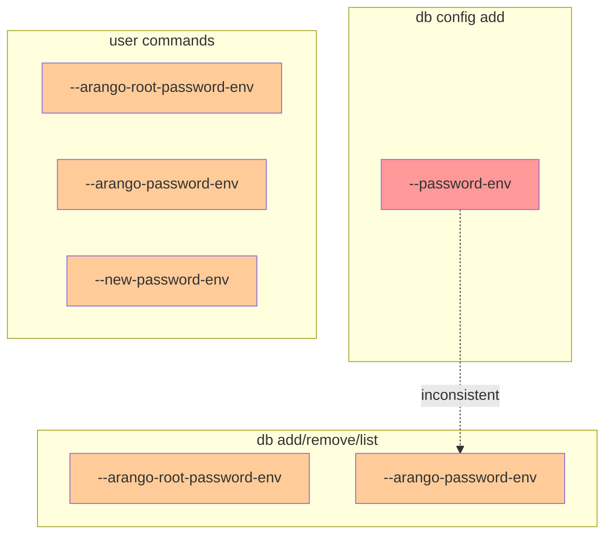
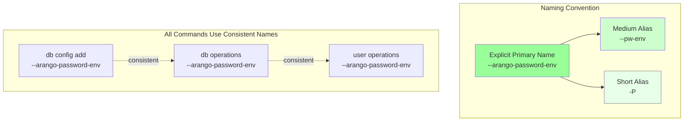
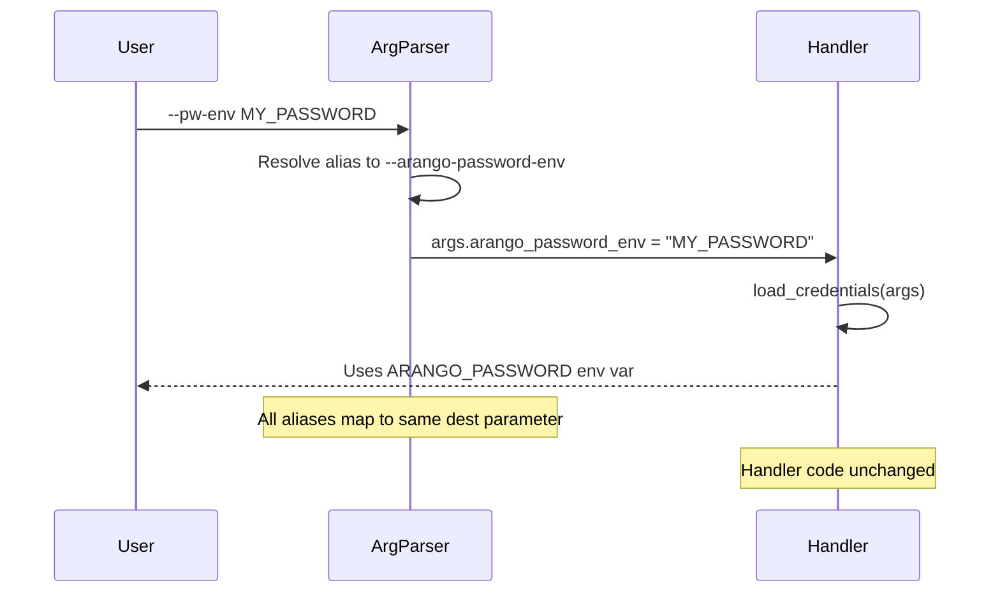

# CLI Consistency and Usability Enhancement — Architecture Analysis (v0)

Date: 2025-12-31

## Executive Summary

**Problem:**
The CLI interface exhibits argument naming inconsistencies and lacks ergonomic aliases for frequently-used verbose arguments, creating friction for users and potential confusion.

**Key Issues Identified:**
1. **Naming Inconsistency**: `db config add` uses `--password-env` while all other commands use `--arango-password-env`
2. **Verbosity**: Arguments like `--arango-root-password-env` (26 chars) and `--arango-password-env` (21 chars) are cumbersome for frequent use
3. **Limited Alias Coverage**: Only `--config-file`/`--cfgf` and `--yes`/`-y` have aliases; command aliases (`rm`, `ls`) exist but argument aliases are sparse

**Proposed Change:**
Standardize argument naming and introduce a systematic alias strategy following Unix CLI conventions, providing both explicit names (primary) and short aliases (convenience).

**Non-Goals:**
- Changing command structure or subcommand hierarchy
- Modifying environment variable names (ARANGO_PASSWORD, etc.)
- Altering functional behavior of any command

**Biggest Risks:**
1. Breaking existing user scripts that rely on `--password-env` in `db config add`
2. Single-letter alias conflicts with future arguments
3. Documentation maintenance burden across multiple files

**Validation Approach:**
- Maintain backward compatibility through aliasing
- Comprehensive test coverage for all alias combinations
- Systematic documentation updates with clear primary/alias distinction

## Current State

### Argument Naming Audit



**Legend:**
- 🔴 Red: Inconsistent naming (should be `--arango-password-env`)
- 🟠 Orange: Verbose arguments needing aliases

### Complete Argument Inventory

| Command | Argument | Length | Has Alias? | Issue |
|---------|----------|--------|------------|-------|
| `server` | `--config-file` | 13 | ✓ (`--cfgf`) | - |
| `db config add` | `--password-env` | 14 | ✗ | **Inconsistent** |
| All `db` ops | `--arango-root-password-env` | 26 | ✗ | **Very verbose** |
| `db add`, `user add` | `--arango-password-env` | 21 | ✗ | **Verbose** |
| `user password` | `--new-password-env` | 17 | ✗ | **Verbose** |
| All commands | `--config-path` | 13 | ✗ | Moderate |
| All commands | `--env-file` | 10 | ✗ | Moderate |
| Various | `--permission` | 12 | ✗ | Moderate |
| Various | `--yes` | 5 | ✓ (`-y`) | - |

### Existing Alias Patterns

**Command Aliases** (already implemented):
- `remove` → `rm`
- `list` → `ls`

**Argument Aliases** (limited):
- `--config-file` → `--cfgf`
- `--yes` → `-y`

## Proposed State

### Standardized Argument Structure



### Proposed Alias Strategy (Hybrid Approach)

**Tier 1: High-Priority (Most Verbose)**

| Primary Argument | Medium Alias | Short Alias | Rationale |
|------------------|--------------|-------------|-----------|
| `--arango-root-password-env` | `--root-pw-env` | `-R` | 26 chars → 14 chars → 2 chars; used in all admin operations |
| `--arango-password-env` | `--pw-env` | `-P` | 21 chars → 8 chars → 2 chars; used in user operations |
| `--new-password-env` | `--new-pw-env` | `-N` | 17 chars → 13 chars → 2 chars; used in password change |

**Tier 2: Medium-Priority (Moderate Verbosity)**

| Primary Argument | Medium Alias | Short Alias | Rationale |
|------------------|--------------|-------------|-----------|
| `--config-path` | `--cfg-path` | `-c` | Used in all `db config` commands |
| `--env-file` | - | `-e` | Used across all commands for dotenv loading |
| `--permission` | `--perm` | `-p` | Used in grant/revoke operations |

**Tier 3: Optional (Less Frequent)**

| Primary Argument | Short Alias | Rationale |
|------------------|-------------|-----------|
| `--url` | `-u` | Common but already short |
| `--database` | `-d` | Used in `db config add` |
| `--username` | `-U` | Used in `db config add` |

**Standardization Fix:**

| Command | Current | Proposed Primary | Backward Compat Alias |
|---------|---------|------------------|----------------------|
| `db config add` | `--password-env` | `--arango-password-env` | `--password-env` (keep as alias) |

### Argument Resolution Flow



## Contracts & Invariants

### Naming Convention Contract

**Primary Names (MUST):**
- Use explicit, descriptive names: `--arango-password-env`, `--arango-root-password-env`
- Follow existing pattern: `--arango-*` prefix for ArangoDB-specific arguments
- Use `-env` suffix for environment variable name arguments

**Aliases (SHOULD):**
- Medium aliases: Abbreviated but readable (`--pw-env`, `--root-pw-env`)
- Short aliases: Single letter, uppercase for important credentials (`-P`, `-R`, `-N`)
- All aliases map to same `dest` parameter in argparse

**Backward Compatibility (MUST):**
- Existing argument names remain valid indefinitely
- `--password-env` continues to work in `db config add`
- No breaking changes to existing scripts

### Invariants

1. **Unique Destination**: All aliases for an argument map to the same `dest` parameter
2. **No Conflicts**: Short aliases must not conflict with existing or reserved flags
3. **Help Text**: Primary name shown in help; aliases mentioned in description
4. **Documentation**: Primary name used in all examples; aliases mentioned in reference

### Implementation Pattern (Pseudo-code)

```python
# Example: db add command
db_add_parser.add_argument(
    "--arango-root-password-env",
    "--root-pw-env",  # Medium alias
    "-R",             # Short alias
    dest="arango_root_password_env",
    help="Root password env var (default: ARANGO_ROOT_PASSWORD). Aliases: --root-pw-env, -R"
)

db_add_parser.add_argument(
    "--arango-password-env",
    "--pw-env",       # Medium alias
    "-P",             # Short alias
    dest="arango_password_env",
    help="User password env var (default: ARANGO_PASSWORD). Aliases: --pw-env, -P"
)

# Standardization fix for db config add
config_add_parser.add_argument(
    "--arango-password-env",  # NEW: Primary name (consistent)
    "--password-env",         # OLD: Keep as alias (backward compat)
    "--pw-env",              # NEW: Medium alias
    "-P",                    # NEW: Short alias
    dest="password_env",     # Keep existing dest for handler compatibility
    required=True,
    help="Environment variable name containing password. Aliases: --password-env, --pw-env, -P"
)
```

### Error Model

**No Breaking Changes:**
- All existing argument names continue to work
- Handlers receive arguments via same `dest` parameters
- No changes to `load_credentials()` or other utility functions

**Validation:**
- argparse handles alias resolution automatically
- No runtime validation needed for aliases
- Help text generation automatic

## Alternatives Considered

### Alternative A: Minimal Aliases (Conservative)

**Approach:**
- Only add medium-length aliases for the most verbose arguments
- Use `--root-pw-env`, `--pw-env`, `--new-pw-env`
- No single-letter aliases

**Pros:**
- Easier to remember (more descriptive)
- Less risk of conflicts
- Simpler documentation

**Cons:**
- Still somewhat verbose for power users
- Doesn't follow Unix convention of single-letter flags
- Less ergonomic for frequent use

**Decision:** Rejected. Doesn't sufficiently address verbosity for power users.

### Alternative B: Aggressive Single-Letter Aliases

**Approach:**
- Add single-letter aliases for all arguments
- `-u`, `-d`, `-U`, `-p`, `-c`, `-e`, `-R`, `-P`, `-N`, etc.

**Pros:**
- Maximum brevity
- Follows tools like `tar`, `ls`, `ps`

**Cons:**
- Hard to remember without documentation
- High risk of conflicts with future arguments
- Difficult to discover (not self-documenting)

**Decision:** Rejected. Too aggressive; sacrifices discoverability.

### Alternative C: Hybrid Approach (RECOMMENDED)

**Approach:**
- Explicit names as primary (always shown in help/docs)
- Medium aliases for common use (readable abbreviations)
- Single-letter aliases for most frequent operations (optional convenience)
- Three-tier priority system

**Pros:**
- Balances discoverability and brevity
- Follows Unix conventions (both `--file` and `-f`)
- Progressive disclosure (beginners use primary, experts use short)
- Backward compatible

**Cons:**
- More implementation work
- Requires careful documentation strategy

**Decision:** ACCEPTED. Best user experience across skill levels.

### Alternative D: No Changes (Status Quo)

**Approach:**
- Fix only the `--password-env` inconsistency
- No new aliases

**Pros:**
- Minimal implementation work
- No risk of conflicts
- No documentation updates needed

**Cons:**
- Doesn't address verbosity complaints
- Missed opportunity for UX improvement
- Inconsistent with existing `--cfgf` alias pattern

**Decision:** Rejected. Doesn't meet user needs for improved ergonomics.

## Risks & Mitigations

### Risk 1: Breaking Changes to Existing Scripts

**Severity:** HIGH
**Likelihood:** LOW (if properly implemented)

**Description:**
Users with existing scripts using `--password-env` in `db config add` might break if we remove it.

**Mitigation:**
- Keep `--password-env` as a permanent alias (not deprecated)
- Add to argparse with same `dest` parameter
- Test backward compatibility explicitly
- Document in changelog as "enhancement, not breaking change"

**Validation:**
- Add test cases for all existing argument forms
- Run integration tests with old-style arguments
- Check that `args.password_env` receives value regardless of which alias used

### Risk 2: Single-Letter Alias Conflicts

**Severity:** MEDIUM
**Likelihood:** MEDIUM

**Description:**
Future arguments might need letters already allocated (`-P`, `-R`, `-N`, `-c`, `-e`, `-p`, `-u`, `-d`, `-U`).

**Mitigation:**
- Reserve allocated letters in documentation
- Use uppercase for credentials (`-P`, `-R`, `-N`) to distinguish from common flags
- Maintain alias registry in code comments
- Consider conflicts before adding new arguments

**Reserved Letters:**
- `-R`: Root password env var
- `-P`: User password env var
- `-N`: New password env var
- `-c`: Config path
- `-e`: Env file
- `-p`: Permission
- `-y`: Yes (already exists)
- `-u`, `-d`, `-U`: Optional tier 3

### Risk 3: User Confusion (Too Many Options)

**Severity:** LOW
**Likelihood:** MEDIUM

**Description:**
Multiple ways to specify the same argument might confuse users.

**Mitigation:**
- Documentation strategy: Always show primary name in examples
- Help text: Primary name in synopsis, aliases in description
- Consistent pattern: `--long-name`, `--abbrev`, `-S`
- Progressive disclosure: Beginners use primary, experts discover aliases

**Documentation Updates Required:**
- `docs/user-guide/cli-reference.md`: Update all command references
- `README.md`: Update quick start examples (use primary names)
- `env.example`: Comments reference primary names
- Help text: Add alias mentions to descriptions

### Risk 4: Implementation Complexity

**Severity:** LOW
**Likelihood:** LOW

**Description:**
Adding aliases to 20+ argument definitions across multiple parsers.

**Mitigation:**
- Systematic approach: Update one command group at a time
- Test each group before moving to next
- Use consistent pattern for all aliases
- Code review for consistency

**Implementation Order:**
1. Fix `db config add` inconsistency (highest priority)
2. Add Tier 1 aliases (password-related, most verbose)
3. Add Tier 2 aliases (moderate verbosity)
4. Add Tier 3 aliases (optional, if desired)
5. Update documentation systematically

### Risk 5: Documentation Maintenance Burden

**Severity:** MEDIUM
**Likelihood:** HIGH

**Description:**
Need to update help text, CLI reference, examples, and maintain consistency.

**Mitigation:**
- Create documentation template for argument descriptions
- Use consistent format: "Primary description. Aliases: --alias1, -A"
- Update all examples to use primary names
- Add "Aliases" section to CLI reference
- Automated tests for help text consistency

## Implementation Recommendations

### Phase 1: Standardization Fix (Immediate)

**Goal:** Fix the `--password-env` inconsistency in `db config add`

**Changes:**
- Make `--arango-password-env` the primary name
- Keep `--password-env` as backward-compatible alias
- Update help text
- Add test coverage

**Impact:** Low risk, high value (consistency)

### Phase 2: Tier 1 Aliases (High Priority)

**Goal:** Add aliases for most verbose arguments

**Changes:**
- `--arango-root-password-env` → `--root-pw-env`, `-R`
- `--arango-password-env` → `--pw-env`, `-P`
- `--new-password-env` → `--new-pw-env`, `-N`

**Impact:** Medium risk, high value (ergonomics)

### Phase 3: Tier 2 Aliases (Medium Priority)

**Goal:** Add aliases for moderately verbose arguments

**Changes:**
- `--config-path` → `--cfg-path`, `-c`
- `--env-file` → `-e`
- `--permission` → `--perm`, `-p`

**Impact:** Low risk, medium value (convenience)

### Phase 4: Documentation Update (Required)

**Goal:** Systematic documentation updates

**Changes:**
- Update `docs/user-guide/cli-reference.md`
- Update help text for all commands
- Add "Aliases" section to documentation
- Update examples to use primary names

**Impact:** High effort, essential for adoption

### Backward Compatibility Guarantee

**Commitment:**
- All existing argument names remain valid indefinitely
- No deprecation warnings for old names
- Aliases are additive, not replacements
- Handlers unchanged (same `dest` parameters)

## Roadmap Recommendation

This is a focused enhancement that doesn't require a multi-phase roadmap. Implementation can proceed in 4 sequential phases as outlined above.

**Estimated Effort:**
- Phase 1 (Standardization): 2-4 hours
- Phase 2 (Tier 1 Aliases): 4-6 hours
- Phase 3 (Tier 2 Aliases): 2-4 hours
- Phase 4 (Documentation): 4-6 hours
- **Total: 12-20 hours**

**Success Criteria:**
- ✅ All existing scripts continue to work
- ✅ All tests pass with both old and new argument forms
- ✅ Documentation updated and consistent
- ✅ Help text shows primary names with alias mentions
- ✅ No breaking changes introduced


