# CLI Consistency and Usability Enhancement — Architecture Analysis (v1)

**Status:** ✅ ACCEPTED  
**Date:** 2025-12-31  
**Version:** v1 (incorporates stakeholder feedback)

## Executive Summary

**Problem:**
The CLI interface exhibits multiple argument naming inconsistencies and lacks ergonomic aliases for frequently-used verbose arguments, creating friction for users.

**Inconsistencies Identified:**
1. **Password naming**: `db config add` uses `--password-env` while all other commands use `--arango-password-env`
2. **Config file/path split**: `--config-file` (server) vs `--config-path` (db config commands) refer to same concept
3. **Verbosity**: Arguments like `--arango-root-password-env` (26 chars) lack ergonomic aliases
4. **Limited coverage**: Only 2 argument aliases exist despite many verbose arguments

**Accepted Solution:**
Implement a systematic hybrid alias strategy with three levels:
- **Primary names**: Explicit and descriptive (e.g., `--arango-password-env`)
- **Medium aliases**: Readable abbreviations (e.g., `--pw-env`, `--cfgf`)
- **Short aliases**: Single-letter for power users (e.g., `-P`, `-C`)

**Key Decisions:**
- ✅ Unify `--config-file` and `--config-path` as aliases
- ✅ Standardize environment file naming: `--environment-file` with `--env-file` as alias
- ✅ Use capital letters for file/path arguments (`-C`, `-E`) to avoid conflicts
- ✅ Implement all three tiers (no optional aliases)
- ✅ Maintain 100% backward compatibility

**Impact:**
- 40-50% reduction in argument length for common operations
- Consistent naming across all commands
- Progressive disclosure (beginners → experts)
- Zero breaking changes

**Implementation Effort:** 12-20 hours across 4 phases

---

## Current State Analysis

### Inconsistencies Audit

```mermaid
graph TD
    subgraph "Naming Inconsistencies"
        I1[❌ Password Naming<br/>--password-env vs<br/>--arango-password-env]
        I2[❌ Config File/Path Split<br/>--config-file vs<br/>--config-path]
        style I1 fill:#ffcccc,stroke:#cc0000,color:#000
        style I2 fill:#ffcccc,stroke:#cc0000,color:#000
    end
    
    subgraph "Verbosity Issues"
        V1[⚠️ --arango-root-password-env<br/>26 characters]
        V2[⚠️ --arango-password-env<br/>21 characters]
        V3[⚠️ --arango-new-password-env<br/>24 characters]
        style V1 fill:#ffe6cc,stroke:#ff8800,color:#000
        style V2 fill:#ffe6cc,stroke:#ff8800,color:#000
        style V3 fill:#ffe6cc,stroke:#ff8800,color:#000
    end
    
    subgraph "Limited Alias Coverage"
        L1[📉 Only 2 aliases exist<br/>--cfgf, -y]
        style L1 fill:#fff4cc,stroke:#ccaa00,color:#000
    end
```



### Complete Argument Inventory

| Command Group | Argument | Length | Current Alias | Issue |
|---------------|----------|--------|---------------|-------|
| `server` | `--config-file` | 13 | `--cfgf` | Split from `--config-path` |
| `db config` | `--config-path` | 13 | ✗ | Split from `--config-file` |
| `db config add` | `--password-env` | 14 | ✗ | **Inconsistent naming** |
| All `db` ops | `--arango-root-password-env` | 26 | ✗ | **Very verbose** |
| `db add`, `user add` | `--arango-password-env` | 21 | ✗ | **Verbose** |
| `user password` | `--arango-new-password-env` | 24 | ✗ | **Very verbose** |
| All commands | `--env-file` | 10 | ✗ | Could be more explicit |
| Various | `--permission` | 12 | ✗ | Moderate verbosity |
| Various | `--url` | 5 | ✗ | Short but common |
| `db config add` | `--database` | 10 | ✗ | Common argument |
| `db config add` | `--username` | 10 | ✗ | Common argument |
| Various | `--yes` | 5 | `-y` ✓ | Already aliased |

---

## Accepted Solution: Hybrid Alias Strategy

### Architecture Overview


### Complete Alias Specification

**Tier 1: Password Arguments (Highest Priority)**

| Primary Argument | Medium Alias | Short Alias | Backward Compat | Rationale |
|------------------|--------------|-------------|-----------------|-----------|
| `--arango-root-password-env` | `--root-pw-env` | `-R` | - | 26 chars → 14 → 2; admin operations |
| `--arango-password-env` | `--pw-env` | `-P` | `--password-env`* | 21 chars → 8 → 2; user operations |
| `--arango-new-password-env` | `--new-pw-env` | `-N` | `--new-password-env` | 24 chars → 13 → 2; password change |

*Only in `db config add` command

**Tier 2: File/Path Arguments (High Priority)**

| Primary Argument | Medium Aliases | Short Alias | Backward Compat | Rationale |
|------------------|----------------|-------------|-----------------|-----------|
| `--config-file` | `--cfgf`, `--cfgp` | `-C` | `--config-path` | Unify config file/path naming |
| `--environment-file` | `--envf` | `-E` | `--env-file` | Explicit naming, consistent pattern |
| `--permission` | `--perm` | `-p` | - | 12 chars → 6 → 2; grant/revoke ops |

**Tier 3: Common Arguments (Medium Priority)**

| Primary Argument | Short Alias | Rationale |
|------------------|-------------|-----------|
| `--url` | `-u` | Common across all commands |
| `--database` | `-d` | Used in `db config add` |
| `--username` | `-U` | Used in `db config add` (uppercase to avoid conflict) |

**Already Aliased (No Changes)**

| Argument | Existing Alias | Status |
|----------|----------------|--------|
| `--yes` | `-y` | ✅ Keep as-is |

---

## Implementation Specification

### Naming Conventions Contract

**Primary Names (MUST):**
- Use explicit, descriptive names as primary
- Follow existing patterns: `--arango-*` prefix for ArangoDB-specific arguments
- Use `-env` suffix for environment variable name arguments
- Use `-file` suffix for file path arguments

**Medium Aliases (SHOULD):**
- Abbreviated but readable: `--pw-env`, `--root-pw-env`, `--cfgf`, `--envf`
- Maintain recognizability of the full name
- Use consistent abbreviation patterns (e.g., `pw` for password, `cfg`/`env` for config/environment)

**Short Aliases (MUST):**
- Single letter, case-sensitive
- **Capital letters** for file/path arguments: `-C` (config), `-E` (environment)
- **Capital letters** for credential arguments: `-R` (root), `-P` (password), `-N` (new password)
- **Lowercase letters** for other arguments: `-u` (url), `-d` (database), `-p` (permission)
- **Uppercase** for username: `-U` (to avoid conflict with `-u` for url)

**Backward Compatibility (MUST):**
- All existing argument names remain valid indefinitely
- Old names become aliases to new primary names
- No deprecation warnings
- Same `dest` parameter in argparse for all aliases

### Argument Resolution Flow


### Implementation Patterns

#### Pattern 1: Unifying Config File/Path

```python
# Server command (currently uses --config-file)
server_parser.add_argument(
    "--config-file",      # Primary name
    "--config-path",      # Backward compat (from db config commands)
    "--cfgf",            # Medium alias (existing)
    "--cfgp",            # Medium alias (new, symmetric with cfgf)
    "-C",                # Short alias (capital for file)
    dest="config_file",  # Keep existing dest
    default=None,
    help="Path to database configuration YAML file. Aliases: --config-path, --cfgf, --cfgp, -C"
)

# db config commands (currently use --config-path)
config_add_parser.add_argument(
    "--config-file",      # Primary name (NEW: unified)
    "--config-path",      # Backward compat (OLD: keep working)
    "--cfgf",            # Medium alias
    "--cfgp",            # Medium alias
    "-C",                # Short alias
    dest="config_path",  # Keep existing dest for handler compatibility
    default="config/databases.yaml",
    help="Path to configuration file. Aliases: --config-path, --cfgf, --cfgp, -C"
)
```

#### Pattern 2: Standardizing Environment File

```python
# All commands that use --env-file
db_add_parser.add_argument(
    "--environment-file", # Primary name (NEW: explicit)
    "--env-file",        # Backward compat (OLD: most common, keep working)
    "--envf",            # Medium alias (NEW: consistent with --cfgf)
    "-E",                # Short alias (capital for file)
    dest="env_file",     # Keep existing dest
    help="Path to .env file for credentials. Aliases: --env-file, --envf, -E"
)
```

#### Pattern 3: Fixing Password Env Inconsistency

```python
# db config add (currently uses --password-env)
config_add_parser.add_argument(
    "--arango-password-env",  # Primary name (NEW: consistent)
    "--password-env",         # Backward compat (OLD: keep working)
    "--pw-env",              # Medium alias (NEW)
    "-P",                    # Short alias (NEW)
    dest="password_env",     # Keep existing dest
    required=True,
    help="Environment variable name containing password. Aliases: --password-env, --pw-env, -P"
)

# All other commands (already use --arango-password-env)
db_add_parser.add_argument(
    "--arango-password-env",  # Primary name (existing)
    "--pw-env",              # Medium alias (NEW)
    "-P",                    # Short alias (NEW)
    dest="arango_password_env",
    help="User password env var (default: ARANGO_PASSWORD). Aliases: --pw-env, -P"
)
```

#### Pattern 4: Adding Aliases to Existing Arguments

```python
# Root password (admin operations)
db_add_parser.add_argument(
    "--arango-root-password-env",  # Primary name (existing)
    "--root-pw-env",              # Medium alias (NEW)
    "-R",                         # Short alias (NEW)
    dest="arango_root_password_env",
    help="Root password env var (default: ARANGO_ROOT_PASSWORD). Aliases: --root-pw-env, -R"
)

# New password (password change)
user_password_parser.add_argument(
    "--arango-new-password-env",  # Primary name (NEW: standardized)
    "--new-password-env",         # Backward compat (OLD: keep working)
    "--new-pw-env",              # Medium alias (NEW)
    "-N",                        # Short alias (NEW)
    dest="new_password_env",
    default="ARANGO_NEW_PASSWORD",
    help="New password env var (default: ARANGO_NEW_PASSWORD). Aliases: --new-password-env, --new-pw-env, -N"
)

# Permission
user_grant_parser.add_argument(
    "--permission",  # Primary name (existing)
    "--perm",       # Medium alias (NEW)
    "-p",           # Short alias (NEW)
    dest="permission",
    choices=["rw", "ro", "none"],
    default="rw",
    help="Permission level (default: rw). Aliases: --perm, -p"
)

# URL
db_add_parser.add_argument(
    "--url",  # Primary name (existing)
    "-u",     # Short alias (NEW)
    dest="url",
    help="ArangoDB server URL (default: ARANGO_URL env or http://localhost:8529). Alias: -u"
)

# Database
config_add_parser.add_argument(
    "--database",  # Primary name (existing)
    "-d",         # Short alias (NEW)
    dest="database",
    required=True,
    help="Database name. Alias: -d"
)

# Username
config_add_parser.add_argument(
    "--username",  # Primary name (existing)
    "-U",         # Short alias (NEW, uppercase to avoid conflict with -u)
    dest="username",
    required=True,
    help="Username. Alias: -U"
)
```

### Invariants

1. **Unique Destination**: All aliases for an argument map to the same `dest` parameter
2. **No Conflicts**: Short aliases must not conflict with existing or reserved flags
3. **Help Text Format**: `"Description. Aliases: --alias1, --alias2, -A"`
4. **Documentation**: Primary name used in all examples; aliases mentioned in reference docs
5. **Case Sensitivity**: Capital letters for files/credentials, lowercase for others
6. **Handler Compatibility**: All handlers continue to use existing `dest` parameter names

### Reserved Short Aliases

| Alias | Purpose | Category |
|-------|---------|----------|
| `-R` | Root password env var | Credential (capital) |
| `-P` | User password env var | Credential (capital) |
| `-N` | New password env var | Credential (capital) |
| `-C` | Config file path | File (capital) |
| `-E` | Environment file path | File (capital) |
| `-p` | Permission level | Option (lowercase) |
| `-u` | URL | Option (lowercase) |
| `-d` | Database name | Option (lowercase) |
| `-U` | Username | Option (uppercase, avoid conflict) |
| `-y` | Yes (skip confirmation) | Option (existing) |

---

## Migration Strategy

### Phase 1: Standardization Fixes (Immediate)

**Goal:** Fix naming inconsistencies without breaking changes

**Changes:**
1. **Config file/path unification**
   - Make `--config-file` primary everywhere
   - Add `--config-path` as alias in server command
   - Add `--config-file` as alias in db config commands
   - Add `--cfgp` medium alias
   - Add `-C` short alias

2. **Password env consistency**
   - Make `--arango-password-env` primary in `db config add`
   - Keep `--password-env` as backward-compatible alias

3. **Environment file standardization**
   - Make `--environment-file` primary everywhere
   - Keep `--env-file` as backward-compatible alias
   - Add `--envf` medium alias
   - Add `-E` short alias

**Impact:** Zero breaking changes, improved consistency

**Testing:**
- Verify all old argument forms still work
- Test that `dest` parameters receive values correctly
- Validate help text shows aliases

### Phase 2: Tier 1 Aliases (High Priority)

**Goal:** Add aliases for most verbose password-related arguments

**Changes:**
- `--arango-root-password-env` → add `--root-pw-env`, `-R`
- `--arango-password-env` → add `--pw-env`, `-P`
- `--arango-new-password-env` → add `--new-password-env` (backward compat), `--new-pw-env`, `-N`

**Commands Affected:**
- All `db` operations (add, remove, list)
- All `user` operations (add, remove, list, grant, revoke, databases, password)

**Impact:** High value for frequent users, no breaking changes

### Phase 3: Tier 2 & 3 Aliases (Medium Priority)

**Goal:** Add remaining aliases for common arguments

**Changes:**
- `--permission` → add `--perm`, `-p`
- `--url` → add `-u`
- `--database` → add `-d`
- `--username` → add `-U`

**Commands Affected:**
- Various commands across `db` and `user` groups

**Impact:** Improved ergonomics for all users

### Phase 4: Documentation Update (Required)

**Goal:** Systematic documentation updates

**Changes:**
1. Update `docs/user-guide/cli-reference.md`
   - Show primary names in syntax sections
   - Add "Aliases" subsection for each command
   - Update all examples to use primary names

2. Update help text
   - Ensure consistent format: "Description. Aliases: --alias1, -A"
   - Verify all aliases listed

3. Update README.md
   - Use primary names in quick start examples
   - Add note about alias availability

4. Update `env.example`
   - Comments reference primary argument names

**Impact:** Essential for user adoption and discoverability

---

## Implementation Roadmap

### Phase 1: Standardization (2-4 hours)

**Tasks:**
1. Update `server` command parser
   - Add `--config-path`, `--cfgp`, `-C` aliases to `--config-file`
2. Update all `db config` command parsers
   - Add `--config-file`, `--cfgf`, `-C` aliases to `--config-path`
3. Update `db config add` parser
   - Change primary to `--arango-password-env`
   - Add `--password-env`, `--pw-env`, `-P` aliases
4. Update all parsers with `--env-file`
   - Change primary to `--environment-file`
   - Add `--env-file`, `--envf`, `-E` aliases
5. Add test coverage for all new aliases
6. Verify backward compatibility

**Deliverables:**
- ✅ Config file/path unified
- ✅ Password env consistent
- ✅ Environment file standardized
- ✅ All tests passing
- ✅ Zero breaking changes

### Phase 2: Tier 1 Aliases (4-6 hours)

**Tasks:**
1. Add aliases to `--arango-root-password-env` (9 commands)
2. Add aliases to `--arango-password-env` (5 commands)
3. Standardize to `--arango-new-password-env` with backward compat (1 command)
4. Update help text for all affected commands
5. Add test coverage for all alias combinations
6. Verify credential loading works with all forms

**Deliverables:**
- ✅ All Tier 1 aliases implemented
- ✅ Help text updated
- ✅ Tests passing

### Phase 3: Tier 2 & 3 Aliases (2-4 hours)

**Tasks:**
1. Add aliases to `--permission` (3 commands)
2. Add aliases to `--url` (all commands)
3. Add aliases to `--database` (1 command)
4. Add aliases to `--username` (1 command)
5. Update help text
6. Add test coverage

**Deliverables:**
- ✅ All remaining aliases implemented
- ✅ Complete alias coverage
- ✅ Tests passing

### Phase 4: Documentation (4-6 hours)

**Tasks:**
1. Update CLI reference documentation
   - Add alias tables
   - Update syntax sections
   - Revise examples to use primary names
2. Update README quick start
3. Update help text consistency
4. Add migration guide for users
5. Update changelog

**Deliverables:**
- ✅ Documentation complete and consistent
- ✅ Examples use primary names
- ✅ Aliases documented
- ✅ Migration guide available

---

## Success Criteria

### Functional Requirements

- ✅ All existing argument names continue to work (100% backward compatibility)
- ✅ All new aliases resolve to correct `dest` parameters
- ✅ Help text shows primary names with alias mentions
- ✅ No changes required to handler functions
- ✅ All tests pass with both old and new argument forms

### Quality Requirements

- ✅ Consistent naming across all commands
- ✅ Clear primary/alias distinction in documentation
- ✅ Progressive disclosure (beginners use primary, experts use short)
- ✅ 40-50% character reduction for common operations
- ✅ Zero breaking changes introduced

### Documentation Requirements

- ✅ All examples use primary names
- ✅ Aliases mentioned in help text and reference docs
- ✅ Migration guide available for users
- ✅ Changelog updated with enhancement details

---

## Risk Mitigation Summary

### Risk 1: Breaking Changes (MITIGATED)

**Mitigation:**
- All old names kept as permanent aliases
- Extensive backward compatibility testing
- No deprecation warnings

**Validation:**
- Test suite covers all old argument forms
- Integration tests with legacy scripts

### Risk 2: Alias Conflicts (MITIGATED)

**Mitigation:**
- Reserved alias registry maintained
- Capital letters for files/credentials
- Careful selection to avoid future conflicts

**Validation:**
- Document all reserved aliases
- Review before adding new arguments

### Risk 3: User Confusion (MITIGATED)

**Mitigation:**
- Clear documentation strategy
- Primary names in all examples
- Progressive disclosure approach

**Validation:**
- Documentation review
- Help text consistency checks

### Risk 4: Implementation Complexity (MITIGATED)

**Mitigation:**
- Systematic 4-phase approach
- Test each phase before proceeding
- Consistent implementation patterns

**Validation:**
- Code review for consistency
- Test coverage for all aliases

---

## Estimated Effort

| Phase | Tasks | Estimated Hours |
|-------|-------|-----------------|
| Phase 1: Standardization | Config/password/env file fixes | 2-4 hours |
| Phase 2: Tier 1 Aliases | Password-related aliases | 4-6 hours |
| Phase 3: Tier 2 & 3 Aliases | Remaining aliases | 2-4 hours |
| Phase 4: Documentation | Systematic doc updates | 4-6 hours |
| **Total** | | **12-20 hours** |

---

## Appendix: Complete Alias Reference

### Quick Lookup Table

| Primary Argument | Medium Aliases | Short | Backward Compat | Commands |
|------------------|----------------|-------|-----------------|----------|
| `--arango-root-password-env` | `--root-pw-env` | `-R` | - | db add/rm/ls, user add/rm/ls/grant/revoke |
| `--arango-password-env` | `--pw-env` | `-P` | `--password-env`* | db config add, db add, user add/databases/password |
| `--arango-new-password-env` | `--new-pw-env` | `-N` | `--new-password-env` | user password |
| `--config-file` | `--cfgf`, `--cfgp` | `-C` | `--config-path` | server, db config * |
| `--environment-file` | `--envf` | `-E` | `--env-file` | All commands with credentials |
| `--permission` | `--perm` | `-p` | - | db add, user grant |
| `--url` | - | `-u` | - | All db/user commands |
| `--database` | - | `-d` | - | db config add |
| `--username` | - | `-U` | - | db config add |
| `--yes` | - | `-y` | - | All commands with confirmation |

*`--password-env` backward compat only in `db config add`

### Character Savings Summary

| Argument | Current | Shortest Form | Savings | Frequency |
|----------|---------|---------------|---------|-----------|
| `--arango-root-password-env` | 26 | `-R` (2) | 24 chars (92%) | Very High |
| `--arango-password-env` | 21 | `-P` (2) | 19 chars (90%) | Very High |
| `--arango-new-password-env` | 24 | `-N` (2) | 22 chars (92%) | Medium |
| `--config-file` / `--config-path` | 13 | `-C` (2) | 11 chars (85%) | High |
| `--environment-file` / `--env-file` | 17/10 | `-E` (2) | 15/8 chars (88%/80%) | High |
| `--permission` | 12 | `-p` (2) | 10 chars (83%) | Medium |

**Average savings: 85-90% when using short aliases**


