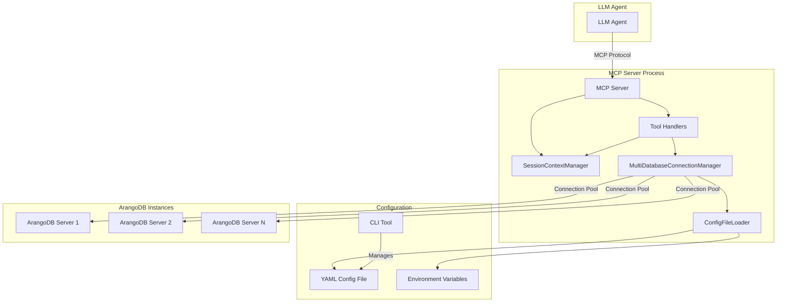

# Multi-Tenancy Architecture Design for mcp-arangodb-async

**Project:** mcp-arangodb-async  
**Version:** 0.3.2  
**Design Date:** 2025-11-08  
**Architect:** Augment Agent  
**Status:** Phase 1 - Architecture Design (v0)

---

## Executive Summary

This document provides detailed architectural design for implementing **Option A-Enhanced (Focused Database Context with Optional Override)** + **Approach 3B (CLI-based Configuration Management)** in the mcp-arangodb-async MCP server.

**Design Goals:**
- ✅ Single MCP server instance supporting multiple databases and multiple ArangoDB servers
- ✅ Focused database context with optional per-tool override
- ✅ Secure configuration management via CLI (using `argparse`)
- ✅ Backward compatibility with existing single-database deployments
- ✅ Production-ready security posture

**Key Design Decisions:**
1. **Session-based focused database context** - Set once, work within it
2. **Multi-database connection pool** - Support multiple servers and databases
3. **YAML configuration file** - Multiple database definitions with environment variable references
4. **CLI-based configuration CRUD** - Secure, admin-controlled (using `argparse`)
5. **Optional database parameter** - Per-tool override for cross-database operations

---

## 1. Architecture Overview

### 1.1 High-Level Architecture



### 1.2 Data Flow Diagram

```
┌─────────────────────────────────────────────────────────────────┐
│                      LLM Agent Request                          │
│                                                                 │
│  1. set_focused_database("production")                         │
│     ↓                                                           │
│  2. arango_query("FOR doc IN users RETURN doc")                │
│     ↓                                                           │
│  3. arango_query("FOR doc IN logs RETURN doc",                 │
│                   database="analytics")  # Override            │
└─────────────────────────────────────────────────────────────────┘
                         │
                         ▼
┌─────────────────────────────────────────────────────────────────┐
│                    MCP Server (entry.py)                        │
│                                                                 │
│  call_tool(name, arguments)                                    │
│    ├─ Extract session_id from request context                  │
│    ├─ Resolve database using 6-level priority                  │
│    │   1. Tool argument "database" parameter                   │
│    │   2. Session focused database                             │
│    │   3. Config file default_database                         │
│    │   4. Environment variable MCP_DEFAULT_DATABASE            │
│    │   5. Environment variable ARANGO_DB                       │
│    │   6. Hardcoded default "_system"                          │
│    └─ Get database connection from pool                        │
└─────────────────────────────────────────────────────────────────┘
                         │
                         ▼
┌─────────────────────────────────────────────────────────────────┐
│          SessionContextManager (session_context.py)             │
│                                                                 │
│  get_focused_database(session_id) → "production"               │
│  set_focused_database(session_id, "production")                │
└─────────────────────────────────────────────────────────────────┘
                         │
                         ▼
┌─────────────────────────────────────────────────────────────────┐
│    MultiDatabaseConnectionManager (multi_db_manager.py)         │
│                                                                 │
│  Connection Pool:                                              │
│  ├─ "production" → (client_prod, db_prod)                      │
│  ├─ "staging" → (client_staging, db_staging)                   │
│  └─ "analytics" → (client_analytics, db_analytics)             │
│                                                                 │
│  get_connection("production") → (client, db)                   │
└─────────────────────────────────────────────────────────────────┘
                         │
                         ▼
┌─────────────────────────────────────────────────────────────────┐
│                  ArangoDB Server Instances                      │
│                                                                 │
│  ├─ Production: http://localhost:8529/prod_db                  │
│  ├─ Staging: http://localhost:8529/staging_db                  │
│  └─ Analytics: http://analytics.example.com:8530/analytics_db  │
└─────────────────────────────────────────────────────────────────┘
```

### 1.3 Integration Points with Existing Codebase

| Component | Existing File | Integration Point | Change Type |
|-----------|---------------|-------------------|-------------|
| **Server Lifespan** | `entry.py:157-221` | Replace singleton connection with multi-database pool | Refactor |
| **Tool Handlers** | `handlers.py:9-13` | Add database resolution logic | Extend |
| **Configuration** | `config.py:45-72` | Add YAML config file support | Extend |
| **Connection Manager** | `db.py:25-99` | Replace singleton with multi-database pool | Replace |
| **CLI Entry Point** | `__main__.py:22-172` | Add config subcommand | Extend |

---

## 2. Component Design

### 2.1 MultiDatabaseConnectionManager

**Purpose:** Manages connections to multiple ArangoDB servers and databases with connection pooling and reuse.

**Responsibilities:**
- Load database configurations from YAML file and environment variables
- Create and maintain connection pool for multiple databases
- Provide thread-safe access to database connections
- Handle connection lifecycle (creation, reuse, cleanup)

**Key Methods (Pseudo-code):**

```python
class MultiDatabaseConnectionManager:
    """Manages connections to multiple ArangoDB servers and databases."""
    
    def __init__(self, config_loader: ConfigFileLoader):
        self._pools: Dict[str, Tuple[ArangoClient, StandardDatabase]] = {}
        self._configs: Dict[str, DatabaseConfig] = {}
        self._lock = threading.Lock()
        self._config_loader = config_loader
    
    def initialize(self):
        """Load database configurations from config file and env vars."""
        # Load from YAML config file
        # Load from environment variables (backward compatibility)
        # Validate configurations
    
    def get_connection(self, database_key: str) -> Tuple[ArangoClient, StandardDatabase]:
        """Get or create connection for specified database."""
        # Thread-safe connection retrieval
        # Create connection if not in pool
        # Reuse existing connection if available
    
    def register_database(self, database_key: str, config: DatabaseConfig):
        """Register a new database configuration at runtime."""
        # Add to _configs
        # Optionally pre-create connection
    
    def close_all(self):
        """Close all connections in the pool."""
        # Cleanup on server shutdown
```

**Strategic Code Snippet (Connection Retrieval):**

```python
def get_connection(self, database_key: str) -> Tuple[ArangoClient, StandardDatabase]:
    with self._lock:
        if database_key not in self._pools:
            config = self._configs.get(database_key)
            if not config:
                raise ValueError(f"Database '{database_key}' not configured")
            
            # Create ArangoClient for this server URL
            client = ArangoClient(hosts=config.url, request_timeout=config.timeout)
            db = client.db(config.database, username=config.username, 
                          password=os.getenv(config.password_env))
            
            self._pools[database_key] = (client, db)
        
        return self._pools[database_key]
```

**Integration Points:**
- **Replaces:** `ConnectionManager` in `db.py:25-99`
- **Called by:** `call_tool()` in `entry.py:324-420`
- **Initialized in:** `server_lifespan()` in `entry.py:157-221`

**File Location:** `mcp_arangodb_async/multi_db_manager.py` (new file)

---

### 2.2 SessionContextManager

**Purpose:** Manages per-session focused database context for MCP connections.

**Responsibilities:**
- Track focused database for each session (stdio or HTTP)
- Provide thread-safe access to session context
- Clean up session context when connection closes
- Support both stdio (persistent) and HTTP (stateful) transports

**Key Methods (Pseudo-code):**

```python
class SessionContextManager:
    """Manages per-session database context for MCP connections."""
    
    def __init__(self):
        self._focused_db: Dict[str, str] = {}  # session_id -> database_key
        self._lock = threading.Lock()
    
    def set_focused_database(self, session_id: str, database_key: str):
        """Set the focused database for a session."""
        # Validate database_key exists in configuration
        # Store in _focused_db
    
    def get_focused_database(self, session_id: str) -> Optional[str]:
        """Get the focused database for a session."""
        # Return focused database or None
    
    def clear_session(self, session_id: str):
        """Clear session context when connection closes."""
        # Remove from _focused_db
    
    def has_focused_database(self, session_id: str) -> bool:
        """Check if session has a focused database set."""
        # Return True if session_id in _focused_db
```

**Strategic Code Snippet (Set Focused Database):**

```python
def set_focused_database(self, session_id: str, database_key: str):
    # Validate database exists in configuration
    if database_key not in self._db_manager.get_configured_databases():
        raise ValueError(f"Database '{database_key}' not configured")
    
    with self._lock:
        self._focused_db[session_id] = database_key
```

**Integration Points:**
- **Called by:** `set_focused_database()` tool handler
- **Called by:** `call_tool()` for database resolution
- **Initialized in:** `server_lifespan()` in `entry.py:157-221`

**File Location:** `mcp_arangodb_async/session_context.py` (new file)

---

### 2.3 ConfigFileLoader

**Purpose:** Load and validate database configurations from YAML file and environment variables.

**Responsibilities:**
- Parse YAML configuration file
- Validate configuration schema using Pydantic
- Merge config file with environment variables
- Provide configuration to MultiDatabaseConnectionManager

**Key Methods (Pseudo-code):**

```python
class ConfigFileLoader:
    """Load and validate database configurations."""
    
    def __init__(self, config_path: Path = Path.home() / ".mcp-arangodb-async" / "config.yaml"):
        self._config_path = config_path
        self._config_data: Optional[ConfigFile] = None
    
    def load(self) -> Dict[str, DatabaseConfig]:
        """Load configurations from YAML file and environment variables."""
        # Load YAML file if exists
        # Load from environment variables (backward compatibility)
        # Validate using Pydantic
        # Return merged configurations
    
    def get_default_database(self) -> Optional[str]:
        """Get default database from config file or environment."""
        # Check config file default_database
        # Check MCP_DEFAULT_DATABASE env var
        # Check ARANGO_DB env var
        # Return None if not found
    
    def reload(self):
        """Reload configuration from file (for runtime updates)."""
        # Re-read YAML file
        # Validate and update _config_data
```

**Strategic Code Snippet (Load Configuration):**

```python
def load(self) -> Dict[str, DatabaseConfig]:
    configs = {}
    
    # Load from YAML file
    if self._config_path.exists():
        with open(self._config_path) as f:
            data = yaml.safe_load(f)
            config_file = ConfigFile(**data)  # Pydantic validation
            configs.update(config_file.databases)
    
    # Backward compatibility: Load from environment variables
    if os.getenv("ARANGO_URL"):
        configs["_env_default"] = DatabaseConfig(
            url=os.getenv("ARANGO_URL", "http://localhost:8529"),
            database=os.getenv("ARANGO_DB", "_system"),
            username=os.getenv("ARANGO_USERNAME", "root"),
            password_env="ARANGO_PASSWORD",
            timeout=float(os.getenv("ARANGO_TIMEOUT_SEC", "30.0"))
        )
    
    return configs
```

**Integration Points:**
- **Called by:** `MultiDatabaseConnectionManager.initialize()`
- **Initialized in:** `server_lifespan()` in `entry.py:157-221`

**File Location:** `mcp_arangodb_async/config_loader.py` (new file)

---

### 2.4 ConfigCLI (argparse-based)

**Purpose:** Command-line interface for database configuration CRUD operations.

**Responsibilities:**
- Add/remove/list/update database configurations
- Validate configuration inputs
- Test database connections
- Manage YAML configuration file

**Key Commands:**

```bash
# Add database
mcp-arangodb-async config add --name production --url http://localhost:8529 \
  --database prod_db --username prod_user --password-env PROD_DB_PASSWORD

# List databases
mcp-arangodb-async config list

# Remove database
mcp-arangodb-async config remove --name staging --yes

# Update database
mcp-arangodb-async config update --name production --timeout 60.0

# Test connection
mcp-arangodb-async config test --name production
```

**Strategic Code Snippet (Main Entry Point):**

```python
def main():
    parser = argparse.ArgumentParser(
        prog="mcp-arangodb-async config",
        description="Manage database configurations"
    )
    
    subparsers = parser.add_subparsers(dest="command")
    
    # Add subcommand
    add_parser = subparsers.add_parser("add")
    add_parser.add_argument("--name", required=True)
    add_parser.add_argument("--url", required=True)
    add_parser.add_argument("--database", required=True)
    add_parser.add_argument("--username", required=True)
    add_parser.add_argument("--password-env", required=True)
    
    # ... other subcommands ...
    
    args = parser.parse_args()
    
    if args.command == "add":
        return handle_add(args)
    # ... other handlers ...
```

**Integration Points:**
- **Modifies:** YAML config file at `~/.mcp-arangodb-async/config.yaml`
- **Entry point:** `pyproject.toml` console script or `__main__.py` subcommand

**File Location:** `mcp_arangodb_async/cli/config.py` (new file)

---

### 2.5 Updated server_lifespan()

**Purpose:** Initialize multi-database infrastructure during server startup.

**Responsibilities:**
- Create MultiDatabaseConnectionManager
- Create SessionContextManager
- Load configurations
- Yield context to server

**Strategic Code Snippet (Refactored Lifespan):**

```python
@asynccontextmanager
async def server_lifespan(server: Server) -> AsyncIterator[Dict[str, Any]]:
    logger = logging.getLogger("mcp_arangodb_async.entry")
    
    # Initialize configuration loader
    config_loader = ConfigFileLoader()
    
    # Initialize multi-database connection manager
    db_manager = MultiDatabaseConnectionManager(config_loader)
    db_manager.initialize()
    
    # Initialize session context manager
    session_manager = SessionContextManager(db_manager)
    
    # Yield context with managers
    yield {
        "db_manager": db_manager,
        "session_manager": session_manager,
        "config_loader": config_loader
    }
    
    # Cleanup on shutdown
    db_manager.close_all()
```

**Integration Points:**
- **Replaces:** Current `server_lifespan()` in `entry.py:157-221`
- **Yields:** Multi-database context instead of single db

---

### 2.6 Updated call_tool()

**Purpose:** Resolve database using 6-level priority and execute tool handler.

**Responsibilities:**
- Extract session_id from request context
- Resolve database using priority hierarchy
- Get database connection from pool
- Execute tool handler with resolved database

**Strategic Code Snippet (Database Resolution):**

```python
async def call_tool(name: str, arguments: dict) -> List[types.TextContent]:
    ctx = server.request_context
    db_manager = ctx.lifespan_context["db_manager"]
    session_manager = ctx.lifespan_context["session_manager"]
    
    # Extract session ID (stdio or HTTP)
    session_id = get_session_id(ctx)
    
    # Resolve database using 6-level priority
    database_key = resolve_database(
        tool_args=arguments,
        session_manager=session_manager,
        session_id=session_id,
        config_loader=db_manager._config_loader
    )
    
    # Get database connection
    client, db = db_manager.get_connection(database_key)
    
    # Execute tool handler
    tool_reg = TOOL_REGISTRY.get(name)
    result = tool_reg.handler(db, arguments)
    
    return _json_content(result)
```

**Integration Points:**
- **Replaces:** Current `call_tool()` in `entry.py:324-420`
- **Calls:** `resolve_database()` helper function

---

### 2.7 New MCP Tools

#### Tool 1: set_focused_database

**Purpose:** Set the focused database for the current session.

**Signature:**
```python
def set_focused_database(session_manager, args: Dict[str, Any]) -> Dict[str, Any]:
    """Set the focused database for the current session."""
    database_name = args["database_name"]
    session_id = args["_session_id"]  # Injected by call_tool()
    
    session_manager.set_focused_database(session_id, database_name)
    
    return {"success": True, "focused_database": database_name}
```

**Tool Model:**
```python
class SetFocusedDatabaseArgs(BaseModel):
    database_name: str = Field(description="Name of the database to focus on")
```

#### Tool 2: get_focused_database

**Purpose:** Get the currently focused database for the session.

**Signature:**
```python
def get_focused_database(session_manager, args: Dict[str, Any]) -> Dict[str, Any]:
    """Get the currently focused database."""
    session_id = args["_session_id"]
    
    focused_db = session_manager.get_focused_database(session_id)
    
    return {"focused_database": focused_db}
```

#### Tool 3: list_available_databases

**Purpose:** List all configured databases (read-only, no credentials).

**Signature:**
```python
def list_available_databases(db_manager, args: Dict[str, Any]) -> Dict[str, Any]:
    """List all configured databases."""
    databases = db_manager.get_configured_databases()
    
    return {
        "databases": [
            {"name": name, "description": config.description}
            for name, config in databases.items()
        ]
    }
```

---

### 2.8 Updated Tool Models (Optional database Parameter)

**Purpose:** Add optional `database` parameter to all 34 existing tools for per-call override.

**Example (arango_query):**

```python
class QueryArgs(BaseModel):
    query: str = Field(description="AQL query to execute")
    bind_vars: Optional[Dict[str, Any]] = Field(default=None, description="Bind variables")
    database: Optional[str] = Field(default=None, description="Database to query (overrides focused database)")
```

**Implementation Strategy:**
- Add `database: Optional[str]` field to all 34 tool Pydantic models
- Update tool descriptions to mention optional database parameter
- No changes to handler logic (database resolution happens in `call_tool()`)

**File Locations:**
- `mcp_arangodb_async/tools/query.py`
- `mcp_arangodb_async/tools/collection.py`
- `mcp_arangodb_async/tools/document.py`
- ... (all tool model files)

---

## 3. Configuration File Schema

### 3.1 YAML Configuration File Structure

**File Location:** `~/.mcp-arangodb-async/config.yaml`

**Complete Schema:**

```yaml
# Configuration file version
version: "1.0"

# Default database to use when no focused database is set
default_database: production

# Database configurations
databases:
  production:
    url: http://localhost:8529
    database: prod_db
    username: prod_user
    password_env: PROD_DB_PASSWORD  # Environment variable reference
    timeout: 30.0
    description: "Production database for live data"

  staging:
    url: http://localhost:8529
    database: staging_db
    username: staging_user
    password_env: STAGING_DB_PASSWORD
    timeout: 30.0
    description: "Staging database for pre-production testing"

  analytics:
    url: http://analytics.example.com:8530  # Different server
    database: analytics_db
    username: analytics_user
    password_env: ANALYTICS_DB_PASSWORD
    timeout: 60.0
    description: "Analytics and reporting database"
```

### 3.2 Pydantic Models for Validation

```python
from pydantic import BaseModel, Field, validator
from typing import Dict, Optional

class DatabaseConfig(BaseModel):
    """Configuration for a single database connection."""

    url: str = Field(description="ArangoDB server URL (e.g., http://localhost:8529)")
    database: str = Field(description="Database name")
    username: str = Field(description="Username for authentication")
    password_env: str = Field(description="Environment variable containing password")
    timeout: float = Field(default=30.0, description="Request timeout in seconds")
    description: Optional[str] = Field(default=None, description="Human-readable description")

    @validator("url")
    def validate_url(cls, v):
        """Validate URL format."""
        if not v.startswith(("http://", "https://")):
            raise ValueError("URL must start with http:// or https://")
        return v.rstrip("/")

    @validator("timeout")
    def validate_timeout(cls, v):
        """Validate timeout is positive."""
        if v <= 0:
            raise ValueError("Timeout must be positive")
        return v

class ConfigFile(BaseModel):
    """Root configuration file model."""

    version: str = Field(description="Configuration file version")
    default_database: Optional[str] = Field(default=None, description="Default database name")
    databases: Dict[str, DatabaseConfig] = Field(description="Database configurations")

    @validator("version")
    def validate_version(cls, v):
        """Validate version format."""
        if v != "1.0":
            raise ValueError("Unsupported configuration version")
        return v

    @validator("default_database")
    def validate_default_database(cls, v, values):
        """Validate default_database exists in databases."""
        if v and "databases" in values and v not in values["databases"]:
            raise ValueError(f"default_database '{v}' not found in databases")
        return v
```

### 3.3 Validation Rules

**Required Fields:**
- `version` - Must be "1.0"
- `databases` - Must contain at least one database configuration
- `url` - Must be valid HTTP/HTTPS URL
- `database` - Must be non-empty string
- `username` - Must be non-empty string
- `password_env` - Must be valid environment variable name

**Optional Fields:**
- `default_database` - If specified, must exist in `databases`
- `timeout` - Defaults to 30.0 seconds
- `description` - Human-readable description

**Security Rules:**
- ❌ **No passwords in config file** - Only environment variable references
- ✅ **Passwords in environment variables** - `export PROD_DB_PASSWORD=secret`

---

## 4. Database Resolution Algorithm

### 4.1 6-Level Priority System

**Pseudo-code:**

```python
def resolve_database(
    tool_args: Dict[str, Any],
    session_manager: SessionContextManager,
    session_id: str,
    config_loader: ConfigFileLoader
) -> str:
    """Resolve database using 6-level priority system.

    Returns:
        database_key: Name of the database to use

    Raises:
        ValueError: If no database can be resolved
    """

    # Level 1: Tool argument override
    if "database" in tool_args and tool_args["database"]:
        return tool_args["database"]

    # Level 2: Session focused database
    focused_db = session_manager.get_focused_database(session_id)
    if focused_db:
        return focused_db

    # Level 3: Config file default_database
    default_db = config_loader.get_default_database()
    if default_db:
        return default_db

    # Level 4: Environment variable MCP_DEFAULT_DATABASE
    env_default = os.getenv("MCP_DEFAULT_DATABASE")
    if env_default:
        return env_default

    # Level 5: Environment variables (backward compatibility)
    if os.getenv("ARANGO_DB"):
        return "_env_default"  # Special key for env-based config

    # Level 6: Hardcoded default
    return "_system"
```

### 4.2 Decision Tree

```
┌─────────────────────────────────────────────────────────────┐
│              Database Resolution Decision Tree              │
└─────────────────────────────────────────────────────────────┘
                         │
                         ▼
              ┌──────────────────────┐
              │ Tool argument        │
              │ "database" present?  │
              └──────────────────────┘
                    │         │
                   Yes       No
                    │         │
                    ▼         ▼
              ┌─────────┐  ┌──────────────────────┐
              │ Use it  │  │ Session focused      │
              │ (L1)    │  │ database set?        │
              └─────────┘  └──────────────────────┘
                                │         │
                               Yes       No
                                │         │
                                ▼         ▼
                          ┌─────────┐  ┌──────────────────────┐
                          │ Use it  │  │ Config file          │
                          │ (L2)    │  │ default_database?    │
                          └─────────┘  └──────────────────────┘
                                            │         │
                                           Yes       No
                                            │         │
                                            ▼         ▼
                                      ┌─────────┐  ┌──────────────────────┐
                                      │ Use it  │  │ MCP_DEFAULT_DATABASE │
                                      │ (L3)    │  │ env var set?         │
                                      └─────────┘  └──────────────────────┘
                                                        │         │
                                                       Yes       No
                                                        │         │
                                                        ▼         ▼
                                                  ┌─────────┐  ┌──────────────────┐
                                                  │ Use it  │  │ ARANGO_DB        │
                                                  │ (L4)    │  │ env var set?     │
                                                  └─────────┘  └──────────────────┘
                                                                    │         │
                                                                   Yes       No
                                                                    │         │
                                                                    ▼         ▼
                                                              ┌─────────┐  ┌─────────┐
                                                              │ Use it  │  │ "_system"│
                                                              │ (L5)    │  │ (L6)    │
                                                              └─────────┘  └─────────┘
```

### 4.3 Edge Case Handling

**Case 1: Database not found in configuration**

```python
def get_connection(self, database_key: str):
    if database_key not in self._configs:
        raise ValueError(
            f"Database '{database_key}' not configured. "
            f"Available databases: {list(self._configs.keys())}"
        )
```

**Case 2: Connection failure**

```python
def get_connection(self, database_key: str):
    try:
        client = ArangoClient(hosts=config.url, request_timeout=config.timeout)
        db = client.db(config.database, username=config.username, password=password)
        db.version()  # Validate connection
    except Exception as e:
        raise ConnectionError(
            f"Failed to connect to database '{database_key}': {e}"
        )
```

**Case 3: Invalid database reference in tool call**

```python
def resolve_database(...):
    database_key = ...  # Resolved from priority system

    # Validate database exists in configuration
    if database_key not in db_manager.get_configured_databases():
        raise ValueError(
            f"Database '{database_key}' not configured. "
            f"Use list_available_databases() to see available databases."
        )
```

---

## 5. Session Management Strategy

### 5.1 Session Identification

**stdio Transport:**
- **Session ID:** Connection-based (single persistent connection per client)
- **Lifetime:** Entire client session (until disconnect)
- **Storage:** In-memory dictionary keyed by connection ID

**HTTP Transport (Stateful Mode):**
- **Session ID:** HTTP session cookie or header
- **Lifetime:** Configurable session timeout
- **Storage:** In-memory dictionary or external session store (Redis)

**HTTP Transport (Stateless Mode):**
- **Session ID:** Not supported (no session persistence)
- **Fallback:** Require `database` parameter in every tool call

### 5.2 Session State Storage

```python
class SessionContextManager:
    def __init__(self, db_manager):
        self._focused_db: Dict[str, str] = {}  # session_id -> database_key
        self._session_metadata: Dict[str, Dict] = {}  # session_id -> metadata
        self._lock = threading.Lock()

    def get_session_id(self, request_context) -> str:
        """Extract session ID from request context."""
        # stdio: Use connection ID
        # HTTP: Use session cookie or header
        # Stateless HTTP: Raise error (no session support)
```

### 5.3 Session Lifecycle

```
┌─────────────────────────────────────────────────────────────┐
│                    Session Lifecycle                        │
└─────────────────────────────────────────────────────────────┘

1. Connection Established
   ↓
   ├─ Generate session_id
   ├─ Initialize session context
   └─ No focused database set (use default)

2. LLM Agent Sets Focused Database
   ↓
   ├─ set_focused_database("production")
   ├─ Store in session context
   └─ All subsequent calls use "production"

3. LLM Agent Works Within Context
   ↓
   ├─ arango_query(...) → Uses "production"
   ├─ arango_create_document(...) → Uses "production"
   └─ arango_query(..., database="analytics") → Override to "analytics"

4. LLM Agent Switches Context
   ↓
   ├─ set_focused_database("staging")
   └─ All subsequent calls use "staging"

5. Connection Closed
   ↓
   ├─ Clear session context
   ├─ Remove from _focused_db
   └─ Cleanup resources
```

### 5.4 Cleanup and Resource Management

```python
@asynccontextmanager
async def server_lifespan(server: Server):
    session_manager = SessionContextManager(db_manager)

    # Register cleanup handler
    def cleanup_session(session_id: str):
        session_manager.clear_session(session_id)

    # Yield context
    yield {"session_manager": session_manager, ...}

    # Cleanup on shutdown
    session_manager.clear_all_sessions()
```

---

## 6. Backward Compatibility Strategy

### 6.1 Compatibility Requirements

**Existing Deployments Must Continue to Work:**
- ✅ Environment variable configuration (ARANGO_URL, ARANGO_DB, etc.)
- ✅ Single database operation
- ✅ No config file required
- ✅ No code changes required

### 6.2 Backward Compatibility Implementation

**Strategy:** Treat environment variables as a special database configuration.

```python
class ConfigFileLoader:
    def load(self) -> Dict[str, DatabaseConfig]:
        configs = {}

        # Load from YAML file (new multi-database mode)
        if self._config_path.exists():
            configs.update(self._load_from_yaml())

        # Backward compatibility: Load from environment variables
        if os.getenv("ARANGO_URL"):
            configs["_env_default"] = DatabaseConfig(
                url=os.getenv("ARANGO_URL", "http://localhost:8529"),
                database=os.getenv("ARANGO_DB", "_system"),
                username=os.getenv("ARANGO_USERNAME", "root"),
                password_env="ARANGO_PASSWORD",
                timeout=float(os.getenv("ARANGO_TIMEOUT_SEC", "30.0"))
            )

        return configs
```

**Resolution Priority for Backward Compatibility:**

```
Level 5: Environment variables (ARANGO_DB)
  ↓
  Maps to special database key "_env_default"
  ↓
  Uses environment variable configuration
  ↓
  100% backward compatible
```

### 6.3 Migration Path

**Phase 1: Existing Users (No Changes)**
```bash
# Existing deployment continues to work
export ARANGO_URL=http://localhost:8529
export ARANGO_DB=my_database
export ARANGO_USERNAME=my_user
export ARANGO_PASSWORD=my_password

mcp-arangodb-async  # Works exactly as before
```

**Phase 2: Gradual Migration (Optional)**
```bash
# User creates config file for multi-database support
mcp-arangodb-async config add --name production \
  --url http://localhost:8529 \
  --database my_database \
  --username my_user \
  --password-env MY_DB_PASSWORD

# Environment variables still work as fallback
export MY_DB_PASSWORD=my_password

mcp-arangodb-async  # Now supports multi-database
```

**Phase 3: Full Multi-Database (Optional)**
```bash
# User adds multiple databases
mcp-arangodb-async config add --name staging ...
mcp-arangodb-async config add --name analytics ...

# LLM agent can switch between databases
set_focused_database("production")
set_focused_database("staging")
```

### 6.4 Deprecation Timeline

**No Deprecation Planned:**
- Environment variable configuration will remain supported indefinitely
- No breaking changes for existing users
- Config file is optional enhancement, not replacement

---

## 7. Security Considerations

### 7.1 Credential Management

**Security Principle:** Passwords NEVER stored in config file, only in environment variables.

**Config File (Secure):**
```yaml
databases:
  production:
    password_env: PROD_DB_PASSWORD  # ✅ Environment variable reference
```

**Environment Variables (Secure):**
```bash
export PROD_DB_PASSWORD=super_secret_password  # ✅ Not in config file
```

**Anti-Pattern (Insecure):**
```yaml
databases:
  production:
    password: super_secret_password  # ❌ NEVER DO THIS
```

### 7.2 CLI Access Control

**File Permissions:**
```bash
# Config file should be readable only by user
chmod 600 ~/.mcp-arangodb-async/config.yaml

# Config directory should be user-only
chmod 700 ~/.mcp-arangodb-async/
```

**CLI Tool Permissions:**
- Only users with shell access can run `mcp-arangodb-async config` commands
- No remote access to configuration management
- Audit trail via shell history

### 7.3 MCP Tool Security

**Read-Only Database Discovery:**
```python
def list_available_databases(db_manager, args):
    """List databases (names only, no credentials)."""
    return {
        "databases": [
            {"name": name, "description": config.description}
            # ❌ NO url, username, password_env
        ]
    }
```

**No Configuration CRUD via MCP Tools:**
- ❌ No `add_database_config()` tool
- ❌ No `remove_database_config()` tool
- ❌ No `update_database_config()` tool
- ✅ Only read-only `list_available_databases()` tool

### 7.4 Connection Pool Security

**Connection Limits:**
```python
class MultiDatabaseConnectionManager:
    MAX_CONNECTIONS = 100  # Prevent connection exhaustion

    def get_connection(self, database_key: str):
        if len(self._pools) >= self.MAX_CONNECTIONS:
            raise RuntimeError("Maximum connection pool size exceeded")
```

**Credential Validation:**
```python
def get_connection(self, database_key: str):
    password = os.getenv(config.password_env)
    if not password:
        raise ValueError(
            f"Password environment variable '{config.password_env}' not set"
        )
```

### 7.5 Audit Logging

**Configuration Changes:**
```python
def handle_add(args):
    logger.info(f"Adding database configuration: {args.name}")
    # ... add database ...
    logger.info(f"Database '{args.name}' added successfully")
```

**Database Access:**
```python
def get_connection(self, database_key: str):
    logger.info(f"Accessing database: {database_key}")
    # ... get connection ...
```

**Focused Database Changes:**
```python
def set_focused_database(self, session_id: str, database_key: str):
    logger.info(f"Session {session_id} focused on database: {database_key}")
    # ... set focused database ...
```

---

## 8. Error Handling and Validation

### 8.1 Configuration Validation Errors

**Invalid YAML Syntax:**
```python
try:
    data = yaml.safe_load(f)
except yaml.YAMLError as e:
    raise ValueError(f"Invalid YAML syntax in config file: {e}")
```

**Schema Validation Errors:**
```python
try:
    config_file = ConfigFile(**data)
except ValidationError as e:
    raise ValueError(f"Configuration validation failed: {e}")
```

**Missing Environment Variables:**
```python
password = os.getenv(config.password_env)
if not password:
    raise ValueError(
        f"Password environment variable '{config.password_env}' not set. "
        f"Please set: export {config.password_env}=<password>"
    )
```

### 8.2 Connection Failures

**Per-Database Connection Failure:**
```python
def get_connection(self, database_key: str):
    try:
        client = ArangoClient(...)
        db = client.db(...)
        db.version()  # Validate connection
    except Exception as e:
        logger.error(f"Failed to connect to database '{database_key}': {e}")
        raise ConnectionError(
            f"Database '{database_key}' is unavailable. "
            f"Please check configuration and server status."
        )
```

**Graceful Degradation:**
- Connection failure for one database does not affect other databases
- Server continues to operate with available databases
- Clear error messages to LLM agent

### 8.3 Invalid Database References

**Database Not Configured:**
```python
def resolve_database(...):
    if database_key not in db_manager.get_configured_databases():
        available = ", ".join(db_manager.get_configured_databases().keys())
        raise ValueError(
            f"Database '{database_key}' not configured. "
            f"Available databases: {available}. "
            f"Use list_available_databases() tool to see all databases."
        )
```

**Tool Call Error Response:**
```json
{
  "error": "Database 'invalid_db' not configured",
  "available_databases": ["production", "staging", "analytics"],
  "suggestion": "Use list_available_databases() to see all databases"
}
```

### 8.4 Graceful Degradation Strategies

**Fallback to Default Database:**
```python
def resolve_database(...):
    try:
        return _resolve_with_priority(...)
    except Exception as e:
        logger.warning(f"Database resolution failed: {e}. Falling back to default.")
        return config_loader.get_default_database() or "_system"
```

**Partial Functionality:**
- If config file is invalid, fall back to environment variables
- If one database is unavailable, continue with other databases
- If session context is lost, fall back to default database

---

## 9. Implementation Phases

### 9.1 Phase 1: Core Infrastructure (1.5 weeks)

**Deliverables:**
- `MultiDatabaseConnectionManager` class
- `SessionContextManager` class
- `ConfigFileLoader` class
- Pydantic models for configuration validation
- Unit tests for core components

**Tasks:**
1. Create `multi_db_manager.py` with connection pool logic
2. Create `session_context.py` with session management
3. Create `config_loader.py` with YAML parsing
4. Define Pydantic models in `config_models.py`
5. Write unit tests for each component
6. Integration test: Load config, create connections, manage sessions

**Dependencies:** None (foundational work)

**Success Criteria:**
- ✅ Can load YAML config file
- ✅ Can create connections to multiple databases
- ✅ Can manage session context
- ✅ All unit tests pass

### 9.2 Phase 2: CLI Tool (1 week)

**Deliverables:**
- `cli/config.py` with argparse-based CLI
- Add/remove/list/update/test commands
- YAML file manipulation logic
- CLI integration tests

**Tasks:**
1. Create `cli/config.py` with argparse setup
2. Implement `handle_add()` command
3. Implement `handle_remove()` command
4. Implement `handle_list()` command
5. Implement `handle_update()` command
6. Implement `handle_test()` command (connection test)
7. Add CLI entry point to `pyproject.toml`
8. Write CLI integration tests

**Dependencies:** Phase 1 (ConfigFileLoader)

**Success Criteria:**
- ✅ Can add database via CLI
- ✅ Can list databases via CLI
- ✅ Can remove database via CLI
- ✅ Can test connection via CLI
- ✅ YAML file correctly updated

### 9.3 Phase 3: Context Management Tools (0.5 weeks)

**Deliverables:**
- `set_focused_database()` MCP tool
- `get_focused_database()` MCP tool
- `list_available_databases()` MCP tool
- Tool registration and handlers

**Tasks:**
1. Create tool models for new tools
2. Implement tool handlers
3. Register tools in TOOL_REGISTRY
4. Update tool documentation
5. Write tool integration tests

**Dependencies:** Phase 1 (SessionContextManager)

**Success Criteria:**
- ✅ Can set focused database via MCP tool
- ✅ Can get focused database via MCP tool
- ✅ Can list databases via MCP tool
- ✅ All tool tests pass

### 9.4 Phase 4: Tool Model Updates (1 week)

**Deliverables:**
- Optional `database` parameter in all 34 tools
- Updated tool descriptions
- Updated tool documentation

**Tasks:**
1. Add `database: Optional[str]` to all tool Pydantic models
2. Update tool descriptions to mention database parameter
3. Update `call_tool()` to use database resolution
4. Refactor `server_lifespan()` for multi-database context
5. Update all tool integration tests
6. Regression testing for existing functionality

**Dependencies:** Phase 1, Phase 3

**Success Criteria:**
- ✅ All 34 tools support optional database parameter
- ✅ Database resolution works correctly
- ✅ Backward compatibility maintained
- ✅ All existing tests pass

### 9.5 Phase 5: Testing & Documentation (1 week)

**Deliverables:**
- Comprehensive test suite
- Security review
- Performance testing
- User documentation
- API reference updates
- Deployment guides

**Tasks:**
1. Write end-to-end integration tests
2. Security audit (credential management, access control)
3. Performance testing (connection pool, session management)
4. Update README.md with multi-database examples
5. Create migration guide for existing users
6. Update API reference documentation
7. Create deployment guide for multi-database setups

**Dependencies:** Phase 1-4 (all implementation complete)

**Success Criteria:**
- ✅ 100% test pass rate
- ✅ Security review complete
- ✅ Performance benchmarks meet targets
- ✅ Documentation complete and accurate

---

## 10. Summary

### 10.1 Architecture Highlights

- ✅ **Multi-database connection pool** - Supports multiple ArangoDB servers and databases
- ✅ **Session-based focused context** - Natural LLM agent workflow
- ✅ **6-level configuration priority** - Flexible and backward compatible
- ✅ **CLI-based configuration management** - Secure, admin-controlled (using `argparse`)
- ✅ **Optional database parameter** - Per-tool override for cross-database operations

### 10.2 Key Design Decisions

1. **argparse for CLI** - Consistency with existing codebase, no new dependencies
2. **YAML for config file** - Human-readable, industry standard
3. **Environment variables for passwords** - Security best practice
4. **Session-based context** - Eliminates context pollution
5. **Backward compatibility** - Existing deployments continue to work

### 10.3 Implementation Effort

| Phase | Duration | Complexity |
|-------|----------|------------|
| Phase 1: Core Infrastructure | 1.5 weeks | Medium-High |
| Phase 2: CLI Tool | 1 week | Medium |
| Phase 3: Context Management Tools | 0.5 weeks | Low |
| Phase 4: Tool Model Updates | 1 week | Medium |
| Phase 5: Testing & Documentation | 1 week | Medium |
| **Total** | **5 weeks** | **Medium-High** |

---

**Report Version:** v0
**Last Updated:** 2025-11-08
**Status:** Ready for Stakeholder Review


