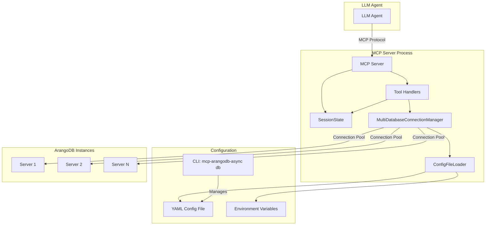
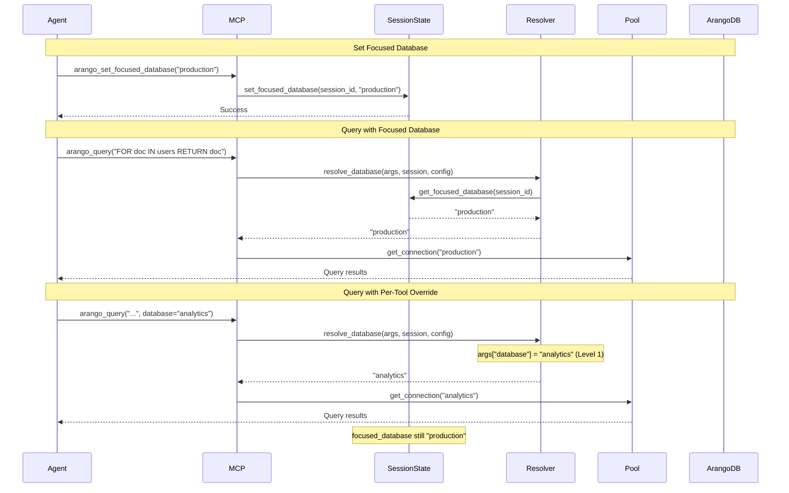
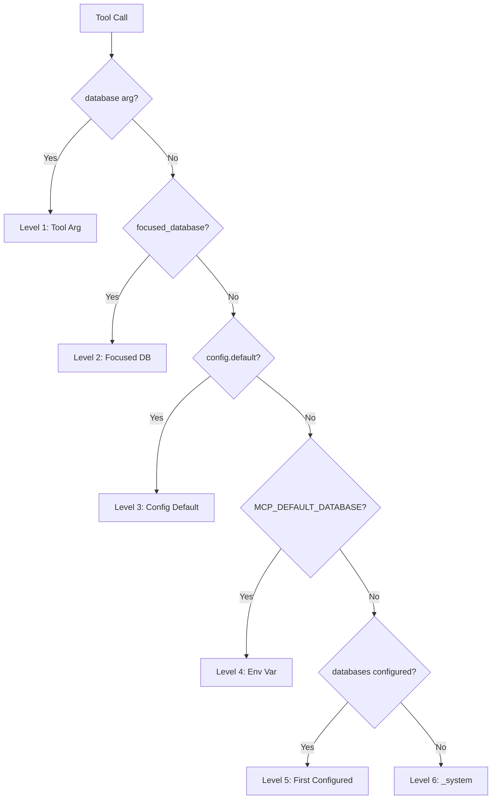
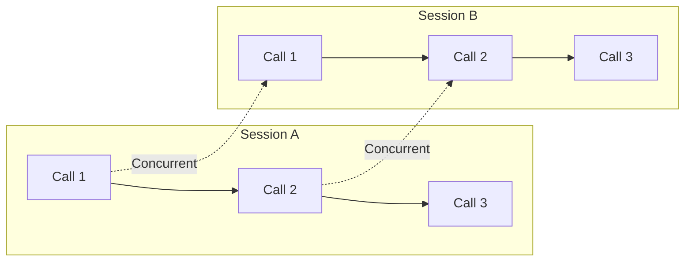

# Multi-Tenancy Architecture Design for mcp-arangodb-async

**Project:** mcp-arangodb-async  
**Version:** 0.4.0 → 0.5.0  
**Design Date:** 2025-11-22  
**Architect:** Augment Agent  
**Status:** Phase 1 - Architecture Design (v3 - Final)

---

## Changes from v2

This v3 report integrates findings from Integration Design v3, resolving terminology conflicts, clarifying session management, and finalizing implementation decisions.

### Key Changes

1. **Terminology Resolution**: `SessionContextManager` → `SessionState`, 3 tools renamed (arango_switch_workflow, arango_get_active_workflow, arango_list_workflows)
2. **Session Management**: Clarified as application-level state containers with implicit creation, sequential processing within session
3. **Per-Tool Database Override**: Added optional `database` parameter to 35 data operation tools for cross-database workflows
4. **Concurrency Model**: Changed from `threading.Lock` to `asyncio.Lock` (codebase is fully async)
5. **Implementation Phases**: Restructured to 5 phases over 4 weeks (reduced from 5.5 weeks)

---

## Executive Summary

This document provides architectural design for implementing **Option A-Enhanced (Focused Database Context with Optional Override)** + **Approach 3B (CLI-based Configuration Management)**.

**Design Goals:**
- ✅ Single MCP server instance supporting multiple databases and multiple ArangoDB servers
- ✅ Focused database context with optional per-tool override
- ✅ Secure CLI-based configuration management (using `argparse`)
- ✅ Comprehensive status reporting for LLM agents
- ✅ MCP Design Pattern support for context window optimization
- ✅ Backward compatibility with single-database deployments
- ✅ Production-ready security posture

**Key Architectural Decisions:**

| Decision | Choice | Rationale |
|----------|--------|-----------|
| **Terminology** | "workflow" for design patterns, "focused_database" for multi-tenancy | Eliminates "context" ambiguity |
| **Session Storage** | `session_state.py` (new file) | Separates concerns from db.py |
| **Session Creation** | Implicit on first tool call | No explicit session management tools needed |
| **Concurrency** | Sequential within session, concurrent across sessions | Matches MCP client behavior |
| **Database Override** | Optional `database` parameter on 35 tools | Enables cross-database operations |
| **Async Locks** | `asyncio.Lock()` | Codebase is fully async, python-arango not thread-safe |
| **Configuration** | YAML file + environment variables | Secure, flexible, backward compatible |
| **CLI Tool** | `argparse`-based `mcp-arangodb-async db` | Already in codebase, admin-controlled |

**Version Context:**
- **Current:** 0.4.0 (43 tools: 34 core + 9 design pattern)
- **Target:** 0.5.0 (multi-tenancy + terminology resolution)
- **Tool Changes:** 3 renamed, 35 require `database` parameter, 6 new multi-tenancy tools
- **Timeline:** 4 weeks (5 phases)

---

## 1. Architecture Overview

### 1.1 High-Level Architecture



### 1.2 Data Flow: Per-Tool Database Override



### 1.3 Integration Points

| Component | File | Integration | Change |
|-----------|------|-------------|--------|
| Server Lifespan | `entry.py:157-221` | Multi-database pool initialization | Refactor |
| Tool Handlers | `handlers.py:9-13` | Database resolution logic | Extend |
| Configuration | `config.py:45-72` | YAML config support | Extend |
| Connection Manager | `db.py:25-99` | Multi-database pool | Replace |
| CLI | `__main__.py:22-172` | `db` subcommand | Extend |
| Design Pattern Tools | `handlers.py:1849-2326` | Global → per-session state | Refactor |

---

## 2. Component Design

### 2.1 MultiDatabaseConnectionManager

**Purpose:** Connection pooling for multiple ArangoDB servers and databases.

**Key Implementation:**

```python
class MultiDatabaseConnectionManager:
    def __init__(self, config_loader: ConfigFileLoader):
        self._pools: Dict[str, Tuple[ArangoClient, StandardDatabase]] = {}
        self._configs: Dict[str, DatabaseConfig] = {}
        self._lock = asyncio.Lock()  # Async lock
        self._config_loader = config_loader

    async def get_connection(self, database_key: str) -> Tuple[ArangoClient, StandardDatabase]:
        """Get or create connection (async-safe)."""
        if database_key in self._pools:
            return self._pools[database_key]
        
        async with self._lock:
            if database_key not in self._pools:
                config = self._configs[database_key]
                client = ArangoClient(hosts=config.url, request_timeout=config.timeout)
                db = client.db(config.database, username=config.username,
                              password=os.getenv(config.password_env))
                self._pools[database_key] = (client, db)
            return self._pools[database_key]
```

**File:** `mcp_arangodb_async/multi_db_manager.py` (new)

---

### 2.2 SessionState (Renamed from SessionContextManager)

**Purpose:** Per-session state management for focused database, active workflow, and tool lifecycle.

**Key Implementation:**

```python
class SessionState:
    def __init__(self):
        self._focused_database: Dict[str, str] = {}              # session_id -> database_key
        self._active_workflow: Dict[str, str] = {}               # session_id -> workflow_name
        self._tool_lifecycle_stage: Dict[str, str] = {}          # session_id -> stage_name
        self._tool_usage_stats: Dict[str, Dict[str, Any]] = {}   # session_id -> stats
        self._lock = asyncio.Lock()

    def initialize_session(self, session_id: str):
        """Initialize new session with defaults."""
        self._focused_database[session_id] = None
        self._active_workflow[session_id] = "baseline"
        self._tool_lifecycle_stage[session_id] = "setup"
        self._tool_usage_stats[session_id] = {}

    async def set_focused_database(self, session_id: str, database_key: str):
        async with self._lock:
            self._focused_database[session_id] = database_key

    def get_focused_database(self, session_id: str) -> Optional[str]:
        return self._focused_database.get(session_id)

    async def set_active_workflow(self, session_id: str, workflow: str):
        async with self._lock:
            self._active_workflow[session_id] = workflow

    def cleanup_session(self, session_id: str):
        """Clean up on client disconnect."""
        self._focused_database.pop(session_id, None)
        self._active_workflow.pop(session_id, None)
        self._tool_lifecycle_stage.pop(session_id, None)
        self._tool_usage_stats.pop(session_id, None)
```

**File:** `mcp_arangodb_async/session_state.py` (new)

---

### 2.3 ConfigFileLoader

**Purpose:** Load and validate database configurations from YAML and environment variables.

**YAML Schema:**

```yaml
default_database: "production"

databases:
  production:
    url: "http://localhost:8529"
    database: "myapp_prod"
    username: "admin"
    password_env: "MCP_ARANGO_PROD_PASSWORD"  # Env var name
    timeout: 60

  staging:
    url: "http://staging.example.com:8529"
    database: "myapp_staging"
    username: "admin"
    password_env: "MCP_ARANGO_STAGING_PASSWORD"
    timeout: 30
```

**Key Methods:**

```python
class ConfigFileLoader:
    def __init__(self, config_path: str = "config/databases.yaml"):
        self.config_path = config_path
        self.default_database: Optional[str] = None
        self._databases: Dict[str, DatabaseConfig] = {}

    def load(self):
        """Load from YAML + backward-compatible env vars."""
        if os.path.exists(self.config_path):
            with open(self.config_path) as f:
                config = yaml.safe_load(f)
                self.default_database = config.get("default_database")
                for key, db_config in config.get("databases", {}).items():
                    self._databases[key] = DatabaseConfig(**db_config)
        else:
            # Backward compatibility: load from env vars
            self._load_from_env_vars()

    def _load_from_env_vars(self):
        """Backward compatibility with v0.4.0 env vars."""
        url = os.getenv("MCP_ARANGO_URL", "http://localhost:8529")
        database = os.getenv("MCP_ARANGO_DATABASE", "_system")
        username = os.getenv("MCP_ARANGO_USERNAME", "root")
        self._databases["default"] = DatabaseConfig(
            url=url, database=database, username=username,
            password_env="MCP_ARANGO_PASSWORD", timeout=30.0
        )
        self.default_database = "default"
```

**File:** `mcp_arangodb_async/config_loader.py` (new)

---

### 2.4 Database Resolution Algorithm

**6-Level Priority Fallback:**

```python
def resolve_database(
    tool_args: Dict[str, Any],
    session_state: SessionState,
    session_id: str,
    config_loader: ConfigFileLoader
) -> str:
    """Resolve database using 6-level priority."""
    # Level 1: Per-tool override (does NOT mutate session state)
    if "database" in tool_args and tool_args["database"]:
        return tool_args["database"]

    # Level 2: Focused database (session-scoped)
    focused = session_state.get_focused_database(session_id)
    if focused:
        return focused

    # Level 3: Config default
    if config_loader.default_database:
        return config_loader.default_database

    # Level 4: Environment variable
    env_default = os.getenv("MCP_DEFAULT_DATABASE")
    if env_default:
        return env_default

    # Level 5: First configured database
    databases = config_loader.get_configured_databases()
    if databases:
        return list(databases.keys())[0]

    # Level 6: Hardcoded fallback
    return "_system"
```

**File:** `mcp_arangodb_async/db_resolver.py` (new) or inline in `entry.py`

---

### 2.5 Session ID Extraction

**Purpose:** Extract session identifier for stdio vs HTTP transports.

```python
def extract_session_id(request_context) -> str:
    """Extract session ID from request context.

    - stdio: Returns "stdio" (singleton session per subprocess)
    - HTTP: Returns unique identifier from request
    """
    if hasattr(request_context, "session") and request_context.session:
        return request_context.session.session_id  # HTTP transport
    return "stdio"  # stdio transport
```

**File:** `mcp_arangodb_async/session_utils.py` (new) or inline in `entry.py`

---

### 2.6 Updated server_lifespan() and call_tool()

**server_lifespan() - Initialize Components:**

```python
async def server_lifespan(server: Server):
    # Initialize components
    config_loader = ConfigFileLoader()
    config_loader.load()

    db_manager = MultiDatabaseConnectionManager(config_loader)
    await db_manager.initialize()

    session_state = SessionState()

    # Store in lifespan context
    server.request_context.lifespan_context = {
        "session_state": session_state,
        "db_manager": db_manager,
        "config_loader": config_loader
    }

    yield

    # Cleanup
    session_state.cleanup_all()
    await db_manager.close_all()
```

**call_tool() - Implicit Session Creation + Database Resolution:**

```python
async def call_tool(name: str, arguments: dict):
    ctx = server.request_context
    session_state = ctx.lifespan_context["session_state"]
    db_manager = ctx.lifespan_context["db_manager"]
    config_loader = ctx.lifespan_context["config_loader"]

    # Extract session ID
    session_id = extract_session_id(ctx)

    # Implicit session creation
    if not session_state.has_session(session_id):
        session_state.initialize_session(session_id)

    # Resolve database (per-tool override or focused database)
    target_db_key = resolve_database(arguments, session_state, session_id, config_loader)

    # Get database connection
    client, db = await db_manager.get_connection(target_db_key)

    # Execute tool handler
    handler = TOOL_REGISTRY[name].handler
    result = handler(db, arguments)

    # Track tool usage
    await session_state.track_tool_usage(session_id, name)

    return result
```

---

### 2.7 Multi-Tenancy MCP Tools (6 Tools)

| Tool | Purpose | Database Param |
|------|---------|----------------|
| `arango_set_focused_database` | Set focused database for session | No |
| `arango_get_focused_database` | Get currently focused database | No |
| `arango_list_available_databases` | List all configured databases | No |
| `arango_get_database_resolution` | Show database resolution for current session | No |
| `arango_test_database_connection` | Test connection to specific database | Yes |
| `arango_get_multi_database_status` | Get status of all configured databases | No |

**Example Implementation:**

```python
@register_tool(name=ARANGO_SET_FOCUSED_DATABASE, model=SetFocusedDatabaseArgs)
async def handle_set_focused_database(db: StandardDatabase, args: Dict[str, Any]):
    session_state = server.request_context.lifespan_context["session_state"]
    session_id = extract_session_id(server.request_context)

    database_key = args["database"]

    # Validate database exists
    db_manager = server.request_context.lifespan_context["db_manager"]
    if database_key not in db_manager.get_configured_databases():
        return {"success": False, "error": f"Database '{database_key}' not configured"}

    await session_state.set_focused_database(session_id, database_key)
    return {"success": True, "focused_database": database_key}
```

---

### 2.8 Design Pattern Tools (8 Tools - 3 Renamed)

| Old Name | New Name | Purpose |
|----------|----------|---------|
| `arango_switch_context` | `arango_switch_workflow` | Switch to workflow-specific tool set |
| `arango_get_active_context` | `arango_get_active_workflow` | Get currently active workflow |
| `arango_list_contexts` | `arango_list_workflows` | List all available workflows |
| (unchanged) | `arango_advance_workflow_stage` | Advance to next workflow stage |
| (unchanged) | `arango_get_tool_usage_stats` | Get tool usage statistics |
| (unchanged) | `arango_unload_tools` | Manually unload specific tools |
| (unchanged) | `arango_search_tools` | Search for tools by keywords |
| (unchanged) | `arango_list_tools_by_category` | List tools by category |

**Migration Required:**
- Update constants in `tools.py:113-115`
- Update models in `models.py:444-465`
- Update handlers in `handlers.py:2023, 2074, 2104`
- Migrate from global variables to SessionState

---

### 2.9 Data Operation Tools (35 Tools - Database Parameter)

**Categories:**

- **Core Data (9):** arango_query, arango_insert, arango_update, arango_remove, arango_list_collections, arango_create_collection, arango_backup, arango_restore, arango_database_status
- **Indexing (3):** arango_list_indexes, arango_create_index, arango_delete_index
- **Validation & Bulk (4):** arango_validate_references, arango_insert_with_validation, arango_bulk_insert, arango_bulk_update
- **Graph (13):** arango_create_graph, arango_add_edge, arango_traverse, arango_shortest_path, arango_list_graphs, arango_add_vertex_collection, arango_add_edge_definition, arango_backup_graph, arango_restore_graph, arango_backup_named_graphs, arango_validate_graph_integrity, arango_graph_statistics, arango_remove_graph
- **Schema & Query (6):** arango_create_schema, arango_validate_document, arango_query_builder, arango_query_profile, arango_explain_query, arango_list_schemas

**Model Update Pattern:**

```python
# Add optional database parameter to all 35 tool models
class QueryArgs(BaseModel):
    query: str
    bind_vars: Optional[Dict[str, Any]] = None
    database: Optional[str] = Field(default=None, description="Database override")
```

---

### 2.10 CLI Tool: mcp-arangodb-async db

**Subcommands:**

```bash
# Add database configuration
mcp-arangodb-async db add production \
  --url http://localhost:8529 \
  --database myapp_prod \
  --username admin \
  --password-env MCP_ARANGO_PROD_PASSWORD

# Remove database configuration
mcp-arangodb-async db remove staging

# List configured databases
mcp-arangodb-async db list

# Test database connection
mcp-arangodb-async db test production

# Show database resolution status
mcp-arangodb-async db status
```

**Implementation:** Extend `__main__.py` with `argparse` subparsers.

---

## 3. Configuration & Security

### 3.1 Configuration Priority (6 Levels)



### 3.2 Security Best Practices

**Password Storage:**
- ✅ Store passwords in environment variables
- ✅ Reference env var names in YAML (`password_env: "MCP_ARANGO_PROD_PASSWORD"`)
- ❌ NEVER store passwords in YAML config file

**CLI Tool Security:**
- Admin-only (requires file system access to modify YAML)
- Not exposed via MCP protocol (agents cannot modify configuration)
- Separate from MCP server process

**Database Access Control:**
- Managed by ArangoDB (username/password per database)
- Use read-only credentials for analytics databases

---

## 4. Session Management

### 4.1 Session Definition

A **session** is an isolated state container for a single agent's interaction stream.

**Properties:**
- **Identifier:** `session_id` (stdio: "stdio", HTTP: unique ID from request)
- **Lifecycle:** Implicit creation on first tool call, cleanup on disconnect
- **Processing:** Sequential (one tool call at a time per session)
- **Isolation:** Independent state (focused_database, active_workflow, etc.)

### 4.2 Concurrency Model

**Within Session:** Sequential processing (single agent cannot make parallel requests)

**Across Sessions:** Concurrent processing (multiple agents can make concurrent requests)



**Implementation:** Async/await (asyncio) with `asyncio.Lock` for shared state mutations.

---

## 5. Backward Compatibility

### 5.1 Single-Database Deployments

**v0.4.0 Behavior:**
- Single database via environment variables
- All tools operate on single database

**v0.5.0 Behavior (Backward Compatible):**
- If YAML config doesn't exist, load from environment variables
- Create single database entry with key "default"
- All tools operate on "default" database (same as v0.4.0)

### 5.2 Migration Path

1. **Upgrade to v0.5.0** - No config changes, behavior identical to v0.4.0
2. **Add YAML Config** (optional) - Create `config/databases.yaml` with multiple databases
3. **Use Per-Tool Override** (optional) - Add `database` parameter for cross-database operations

---

## 6. Implementation Phases

### Phase 1: Foundation (1 week)

**Deliverables:**
- Create `session_state.py`, `multi_db_manager.py`, `config_loader.py`, `db_resolver.py`, `session_utils.py`
- Update `entry.py` to initialize SessionState and MultiDatabaseConnectionManager
- Implement implicit session creation

**Tests:**
- SessionState unit tests (isolation, implicit creation)
- MultiDatabaseConnectionManager unit tests (connection pooling, async locks)
- Database resolution unit tests (6-level priority)

---

### Phase 2: Tool Renaming (3 days)

**Deliverables:**
- Update tool constants in `tools.py:113-115`
- Update Pydantic models in `models.py:444-465`
- Update handler registrations in `handlers.py:2023, 2074, 2104`
- Update all tests and documentation

**Tests:**
- Verify all tests pass with new tool names
- Grep for old tool names (should return 0 results except changelog)

---

### Phase 3: State Migration (1 week)

**Deliverables:**
- Migrate 6 tools + 1 helper from global to per-session state
- Remove global variables (`_ACTIVE_CONTEXT`, `_CURRENT_STAGE`, `_TOOL_USAGE_STATS`)
- Update handlers to access SessionState via lifespan_context

**Tests:**
- `test_concurrent_sessions_independent_state()`
- `test_workflow_switch_preserves_focused_database()`
- Grep for global variables (should return 0 results)

---

### Phase 4: Database Override (1.5 weeks)

**Deliverables:**
- Add `database` parameter to 35 tool models
- Update 35 tool handlers to use database resolution
- Implement 6 multi-tenancy MCP tools
- Implement CLI tool `mcp-arangodb-async db`

**Tests:**
- `test_per_tool_override_does_not_mutate_state()`
- `test_cross_database_workflow()` (data migration scenario)
- `test_database_resolution_priority()`
- CLI tests (`test_db_add_remove_list()`)

---

### Phase 5: Verification (3 days)

**Deliverables:**
- Run full test suite
- Test concurrent sessions (2 MCP clients, verify independent state)
- Test cross-database workflows
- Test backward compatibility
- Update changelog and migration guide

**Tests:**
- Stress test (10 concurrent sessions)
- Performance test (connection pool efficiency)
- Security test (passwords not logged)

---

### Timeline Summary

| Phase | Duration | Deliverables |
|-------|----------|--------------|
| 1. Foundation | 1 week | SessionState, MultiDatabaseConnectionManager, ConfigFileLoader |
| 2. Tool Renaming | 3 days | 3 tools renamed, all references updated |
| 3. State Migration | 1 week | 6 tools migrated, global variables removed |
| 4. Database Override | 1.5 weeks | 35 tools updated, 6 multi-tenancy tools, CLI tool |
| 5. Verification | 3 days | Full test suite, documentation, release |
| **Total** | **4 weeks** | v0.5.0 release |

---

## 7. Summary

### 7.1 Key Architectural Decisions

| Decision | Choice | Rationale |
|----------|--------|-----------|
| Terminology | "workflow" for design patterns | Eliminates "context" ambiguity |
| Session Storage | `session_state.py` | Separates concerns |
| Session Creation | Implicit on first tool call | No explicit tools needed |
| Concurrency | Sequential within session | Matches MCP client behavior |
| Database Override | Optional `database` param on 35 tools | Cross-database operations |
| Async Locks | `asyncio.Lock()` | Codebase is async |
| Configuration | YAML + env vars | Secure, flexible |
| CLI Tool | `argparse`-based | Already in codebase |

### 7.2 Implementation Checklist

**New Files (5):**
- `mcp_arangodb_async/session_state.py`
- `mcp_arangodb_async/multi_db_manager.py`
- `mcp_arangodb_async/config_loader.py`
- `mcp_arangodb_async/db_resolver.py`
- `mcp_arangodb_async/session_utils.py`

**Modified Files (6):**
- `mcp_arangodb_async/tools.py` (3 tool name constants)
- `mcp_arangodb_async/models.py` (3 model renames + 35 database parameters)
- `mcp_arangodb_async/handlers.py` (3 renames + 6 migrations + 35 resolutions + 6 new tools)
- `mcp_arangodb_async/entry.py` (SessionState init, session ID extraction)
- `mcp_arangodb_async/db.py` (Replace ConnectionManager)
- `mcp_arangodb_async/__main__.py` (Add `db` subcommand)

**Test Files (3):**
- `tests/test_session_state.py` (NEW)
- `tests/test_multi_db_manager.py` (NEW)
- `tests/test_mcp_integration.py` (UPDATE)

**Documentation (4):**
- `docs/user-guide/mcp-design-patterns.md` (UPDATE: tool names)
- `docs/user-guide/tools-reference.md` (UPDATE: database parameter)
- `docs/migration/v0.4-to-v0.5.md` (NEW)
- `README.md` (UPDATE: examples)

### 7.3 Success Criteria

- ✅ All 43 tools support multi-database deployments
- ✅ Backward compatibility with single-database deployments
- ✅ Concurrent sessions have independent state
- ✅ Per-tool database override works without mutating state
- ✅ All tests pass (unit, integration, stress)
- ✅ Documentation updated and accurate
- ✅ Security best practices followed
- ✅ CLI tool provides secure configuration management

---

**Report Version:** v3 (Final)
**Last Updated:** 2025-11-22
**Status:** Ready for Implementation
**Next Step:** Begin Phase 1 (Foundation)


