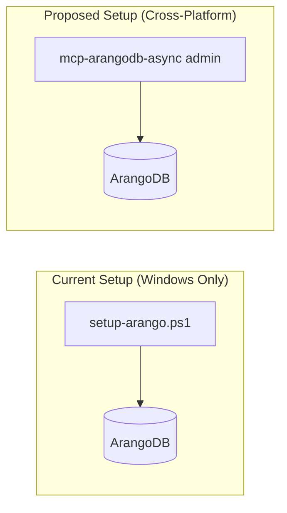
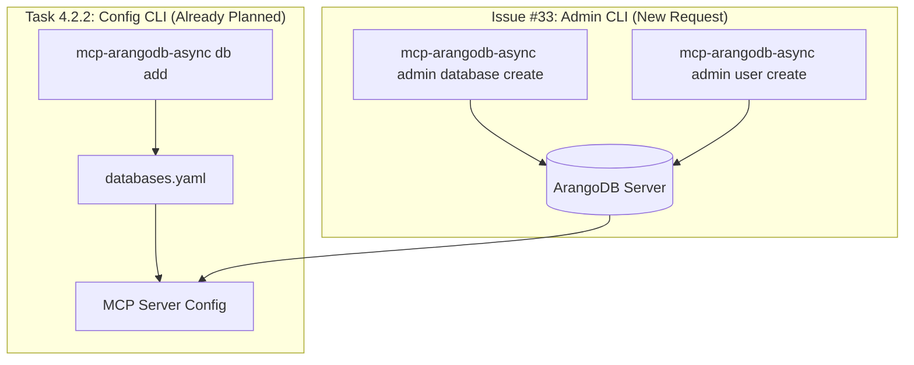
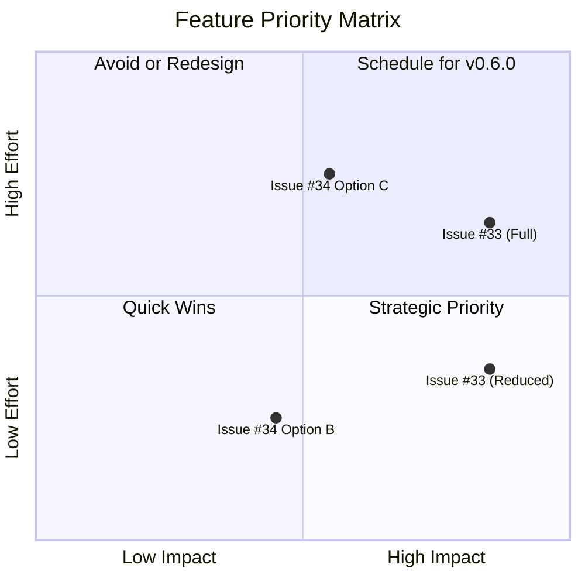

# Scope Extension Evaluation Report

**Project**: mcp-arangodb-async v0.5.0 Multi-Tenancy  
**Report Date**: 2025-12-02  
**Status**: Evaluation Complete  
**Issues Evaluated**: [#33](https://github.com/LittleCoinCoin/mcp-arangodb-async/issues/33), [#34](https://github.com/LittleCoinCoin/mcp-arangodb-async/issues/34)

---

## Executive Summary

Two scope extension requests were identified before the v0.5.0 release closure. This report evaluates their technical feasibility, effort, and alignment with multi-tenancy goals.

| Issue | Title | Priority | Recommendation | Effort |
|-------|-------|----------|----------------|--------|
| #33 | Admin CLI for User/Database CRUD | **HIGH** | IMPLEMENT (reduced scope) | 2-3 days |
| #34 | Hot Reload Configuration | MEDIUM | DEFER to v0.6.0 | 1-4 days |

**Bottom Line**: Issue #33 addresses a critical portability blocker (Windows-only setup script) and should be implemented with reduced scope. Issue #34 is a DX improvement that can be safely deferred.

---

## Issue #33: Admin CLI for User/Database CRUD

### Problem Statement

The current database and user setup relies on `scripts/setup-arango.ps1`, a **Windows-only** PowerShell script. This breaks cross-platform portability and forces non-Windows users to manually configure ArangoDB.

### Current vs Proposed



### Technical Evaluation

| Aspect | Assessment |
|--------|------------|
| **Feasibility** | HIGH - python-arango provides all needed APIs |
| **Dependencies** | None (python-arango already installed) |
| **Risk** | LOW - New CLI commands, no changes to MCP server |
| **Complexity** | MODERATE - Root authentication, error handling |

**python-arango API Support:**
- `sys_db.create_database()`, `sys_db.delete_database()`, `sys_db.databases()`
- `sys_db.create_user()`, `sys_db.update_permission()`

### Scope Analysis

The proposed issue scope is **broader than necessary** for addressing the portability blocker:

| Command | In setup-arango.ps1? | Recommendation |
|---------|---------------------|----------------|
| `admin database create` | ✅ Yes | INCLUDE |
| `admin database delete` | ❌ No | INCLUDE (cleanup) |
| `admin database list` | ❌ No | INCLUDE (discovery) |
| `admin user create` | ✅ Yes | INCLUDE |
| `admin user delete` | ❌ No | DEFER |
| `admin user list` | ❌ No | DEFER |
| `admin user grant` | ✅ Yes | INCLUDE |
| `admin user revoke` | ❌ No | DEFER |
| `user databases` | ❌ No | DEFER |
| `user password` | ❌ No | DEFER |

### Critical Distinction



**These are COMPLEMENTARY operations:**
1. Use `admin database create` to create the database in ArangoDB
2. Use `db add` to register it in the MCP server configuration
3. MCP server connects using the configuration

### Recommendation for #33

**IMPLEMENT with reduced scope** to achieve portability parity:

```bash
# Minimal viable scope (5 commands)
mcp-arangodb-async admin database create <name>
mcp-arangodb-async admin database delete <name>
mcp-arangodb-async admin database list
mcp-arangodb-async admin user create <username> --password-env VAR
mcp-arangodb-async admin user grant <username> <database> --permission rw
```

**Effort**: 2-3 days | **Integrates with**: `__main__.py` argparse

---

## Issue #34: Hot Reload Configuration

### Problem Statement

When database configuration changes (via CLI or YAML edit), the MCP server must be manually restarted. This degrades DX in production environments.

### Proposed Options

| Option | Description | Pros | Cons | Effort |
|--------|-------------|------|------|--------|
| A | File Watcher | Automatic | Adds dependency, race conditions | 2-3 days |
| B | MCP Tool | Simple, explicit | Manual trigger | 0.5-1 day |
| C | Hybrid | Best of both | Full complexity | 3-4 days |

### Technical Evaluation

| Aspect | Assessment |
|--------|------------|
| **Feasibility** | HIGH for Option B, MEDIUM for Option A |
| **Risk** | MODERATE - Runtime complexity, error handling |
| **Complexity** | Connection pool reload, state preservation |
| **Workaround** | Server restart (simple, reliable) |

### Current Architecture Gap

The current `entry.py` loads configuration **once** at startup:

```python
# entry.py:196-204 (current implementation)
config_loader = ConfigFileLoader()
config_loader.load()  # Called once at startup
# No reload mechanism exists
```

**Required Changes for Hot Reload:**
- Add `ConfigFileLoader.reload()` method
- Add `MultiDatabaseConnectionManager.reload_connections()` method
- Handle in-flight requests during reload
- Validate focused_database still exists after reload

### Recommendation for #34

**DEFER to v0.6.0** with the following rationale:

1. **Not a blocker**: Server restart is acceptable for configuration changes
2. **Risk reduction**: Let multi-tenancy stabilize before adding runtime complexity
3. **Low user impact**: Configuration changes are infrequent operations
4. **Complexity**: Atomic reload with rollback adds significant complexity

**If forced to implement for v0.5.0**: Option B only (MCP tool trigger)

---

## Decision Matrix



---

## Recommended Action Plan

### For v0.5.0 Release

| Action | Issue | Timeline | Assigned |
|--------|-------|----------|----------|
| Implement Admin CLI (reduced scope) | #33 | 2-3 days | TBD |
| Deprecate setup-arango.ps1 | #33 | Same PR | TBD |
| Update documentation | #33 | Same PR | TBD |
| DEFER Hot Reload | #34 | v0.6.0 | - |

### Milestone 5.1 Integration

Add as **Task 5.1.0 - Admin CLI** before existing Task 5.1.1:
- Pre-condition: Phase 4 complete
- Success Gates: 5 admin commands, cross-platform tests, documentation

---

## References

- [Issue #33](https://github.com/LittleCoinCoin/mcp-arangodb-async/issues/33)
- [Issue #34](https://github.com/LittleCoinCoin/mcp-arangodb-async/issues/34)
- [python-arango User Management](https://docs.python-arango.com/)
- [Roadmap v3](./02-implementation_roadmap_v3.md)

---

**Report Version**: v0  
**Next Steps**: Stakeholder decision on recommendations

