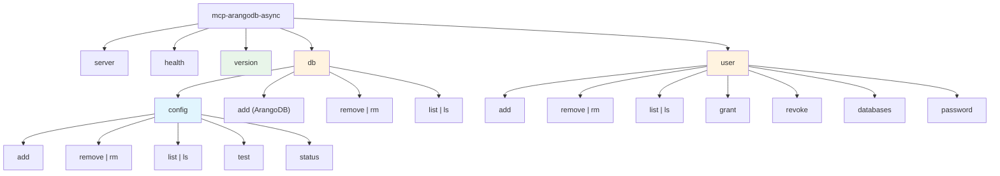

# Admin CLI Design Analysis – v1

**Project**: mcp-arangodb-async – Model Context Protocol Server for ArangoDB
**Report Date**: 2025-12-03
**Last Updated**: 2025-12-03
**Phase**: Analysis (Code Change Phases, Phase 1)
**Source**: Issue #35 (Scope Analysis & Design) + User Concerns (4 items) + Stakeholder Feedback
**Target Milestone**: 4.3 - Admin CLI

---

## Executive Summary

This report analyzes the proposed CLI design from `04-admin_cli_roadmap_v0.md` against the existing `mcp-arangodb-async db` CLI implementation. Four specific ergonomic concerns are addressed with concrete design improvements, refined through stakeholder feedback.

**Key Findings (v1 Updates)**:

1. **Unified `db` command hierarchy** - Merge existing `db` config commands under `db config` namespace; new ArangoDB operations at `db` root level
2. **Atomic database+user creation** via `--with-user` flag for common workflows
3. **Comprehensive safety features** - `--dry-run` for all mutating operations; interactive confirmation prompts with `--yes` bypass
4. **Consistent naming** - Use `add/remove` verbs with Unix-style aliases (`rm`, `ls`)
5. **Version command** using `importlib.metadata.version()` (no hardcoded versions)

**Recommendation**: Adopt unified `db` command structure with implicit admin mode detection.

---

## Table of Contents

1. [Changelog](#1-changelog)
2. [Current CLI Architecture Analysis](#2-current-cli-architecture-analysis)
3. [Proposed CLI Analysis](#3-proposed-cli-analysis)
4. [Design Recommendations](#4-design-recommendations)
   - [Concern #1: Command Structure & Naming](#41-concern-1-command-structure--naming)
   - [Concern #2: Database & User Creation Workflow](#42-concern-2-database--user-creation-workflow)
   - [Concern #3: Safety & Transparency Features](#43-concern-3-safety--transparency-features)
   - [Concern #4: Version Information](#44-concern-4-version-information)
5. [Complete Command Reference](#5-complete-command-reference)
6. [Implementation Guidance](#6-implementation-guidance)
7. [python-arango API Reference](#7-python-arango-api-reference)
8. [Trade-off Analysis](#8-trade-off-analysis)
9. [Comparison with setup-arango.ps1](#9-comparison-with-setup-arangops1)
10. [Success Criteria Verification](#10-success-criteria-verification)

---

## 1. Changelog

### v1 (2025-12-03) – Stakeholder Feedback Integration

| Change | Description |
|--------|-------------|
| **Merged `db` hierarchy** | Consolidated `db` and proposed `database` commands into unified `db` namespace; existing config commands moved to `db config` subcommand |
| **Replaced `--force` with confirmation prompts** | Implemented interactive confirmation pattern with `--yes` flag and `MCP_ARANGODB_ASYNC_CLI_YES` environment variable |
| **Expanded `--dry-run` coverage** | Added `--dry-run` to all mutating commands: `db config add/remove`, `db add/remove`, `user add/remove/grant/revoke` |
| **Consistent naming conventions** | Renamed `create/delete` to `add/remove`; added Unix-style aliases (`rm`, `ls`) |
| **Confirmation shows preview** | Confirmation prompts now display preview of changes (similar to `--dry-run` output) |
| **Added Section 1 (Changelog)** | Document version history |

### v0 (2025-12-03) – Initial Analysis

- Initial CLI design analysis addressing 4 stakeholder concerns
- Proposed flat command structure with implicit admin mode
- Introduced `--dry-run` and version command concepts

---

## 2. Current CLI Architecture Analysis

### 2.1 Existing `db` Command Structure

Implementation in `__main__.py` (lines 64-131) and `cli_db.py`:

```text
mcp-arangodb-async
├── server [--transport] [--host] [--port] [--stateless]
├── health
└── db
    ├── add <key> --url --database --username --password-env [--timeout] [--description]
    ├── remove <key> [--config-path]
    ├── list [--config-path]
    ├── test <key> [--config-path]
    └── status [--config-path]
```

**Observed Patterns**:

| Pattern | Example | Rationale |
|---------|---------|-----------|
| Positional entity key | `db add production` | Primary identifier is mandatory |
| Named configuration | `--url`, `--database` | Configuration is optional/contextual |
| Password via env var | `--password-env VAR_NAME` | Security: never expose passwords in CLI |
| Config file path | `--config-path` | Allows non-default config locations |
| Human-readable output | `✓ Database 'x' added` | Clear success/error messaging |

### 2.2 PowerShell Script Behavior

`scripts/setup-arango.ps1` performs **atomic database+user creation**:

```powershell
# Lines 39-45: Single JavaScript block creates both
db._createDatabase('$DbName')
users.save('$User', '$Password', true)
users.grantDatabase('$User', '$DbName', 'rw')
```

This atomic approach is user-friendly for initial setup but limits flexibility.

---

## 3. Proposed CLI Analysis

### 3.1 Original Proposed Structure (from 04-admin_cli_roadmap_v0.md)

```text
mcp-arangodb-async
├── admin
│   ├── user
│   │   ├── create, delete, list, grant, revoke
│   └── database
│       ├── create, delete, list
└── user
    ├── databases
    └── password
```

### 3.2 Identified Issues

| Issue | Description | Impact |
|-------|-------------|--------|
| Nested hierarchy | 3-level: `admin → user → create` | Verbose, poor discoverability |
| Naming collision | `admin database` vs existing `db` | Conceptual confusion |
| Missing safety | No `--dry-run` for destructive ops | Risk of accidental data loss |
| Missing version | No version command | Can't verify installed version |
| Separated operations | Database+user require multiple commands | Workflow friction |

---

## 4. Design Recommendations

### 4.1 Concern #1: Command Structure & Naming

**Problem**: The original `admin` prefix adds verbosity without benefit. Additionally, having separate `db` (config) and `database` (ArangoDB) commands creates naming confusion.

**Recommended Solution**: **Unified `db` Command Hierarchy with Implicit Admin Mode**

**Key Design Decisions**:

1. **Merge `db` and `database`** - Since existing `db` command is not yet in a pre-release, no breaking changes
2. **Move existing `db` subcommands to `db config`** - Clear separation between config file management and ArangoDB operations
3. **Admin operations require `ARANGO_ROOT_PASSWORD`** - Implicit admin mode via environment variable
4. **Consistent `add/remove` naming** - Matches existing `db add/remove` pattern with Unix-style aliases

**Proposed Unified Structure**:

```text
mcp-arangodb-async
├── server                              # Existing: MCP server
├── health                              # Existing: Health check
├── version                             # NEW: Display version info
├── db                                  # UNIFIED: Database management
│   ├── config                          # MOVED: YAML configuration management
│   │   ├── add (--dry-run, --yes)
│   │   ├── remove | rm (--dry-run, --yes)
│   │   ├── list | ls
│   │   ├── test
│   │   └── status
│   ├── add (--with-user, --dry-run, --yes)      # NEW: ArangoDB database creation
│   ├── remove | rm (--dry-run, --yes)           # NEW: ArangoDB database deletion
│   └── list | ls [--json]                       # NEW: ArangoDB database listing
└── user                                # NEW: ArangoDB user management
    ├── add (--dry-run, --yes)          # Admin: Create user
    ├── remove | rm (--dry-run, --yes)  # Admin: Delete user
    ├── list | ls [--json]              # Admin: List users
    ├── grant (--dry-run, --yes)        # Admin: Grant permission
    ├── revoke (--dry-run, --yes)       # Admin: Revoke permission
    ├── databases [--json]              # Self-service: List accessible DBs
    └── password (--dry-run, --yes)     # Self-service: Change own password
```

**Naming Conventions**:

| Component | Convention | Example |
|-----------|------------|---------|
| Verbs | `add`, `remove`, `list`, `grant`, `revoke` | `db add mydb` |
| Aliases | Unix-style shortcuts | `rm` for `remove`, `ls` for `list` |
| Flags (read) | `--json` for machine-readable output | `db list --json` |
| Flags (safety) | `--dry-run`, `--yes` | `db remove mydb --dry-run` |

**Rationale**:

- Eliminates `admin` prefix verbosity
- Single `db` namespace for all database-related operations
- `db config` clearly indicates config file operations
- Consistent verb naming across all commands

### 4.2 Concern #2: Database & User Creation Workflow

**Problem**: Original proposal separates database and user creation, but common use case requires both.

**Recommended Solution**: **Optional `--with-user` Flag on `db add`**

```bash
# Atomic: Create database AND user in one command
mcp-arangodb-async db add mydb \
  --with-user myuser \
  --user-password-env MY_USER_PASSWORD \
  --permission rw

# Granular: Create database only
mcp-arangodb-async db add mydb

# Granular: Create user only
mcp-arangodb-async user add myuser --password-env MY_USER_PASSWORD
```

**Workflow Comparison**:

| Scenario | Original Proposal | Improved Design |
|----------|-------------------|-----------------|
| New project setup | 3 commands | 1 command |
| Add user to existing DB | 2 commands | 2 commands (same) |
| Create DB without user | 1 command | 1 command (same) |

**Rationale**: Preserves granular operations while enabling common workflow optimization.

### 4.3 Concern #3: Safety & Transparency Features

**Problem**: Admin operations can cause irreversible damage without preview capability.

**Recommended Solution**: **Two-Part Safety System**

1. **`--dry-run` flag** for all mutating operations (preview without execution)
2. **Interactive confirmation prompts** with `--yes` flag and environment variable bypass

#### 4.3.1 Dry-Run for All Mutating Operations

**Scope**: `--dry-run` applies to **mutating operations only**, not read-only commands.

**Mutating Commands** (require `--dry-run` support):

- `db add`, `db remove`
- `db config add`, `db config remove`
- `user add`, `user remove`, `user grant`, `user revoke`, `user password`

**Read-Only Commands** (no `--dry-run` needed):

- `db list`, `db config list`, `db config status`, `db config test`
- `user list`, `user databases`

**Example**:

```bash
# Preview what will be created
mcp-arangodb-async db add mydb --with-user myuser --dry-run

# Output:
# [DRY RUN] Would perform the following actions:
#   1. CREATE DATABASE: mydb
#   2. CREATE USER: myuser (active: true)
#   3. GRANT PERMISSION: myuser → mydb (permission: rw)
#
# No changes made. Remove --dry-run to execute.
```

#### 4.3.2 Interactive Confirmation with `--yes` Bypass

**Behavior**: All mutating commands prompt for confirmation by default, showing a preview of changes.

**Confirmation Bypass Options**:

| Method | Syntax | Use Case |
|--------|--------|----------|
| CLI flag | `--yes` or `-y` | One-time bypass |
| Environment variable | `MCP_ARANGODB_ASYNC_CLI_YES=1` | Non-interactive environments (CI/CD, scripts) |

**Confirmation Flow**:

```bash
# Default: Prompt for confirmation (shows preview like --dry-run)
$ mcp-arangodb-async db remove mydb

The following actions will be performed:
  1. DELETE DATABASE: mydb
  2. AFFECTED USERS: user1, user2 (permissions will be revoked)

Are you sure you want to proceed? [y/N]: y
✓ Database 'mydb' removed successfully

# With --yes flag: Skip prompt
$ mcp-arangodb-async db remove mydb --yes
✓ Database 'mydb' removed successfully

# With environment variable: Skip prompt
$ MCP_ARANGODB_ASYNC_CLI_YES=1 mcp-arangodb-async db remove mydb
✓ Database 'mydb' removed successfully
```

**Confirmation Priority**:

1. Check `--yes` flag → if present, proceed immediately
2. Check `MCP_ARANGODB_ASYNC_CLI_YES` env var → if set to `1`, proceed immediately
3. Otherwise, display preview and prompt for confirmation

**Exit Codes**:

| Code | Meaning |
|------|---------|
| 0 | Success (or dry-run completed) |
| 1 | Error (validation, connection, permission) |
| 2 | Operation cancelled by user (confirmation denied) |

### 4.4 Concern #4: Version Information

**Problem**: No way to display CLI/library version.

**Recommended Solution**: **`version` Command with `importlib.metadata`**

**Implementation**:

```python
# mcp_arangodb_async/__main__.py
import sys
from importlib.metadata import version, PackageNotFoundError

def handle_version() -> int:
    """Display version information."""
    try:
        pkg_version = version("mcp-arangodb-async")
    except PackageNotFoundError:
        pkg_version = "unknown (not installed as package)"

    print(f"mcp-arangodb-async version {pkg_version}")
    print(f"Python {sys.version.split()[0]}")
    return 0
```

**Usage**:

```bash
$ mcp-arangodb-async version
mcp-arangodb-async version 0.4.7
Python 3.11.5
```

**Anti-patterns Avoided**:

- ❌ Hardcoded `__version__ = "0.4.7"` in source files
- ❌ Duplicate version strings across multiple files
- ✅ Single source of truth: `pyproject.toml` → `importlib.metadata`

---

## 5. Complete Command Reference

### 5.1 Command Hierarchy Diagram



**Legend**:

- 🔵 Blue (`db config`): YAML config file management (existing, moved)
- 🟠 Orange (`db`, `user`): ArangoDB admin operations (new)
- 🟢 Green (`version`): Utility command (new)

### 5.2 Full Command Specifications

#### `version` Command

```bash
mcp-arangodb-async version
```

**Output**: Package version and Python version.

#### `db` Commands – ArangoDB Database Operations (Require `ARANGO_ROOT_PASSWORD`)

| Command | Aliases | Syntax | Description |
|---------|---------|--------|-------------|
| `add` | - | `db add <name> [--with-user <user>] [--user-password-env VAR] [--permission rw\|ro] [--dry-run] [--yes]` | Create database |
| `remove` | `rm` | `db remove <name> [--dry-run] [--yes]` | Delete database |
| `list` | `ls` | `db list [--json]` | List all databases |

#### `db config` Commands – YAML Configuration Management

| Command | Aliases | Syntax | Description |
|---------|---------|--------|-------------|
| `add` | - | `db config add <key> --url --database --username --password-env [--timeout] [--description] [--config-path] [--dry-run] [--yes]` | Add config entry |
| `remove` | `rm` | `db config remove <key> [--config-path] [--dry-run] [--yes]` | Remove config entry |
| `list` | `ls` | `db config list [--config-path]` | List config entries |
| `test` | - | `db config test <key> [--config-path]` | Test connection |
| `status` | - | `db config status [--config-path]` | Show config status |

#### `user` Commands

**Admin Commands** (Require `ARANGO_ROOT_PASSWORD`):

| Command | Aliases | Syntax | Description |
|---------|---------|--------|-------------|
| `add` | - | `user add <username> --password-env VAR [--active] [--dry-run] [--yes]` | Create user |
| `remove` | `rm` | `user remove <username> [--dry-run] [--yes]` | Delete user |
| `list` | `ls` | `user list [--json]` | List all users |
| `grant` | - | `user grant <username> <database> [--permission rw\|ro\|none] [--dry-run] [--yes]` | Grant permission |
| `revoke` | - | `user revoke <username> <database> [--dry-run] [--yes]` | Revoke permission |

**Self-Service Commands** (Require `ARANGO_USER_PASSWORD`):

| Command | Aliases | Syntax | Description |
|---------|---------|--------|-------------|
| `databases` | - | `user databases [--json]` | List accessible databases |
| `password` | - | `user password --new-password-env VAR [--dry-run] [--yes]` | Change own password |

---

## 6. Implementation Guidance

### 6.1 Authentication Pattern

```python
# Environment variable requirements by operation type
ADMIN_OPS = {
    "db add", "db remove", "db list",
    "user add", "user remove", "user list", "user grant", "user revoke"
}
SELF_SERVICE_OPS = {"user databases", "user password"}

def get_required_env_var(operation: str) -> str:
    if operation in ADMIN_OPS:
        return "ARANGO_ROOT_PASSWORD"
    elif operation in SELF_SERVICE_OPS:
        return "ARANGO_USER_PASSWORD"
    raise ValueError(f"Unknown operation: {operation}")
```

### 6.2 Connection Pattern

```python
import os
from arango import ArangoClient
from arango.database import StandardDatabase

def get_system_db_connection() -> StandardDatabase:
    """Connect to _system database as root for admin operations."""
    client = ArangoClient(hosts=os.getenv("ARANGO_URL", "http://localhost:8529"))
    root_password = os.getenv("ARANGO_ROOT_PASSWORD")
    if not root_password:
        raise ValueError("ARANGO_ROOT_PASSWORD environment variable required")
    return client.db("_system", username="root", password=root_password)
```

### 6.3 Confirmation Utility Function

```python
# mcp_arangodb_async/cli_utils.py
import os
import sys

ENV_VAR_YES = "MCP_ARANGODB_ASYNC_CLI_YES"

def confirm_action(
    actions: list[str],
    yes_flag: bool = False,
    prompt: str = "Are you sure you want to proceed?"
) -> bool:
    """
    Display action preview and prompt for confirmation.

    Args:
        actions: List of actions to display in preview
        yes_flag: If True, skip confirmation (--yes flag)
        prompt: Confirmation prompt text

    Returns:
        True if confirmed, False otherwise

    Priority:
        1. --yes flag → proceed immediately
        2. MCP_ARANGODB_ASYNC_CLI_YES env var → proceed immediately
        3. Interactive prompt → wait for user input
    """
    # Check --yes flag
    if yes_flag:
        return True

    # Check environment variable
    if os.getenv(ENV_VAR_YES, "").lower() in ("1", "true", "yes"):
        return True

    # Display preview
    print("\nThe following actions will be performed:")
    for i, action in enumerate(actions, 1):
        print(f"  {i}. {action}")
    print()

    # Check if interactive terminal
    if not sys.stdin.isatty():
        print("Error: Non-interactive terminal. Use --yes flag or set "
              f"{ENV_VAR_YES}=1 to bypass confirmation.")
        return False

    # Prompt for confirmation
    try:
        response = input(f"{prompt} [y/N]: ").strip().lower()
        return response in ("y", "yes")
    except (EOFError, KeyboardInterrupt):
        print("\nOperation cancelled.")
        return False
```

### 6.4 Dry-Run Context

```python
class DryRunContext:
    """Context for recording and reporting dry-run actions."""

    def __init__(self, enabled: bool):
        self.enabled = enabled
        self.actions: list[str] = []

    def record(self, action: str) -> None:
        self.actions.append(action)

    def report(self) -> None:
        if self.enabled:
            print("[DRY RUN] Would perform the following actions:")
            for i, action in enumerate(self.actions, 1):
                print(f"  {i}. {action}")
            print("\nNo changes made. Remove --dry-run to execute.")
```

### 6.5 Alias Registration Pattern

```python
# In __main__.py - Argparse alias pattern
def setup_db_subparsers(db_parser: argparse.ArgumentParser) -> None:
    """Configure db command with ArangoDB operations and config namespace."""
    subparsers = db_parser.add_subparsers(dest="db_command")

    # db config namespace (existing commands moved here)
    config_parser = subparsers.add_parser("config", help="YAML configuration management")
    config_subparsers = config_parser.add_subparsers(dest="config_command")
    # ... add config subcommands

    # db add (ArangoDB database creation)
    add_parser = subparsers.add_parser("add", help="Create ArangoDB database")
    add_parser.add_argument("name", help="Database name")
    add_parser.add_argument("--with-user", help="Create user with database access")
    add_parser.add_argument("--dry-run", action="store_true", help="Preview changes")
    add_parser.add_argument("--yes", "-y", action="store_true", help="Skip confirmation")

    # db remove with alias
    remove_parser = subparsers.add_parser("remove", aliases=["rm"],
                                          help="Delete ArangoDB database")
    remove_parser.add_argument("name", help="Database name")
    remove_parser.add_argument("--dry-run", action="store_true")
    remove_parser.add_argument("--yes", "-y", action="store_true")

    # db list with alias
    list_parser = subparsers.add_parser("list", aliases=["ls"],
                                         help="List ArangoDB databases")
    list_parser.add_argument("--json", action="store_true", help="JSON output")
```

### 6.6 Help Text with Aliases

Ensure aliases are documented in help output:

```text
$ mcp-arangodb-async db --help
usage: mcp-arangodb-async db [-h] {config,add,remove,rm,list,ls} ...

ArangoDB database management

positional arguments:
  {config,add,remove,rm,list,ls}
    config              YAML configuration management
    add                 Create ArangoDB database
    remove (rm)         Delete ArangoDB database
    list (ls)           List ArangoDB databases
```

### 6.7 File Organization

```text
mcp_arangodb_async/
├── __main__.py          # CLI entry point (extend with db/user commands)
├── cli_db.py            # MOVED: config file management → db config
├── cli_db_arango.py     # NEW: ArangoDB database CRUD (db add/remove/list)
├── cli_user.py          # NEW: ArangoDB user management
└── cli_utils.py         # NEW: Shared utilities (confirm_action, DryRunContext)
```

---

## 7. python-arango API Reference

### 7.1 Database Operations (via `sys_db`)

| Operation | python-arango Method | Notes |
|-----------|---------------------|-------|
| Create | `sys_db.create_database(name, users=[...])` | Can include initial users |
| Delete | `sys_db.delete_database(name)` | No cascade - users remain |
| List | `sys_db.databases()` | Returns list of names |
| Check | `sys_db.has_database(name)` | Returns bool |

### 7.2 User Operations (via `sys_db`)

| Operation | python-arango Method | Notes |
|-----------|---------------------|-------|
| Create | `sys_db.create_user(username, password, active, extra)` | |
| Delete | `sys_db.delete_user(username)` | |
| List | `sys_db.users()` | Returns list of user dicts |
| Check | `sys_db.has_user(username)` | Returns bool |
| Update | `sys_db.update_user(username, password, active)` | For password change |

### 7.3 Permission Operations (via `sys_db`)

| Operation | python-arango Method | Notes |
|-----------|---------------------|-------|
| Grant | `sys_db.update_permission(username, permission, database)` | permission: `rw`, `ro`, `none` |
| Revoke | `sys_db.reset_permission(username, database)` | Removes access |
| List | `sys_db.permissions(username)` | Returns permission dict |

---

## 8. Trade-off Analysis

### 8.1 Unified vs. Separate Command Hierarchies

| Aspect | Separate (`db` + `database`) | Unified (`db` + `db config`) |
|--------|------------------------------|------------------------------|
| **Discoverability** | Confusing (similar names) | Clear (single namespace) |
| **Typing effort** | Similar | Similar |
| **Conceptual clarity** | Poor (db vs database?) | Good (db.config vs db) |
| **Consistency** | Inconsistent | Follows namespace pattern |
| **Breaking changes** | Avoid existing `db` | Acceptable (not yet released) |

**Decision**: Unified `db` hierarchy with `db config` namespace preferred.

### 8.2 Flat vs. Nested Command Structure

| Aspect | Nested (`admin user add`) | Flat (`user add`) |
|--------|---------------------------|-------------------|
| **Discoverability** | Lower (3 levels) | Higher (2 levels) |
| **Typing effort** | 6 more characters | Fewer keystrokes |
| **Tab completion** | Slower | Faster |
| **Conceptual clarity** | Explicit admin scope | Implicit via env var |
| **Consistency** | Breaks existing patterns | Matches `db` command |

**Decision**: Flat structure preferred for consistency and usability.

### 8.3 Confirmation: `--force` vs. `--yes`

| Aspect | `--force` flag | Interactive prompt + `--yes` |
|--------|----------------|------------------------------|
| **Default safety** | Unsafe (must remember flag) | Safe (prompts by default) |
| **User experience** | Abrupt | Informative (shows preview) |
| **CI/CD support** | Requires flag | Supports env var |
| **Common practice** | Less common in modern CLIs | Standard (npm, gh, etc.) |

**Decision**: Interactive prompt with `--yes` bypass provides better UX and safety.

### 8.4 Atomic vs. Granular Operations

| Aspect | Atomic Only | Granular + Atomic Flag |
|--------|-------------|------------------------|
| **Simple setup** | ✅ One command | ✅ One command (with flag) |
| **Advanced ops** | ❌ Not possible | ✅ Full flexibility |
| **Migration** | ❌ Complex | ✅ Easy (add users gradually) |
| **Rollback** | ❌ All or nothing | ✅ Step-by-step |

**Decision**: Granular with `--with-user` flag provides best of both.

---

## 9. Comparison with setup-arango.ps1

| Feature | PowerShell Script | New CLI |
|---------|-------------------|---------|
| Create database | ✅ | ✅ `db add` |
| Create user | ✅ | ✅ `user add` |
| Grant permission | ✅ | ✅ `user grant` |
| Atomic DB+user | ✅ (only mode) | ✅ `db add --with-user` |
| Delete database | ❌ | ✅ `db remove` |
| Delete user | ❌ | ✅ `user remove` |
| Revoke permission | ❌ | ✅ `user revoke` |
| List databases | ❌ | ✅ `db list` |
| List users | ❌ | ✅ `user list` |
| Dry-run preview | ❌ | ✅ `--dry-run` |
| Confirmation prompts | ❌ | ✅ Interactive + `--yes` |
| Unix aliases | ❌ | ✅ `rm`, `ls` |
| Cross-platform | ❌ Windows only | ✅ Python |

**Conclusion**: New CLI provides full feature parity plus significant extensions.

---

## 10. Success Criteria Verification

| Criterion | Status | Evidence |
|-----------|--------|----------|
| Clear CLI design | ✅ | Section 5: Complete command reference |
| Addresses all 4 concerns | ✅ | Sections 4.1-4.4 |
| Maintains consistency | ✅ | Section 8: Trade-off analysis |
| Actionable specs | ✅ | Section 6: Implementation guidance |
| Merged `db` hierarchy | ✅ | Section 4.1: Unified command structure |
| Confirmation prompts | ✅ | Section 4.3: `--yes` flag + env var |
| Consistent naming | ✅ | Section 5.2: `add/remove` with aliases |
| Expanded `--dry-run` | ✅ | Section 4.3: All mutating commands |

---

**Report Version**: v1
**Status**: Ready for Implementation
**Next Steps**: Proceed to Task 4.3.2 (Test Suite Development)
