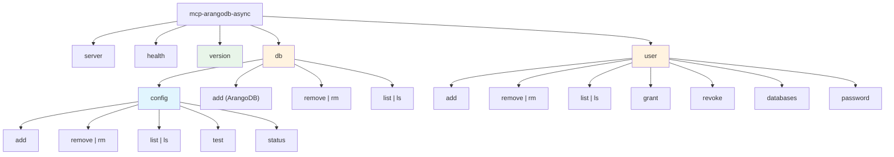

# Admin CLI Design Analysis – v2 (Final Design)

**Project**: mcp-arangodb-async – Model Context Protocol Server for ArangoDB
**Report Date**: 2025-12-03
**Last Updated**: 2025-12-03
**Phase**: Analysis (Code Change Phases, Phase 1)
**Source**: Issue #35 (Scope Analysis & Design) + Stakeholder Feedback (v0→v1→v2)
**Target Milestone**: 4.3 - Admin CLI

---

## Executive Summary

This document specifies the final CLI design for ArangoDB user and database management. The design has been approved through stakeholder review (v0→v1→v2).

**Key Design Decisions**:

1. **Unified `db` command hierarchy** - Config commands at `db config`; ArangoDB operations at `db` root
2. **Atomic operations** via `--with-user` flag for common database+user creation workflow
3. **Comprehensive safety** - `--dry-run` preview + interactive confirmation with `--yes` bypass
4. **Consistent naming** - `add/remove` verbs with Unix-style aliases (`rm`, `ls`)
5. **Standardized result reporting** - All mutating commands display `[CONSEQUENCE_TYPE]` formatted output

---

## Table of Contents

1. [Changelog](#1-changelog)
2. [Command Structure](#2-command-structure)
3. [Result Reporting Format](#3-result-reporting-format)
4. [Safety Features](#4-safety-features)
5. [Complete Command Reference](#5-complete-command-reference)
6. [Implementation Guidance](#6-implementation-guidance)
7. [python-arango API Reference](#7-python-arango-api-reference)

---

## 1. Changelog

### v2 (2025-12-03) – Enhanced Result Reporting

| Change | Description |
|--------|-------------|
| **Standardized result output** | All mutating commands display `[CONSEQUENCE_TYPE]` formatted results with past-tense verbs |
| **Comprehensive feedback** | Operations report all side effects (e.g., affected users when database deleted) |
| **Unified format** | Same format for `--dry-run` preview and actual execution (with `- DRY-RUN` suffix) |
| **Streamlined report** | Removed trade-off analysis; focused on final accepted design |

### v1 (2025-12-03) – Stakeholder Feedback Integration

- Merged `db` and `database` into unified hierarchy
- Replaced `--force` with confirmation prompts + `--yes` bypass
- Expanded `--dry-run` to all mutating commands
- Consistent `add/remove` naming with Unix aliases

### v0 (2025-12-03) – Initial Analysis

- Initial CLI design addressing 4 stakeholder concerns
- Proposed flat command structure with implicit admin mode

---

## 2. Command Structure

### 2.1 Command Hierarchy

```text
mcp-arangodb-async
├── server                              # Existing: MCP server
├── health                              # Existing: Health check
├── version                             # NEW: Display version info
├── db                                  # UNIFIED: Database management
│   ├── config                          # MOVED: YAML configuration management
│   │   ├── add (--dry-run, --yes)
│   │   ├── remove | rm (--dry-run, --yes)
│   │   ├── list | ls
│   │   ├── test
│   │   └── status
│   ├── add (--with-user, --dry-run, --yes)      # NEW: ArangoDB database creation
│   ├── remove | rm (--dry-run, --yes)           # NEW: ArangoDB database deletion
│   └── list | ls [--json]                       # NEW: ArangoDB database listing
└── user                                # NEW: ArangoDB user management
    ├── add (--dry-run, --yes)          # Admin: Create user
    ├── remove | rm (--dry-run, --yes)  # Admin: Delete user
    ├── list | ls [--json]              # Admin: List users
    ├── grant (--dry-run, --yes)        # Admin: Grant permission
    ├── revoke (--dry-run, --yes)       # Admin: Revoke permission
    ├── databases [--json]              # Self-service: List accessible DBs
    └── password (--dry-run, --yes)     # Self-service: Change own password
```

### 2.2 Naming Conventions

| Component | Convention | Example |
|-----------|------------|---------|
| Verbs | `add`, `remove`, `list`, `grant`, `revoke` | `db add mydb` |
| Aliases | Unix-style shortcuts | `rm` for `remove`, `ls` for `list` |
| Flags (read) | `--json` for machine-readable output | `db list --json` |
| Flags (safety) | `--dry-run`, `--yes` | `db remove mydb --dry-run` |

### 2.3 Authentication

| Operation Type | Required Environment Variable |
|----------------|-------------------------------|
| Admin operations (`db add/remove/list`, `user add/remove/list/grant/revoke`) | `ARANGO_ROOT_PASSWORD` |
| Self-service operations (`user databases`, `user password`) | `ARANGO_USER_PASSWORD` |

---

## 3. Result Reporting Format

### 3.1 Standardized Output Template

All mutating commands use consistent `[CONSEQUENCE_TYPE]` format for reporting results:

```text
<command description>:
[<CONSEQUENCE_TYPE>] <detailed result description>
[<CONSEQUENCE_TYPE>] <detailed result description>
...
```

For `--dry-run` mode, append `- DRY-RUN` to each consequence type:

```text
[<CONSEQUENCE_TYPE> - DRY-RUN] <detailed result description>
```

### 3.2 Consequence Type Naming

**Requirement**: Use **past-tense verbs** in uppercase that match the command verb:

| Command Verb | Consequence Type |
|--------------|------------------|
| `add` | `ADDED` |
| `remove` | `REMOVED` |
| `grant` | `GRANTED` |
| `revoke` | `REVOKED` |
| `password` (change) | `UPDATED` |

### 3.4 Example: `db add` with `--with-user`

```bash
$ mcp-arangodb-async db add mydb --with-user myuser --user-password-env MY_PASS --permission rw

The following actions will be performed:
  [ADDED - DRY-RUN] Database 'mydb'
  [ADDED - DRY-RUN] User 'myuser' (active: true)
  [GRANTED - DRY-RUN] Permission rw: myuser → mydb

Are you sure you want to proceed? [y/N]: y

db add:
[ADDED] Database 'mydb'
[ADDED] User 'myuser' (active: true)
[GRANTED] Permission rw: myuser → mydb
```

### 3.5 Example: `db remove` with Side Effects

```bash
$ mcp-arangodb-async db remove mydb

The following actions will be performed:
  [REMOVED - DRY-RUN] Database 'mydb'
  [REVOKED - DRY-RUN] Permission: user1 → mydb
  [REVOKED - DRY-RUN] Permission: user2 → mydb

Are you sure you want to proceed? [y/N]: y

db remove:
[REMOVED] Database 'mydb'
[REVOKED] Permission: user1 → mydb (was: rw)
[REVOKED] Permission: user2 → mydb (was: ro)
```

### 3.6 Example: `--dry-run` Mode

```bash
$ mcp-arangodb-async user add newuser --password-env USER_PASS --dry-run

user add (dry-run):
[ADDED - DRY-RUN] User 'newuser' (active: true)

No changes made. Remove --dry-run to execute.
```

### 3.7 Example: `--yes` Flag (Skip Confirmation)

```bash
$ mcp-arangodb-async user grant myuser mydb --permission rw --yes

user grant:
[GRANTED] Permission rw: myuser → mydb
```

---

## 4. Safety Features

### 4.1 Overview

| Feature | Purpose | Scope |
|---------|---------|-------|
| `--dry-run` | Preview changes without execution | Mutating commands only |
| Interactive confirmation | Require user approval with preview | All mutating commands |
| `--yes` / `-y` | Skip confirmation prompt | All mutating commands |
| `MCP_ARANGODB_ASYNC_CLI_YES=1` | Skip confirmation in CI/CD | All mutating commands |

### 4.2 Mutating vs. Read-Only Commands

**Mutating Commands** (require `--dry-run` and confirmation support):

- `db add`, `db remove`
- `db config add`, `db config remove`
- `user add`, `user remove`, `user grant`, `user revoke`, `user password`

**Read-Only Commands** (no safety features needed):

- `db list`, `db config list`, `db config status`, `db config test`
- `user list`, `user databases`
- `version`, `health`

### 4.3 Confirmation Flow

```text
┌─────────────────────────────────────────────────────────────┐
│ User runs mutating command                                  │
└─────────────────────────────────────────────────────────────┘
                              │
                              ▼
                    ┌─────────────────┐
                    │ --dry-run set?  │──Yes──▶ Display preview
                    └─────────────────┘         with [*- DRY-RUN]
                              │ No              Exit (no changes)
                              ▼
                    ┌─────────────────┐
                    │ --yes flag set? │──Yes──▶ Execute operation
                    └─────────────────┘         Display results
                              │ No
                              ▼
                    ┌─────────────────┐
                    │ Env var set?    │──Yes──▶ Execute operation
                    │ (CLI_YES=1)     │         Display results
                    └─────────────────┘
                              │ No
                              ▼
                    ┌─────────────────┐
                    │ Display preview │
                    │ Prompt [y/N]    │
                    └─────────────────┘
                              │
              ┌───────────────┴───────────────┐
              │ y                             │ N/other
              ▼                               ▼
      Execute operation                Exit code 2
      Display results                  (cancelled)
```

### 4.4 Exit Codes

| Code | Meaning |
|------|---------|
| 0 | Success (or dry-run completed) |
| 1 | Error (validation, connection, permission) |
| 2 | Operation cancelled by user |

---

## 5. Complete Command Reference

### 5.1 Command Hierarchy Diagram



**Legend**:

- 🔵 Blue (`db config`): YAML config file management
- 🟠 Orange (`db`, `user`): ArangoDB admin operations
- 🟢 Green (`version`): Utility command

### 5.2 `version` Command

```bash
$ mcp-arangodb-async version
mcp-arangodb-async version 0.4.7
Python 3.11.5
```

### 5.3 `db` Commands – ArangoDB Database Operations

**Requires**: `ARANGO_ROOT_PASSWORD` environment variable

| Command | Aliases | Syntax |
|---------|---------|--------|
| `add` | - | `db add <name> [--with-user <user>] [--user-password-env VAR] [--permission rw\|ro] [--dry-run] [--yes]` |
| `remove` | `rm` | `db remove <name> [--dry-run] [--yes]` |
| `list` | `ls` | `db list [--json]` |

**Example with result reporting**:

```bash
$ mcp-arangodb-async db add projectdb --with-user devuser --user-password-env DEV_PASS --permission rw --yes

db add:
[ADDED] Database 'projectdb'
[ADDED] User 'devuser' (active: true)
[GRANTED] Permission rw: devuser → projectdb
```

### 5.4 `db config` Commands – YAML Configuration Management

| Command | Aliases | Syntax |
|---------|---------|--------|
| `add` | - | `db config add <key> --url --database --username --password-env [--timeout] [--description] [--config-path] [--dry-run] [--yes]` |
| `remove` | `rm` | `db config remove <key> [--config-path] [--dry-run] [--yes]` |
| `list` | `ls` | `db config list [--config-path]` |
| `test` | - | `db config test <key> [--config-path]` |
| `status` | - | `db config status [--config-path]` |

**Example with result reporting**:

```bash
$ mcp-arangodb-async db config add production --url http://prod:8529 --database app --username reader --password-env PROD_PASS --yes

db config add:
[ADDED] Configuration 'production' → http://prod:8529/app
```

### 5.5 `user` Commands – Admin Operations

**Requires**: `ARANGO_ROOT_PASSWORD` environment variable

| Command | Aliases | Syntax |
|---------|---------|--------|
| `add` | - | `user add <username> --password-env VAR [--active] [--dry-run] [--yes]` |
| `remove` | `rm` | `user remove <username> [--dry-run] [--yes]` |
| `list` | `ls` | `user list [--json]` |
| `grant` | - | `user grant <username> <database> [--permission rw\|ro\|none] [--dry-run] [--yes]` |
| `revoke` | - | `user revoke <username> <database> [--dry-run] [--yes]` |

**Example – user add**:

```bash
$ mcp-arangodb-async user add analyst --password-env ANALYST_PASS --yes

user add:
[ADDED] User 'analyst' (active: true)
```

**Example – user remove with side effects**:

```bash
$ mcp-arangodb-async user remove analyst --yes

user remove:
[REMOVED] User 'analyst'
[REVOKED] Permission: analyst → projectdb (was: ro)
[REVOKED] Permission: analyst → reportdb (was: rw)
```

**Example – user grant**:

```bash
$ mcp-arangodb-async user grant analyst reportdb --permission ro --yes

user grant:
[GRANTED] Permission ro: analyst → reportdb
```

**Example – user revoke**:

```bash
$ mcp-arangodb-async user revoke analyst reportdb --yes

user revoke:
[REVOKED] Permission: analyst → reportdb (was: ro)
```

### 5.6 `user` Commands – Self-Service Operations

**Requires**: `ARANGO_USER_PASSWORD` environment variable (user's own password)

| Command | Aliases | Syntax |
|---------|---------|--------|
| `databases` | - | `user databases [--json]` |
| `password` | - | `user password --new-password-env VAR [--dry-run] [--yes]` |

**Example – password change**:

```bash
$ mcp-arangodb-async user password --new-password-env NEW_PASS --yes

user password:
[UPDATED] Password for current user
```

---

## 6. Implementation Guidance

### 6.1 Result Reporter Utility

```python
# mcp_arangodb_async/cli_utils.py
from dataclasses import dataclass
from enum import Enum
from typing import Optional

class ConsequenceType(Enum):
    """Standardized consequence types matching command verbs."""
    ADDED = "ADDED"
    REMOVED = "REMOVED"
    GRANTED = "GRANTED"
    REVOKED = "REVOKED"
    UPDATED = "UPDATED"

@dataclass
class Consequence:
    """A single operation consequence for reporting."""
    type: ConsequenceType
    description: str
    detail: Optional[str] = None  # e.g., "(was: rw)" for revoked permissions

    def format(self, dry_run: bool = False) -> str:
        """Format consequence for display."""
        suffix = " - DRY-RUN" if dry_run else ""
        detail_str = f" {self.detail}" if self.detail else ""
        return f"[{self.type.value}{suffix}] {self.description}{detail_str}"

class ResultReporter:
    """Collects and reports operation consequences."""

    def __init__(self, command_name: str, dry_run: bool = False):
        self.command_name = command_name
        self.dry_run = dry_run
        self.consequences: list[Consequence] = []

    def add(self, type: ConsequenceType, description: str, detail: str = None) -> None:
        """Record a consequence."""
        self.consequences.append(Consequence(type, description, detail))

    def report(self) -> None:
        """Print formatted results."""
        mode = " (dry-run)" if self.dry_run else ""
        print(f"\n{self.command_name}{mode}:")
        for consequence in self.consequences:
            print(consequence.format(self.dry_run))
        if self.dry_run:
            print("\nNo changes made. Remove --dry-run to execute.")

    def get_preview_lines(self) -> list[str]:
        """Get preview lines for confirmation prompt."""
        return [c.format(dry_run=True) for c in self.consequences]
```

### 6.2 Integration with Confirmation Flow

```python
def handle_db_add(args) -> int:
    """Handle db add command with result reporting."""
    reporter = ResultReporter("db add", dry_run=args.dry_run)

    # Collect planned actions
    reporter.add(ConsequenceType.ADDED, f"Database '{args.name}'")
    if args.with_user:
        reporter.add(ConsequenceType.ADDED, f"User '{args.with_user}' (active: true)")
        reporter.add(ConsequenceType.GRANTED,
                     f"Permission {args.permission}: {args.with_user} → {args.name}")

    # Handle dry-run
    if args.dry_run:
        reporter.report()
        return 0

    # Confirm with preview
    if not confirm_action(reporter.get_preview_lines(), args.yes):
        print("Operation cancelled.")
        return 2

    # Execute operations
    sys_db = get_system_db_connection()
    sys_db.create_database(args.name)
    if args.with_user:
        password = os.getenv(args.user_password_env)
        sys_db.create_user(args.with_user, password, active=True)
        sys_db.update_permission(args.with_user, args.permission, args.name)

    # Report results
    reporter.report()
    return 0
```

### 6.3 Confirmation Utility (Updated)

```python
ENV_VAR_YES = "MCP_ARANGODB_ASYNC_CLI_YES"

def confirm_action(
    preview_lines: list[str],
    yes_flag: bool = False,
    prompt: str = "Are you sure you want to proceed?"
) -> bool:
    """Display preview and prompt for confirmation."""
    # Check --yes flag
    if yes_flag:
        return True

    # Check environment variable
    if os.getenv(ENV_VAR_YES, "").lower() in ("1", "true", "yes"):
        return True

    # Display preview
    print("\nThe following actions will be performed:")
    for line in preview_lines:
        print(f"  {line}")
    print()

    # Check if interactive terminal
    if not sys.stdin.isatty():
        print(f"Error: Non-interactive terminal. Use --yes flag or set "
              f"{ENV_VAR_YES}=1 to bypass confirmation.")
        return False

    # Prompt for confirmation
    try:
        response = input(f"{prompt} [y/N]: ").strip().lower()
        return response in ("y", "yes")
    except (EOFError, KeyboardInterrupt):
        print("\nOperation cancelled.")
        return False
```

### 6.4 Connection Pattern

```python
import os
from arango import ArangoClient
from arango.database import StandardDatabase

def get_system_db_connection() -> StandardDatabase:
    """Connect to _system database as root for admin operations."""
    client = ArangoClient(hosts=os.getenv("ARANGO_URL", "http://localhost:8529"))
    root_password = os.getenv("ARANGO_ROOT_PASSWORD")
    if not root_password:
        raise ValueError("ARANGO_ROOT_PASSWORD environment variable required")
    return client.db("_system", username="root", password=root_password)
```

### 6.5 Alias Registration Pattern

```python
# In __main__.py - Argparse alias pattern
def setup_db_subparsers(db_parser: argparse.ArgumentParser) -> None:
    """Configure db command with ArangoDB operations and config namespace."""
    subparsers = db_parser.add_subparsers(dest="db_command")

    # db config namespace
    config_parser = subparsers.add_parser("config", help="YAML configuration management")

    # db add
    add_parser = subparsers.add_parser("add", help="Create ArangoDB database")
    add_parser.add_argument("name", help="Database name")
    add_parser.add_argument("--with-user", help="Create user with database access")
    add_parser.add_argument("--user-password-env", help="Env var containing user password")
    add_parser.add_argument("--permission", choices=["rw", "ro"], default="rw")
    add_parser.add_argument("--dry-run", action="store_true", help="Preview changes")
    add_parser.add_argument("--yes", "-y", action="store_true", help="Skip confirmation")

    # db remove with alias
    remove_parser = subparsers.add_parser("remove", aliases=["rm"],
                                          help="Delete ArangoDB database")
    remove_parser.add_argument("name", help="Database name")
    remove_parser.add_argument("--dry-run", action="store_true")
    remove_parser.add_argument("--yes", "-y", action="store_true")

    # db list with alias
    list_parser = subparsers.add_parser("list", aliases=["ls"],
                                         help="List ArangoDB databases")
    list_parser.add_argument("--json", action="store_true", help="JSON output")
```

### 6.6 File Organization

```text
mcp_arangodb_async/
├── __main__.py          # CLI entry point (extend with db/user commands)
├── cli_db.py            # MOVED: config file management → db config
├── cli_db_arango.py     # NEW: ArangoDB database CRUD (db add/remove/list)
├── cli_user.py          # NEW: ArangoDB user management
└── cli_utils.py         # NEW: Shared utilities (ResultReporter, confirm_action)
```

---

## 7. python-arango API Reference

### 7.1 Database Operations (via `sys_db`)

| Operation | python-arango Method | Notes |
|-----------|---------------------|-------|
| Create | `sys_db.create_database(name, users=[...])` | Can include initial users |
| Delete | `sys_db.delete_database(name)` | No cascade - users remain |
| List | `sys_db.databases()` | Returns list of names |
| Check | `sys_db.has_database(name)` | Returns bool |

### 7.2 User Operations (via `sys_db`)

| Operation | python-arango Method | Notes |
|-----------|---------------------|-------|
| Create | `sys_db.create_user(username, password, active, extra)` | |
| Delete | `sys_db.delete_user(username)` | |
| List | `sys_db.users()` | Returns list of user dicts |
| Check | `sys_db.has_user(username)` | Returns bool |
| Update | `sys_db.update_user(username, password, active)` | For password change |

### 7.3 Permission Operations (via `sys_db`)

| Operation | python-arango Method | Notes |
|-----------|---------------------|-------|
| Grant | `sys_db.update_permission(username, permission, database)` | permission: `rw`, `ro`, `none` |
| Revoke | `sys_db.reset_permission(username, database)` | Removes access |
| List | `sys_db.permissions(username)` | Returns permission dict |

---

## 8. Success Criteria Verification

| Criterion | Status | Evidence |
|-----------|--------|----------|
| Standardized result output | ✅ | Section 3: `[CONSEQUENCE_TYPE]` format |
| Comprehensive feedback | ✅ | Section 3.3: Side effects reported |
| Unified format for dry-run/execute | ✅ | Sections 3.4-3.7: Same format with `- DRY-RUN` suffix |
| Result reporting utility | ✅ | Section 6.1: `ResultReporter` class |
| All command examples updated | ✅ | Section 5: Every mutating command shows format |
| Trade-off analysis removed | ✅ | Streamlined for final design |

---

**Report Version**: v2 (Final Design)
**Status**: Ready for Implementation
**Next Steps**: Proceed to Task 4.3.2 (Test Suite Development)
