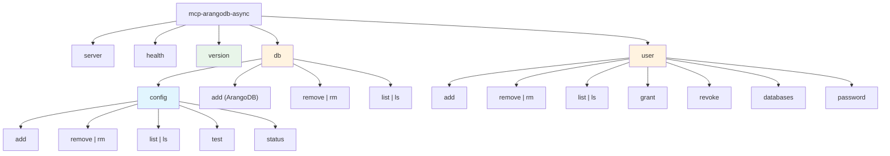

# Admin CLI Design Analysis – v4 (Final Design)

**Project**: mcp-arangodb-async – Model Context Protocol Server for ArangoDB
**Report Date**: 2025-12-03
**Last Updated**: 2025-12-03
**Phase**: Analysis (Code Change Phases, Phase 1)
**Source**: Issue #35 (Scope Analysis & Design) + Stakeholder Feedback (v0→v1→v2→v3→v4)
**Target Milestone**: 4.3 - Admin CLI

---

## Executive Summary

This document specifies the final CLI design for ArangoDB user and database management. The design has been approved through stakeholder review (v0→v1→v2→v3→v4).

**Key Design Decisions**:

1. **Unified `db` command hierarchy** - Config commands at `db config`; ArangoDB operations at `db` root
2. **Atomic operations** via `--with-user` flag for common database+user creation workflow
3. **Comprehensive safety** - `--dry-run` preview + interactive confirmation with `--yes` bypass
4. **Consistent naming** - `add/remove` verbs with Unix-style aliases (`rm`, `ls`)
5. **Standardized result reporting** - Color-coded `[CONSEQUENCE_TYPE]` formatted output with tense distinction
6. **Flexible credential handling** - Industry-standard `--env-file` support with optional variable name overrides

---

## Table of Contents

1. [Changelog](#1-changelog)
2. [Command Structure](#2-command-structure)
3. [Result Reporting Format](#3-result-reporting-format)
4. [Safety Features](#4-safety-features)
5. [Complete Command Reference](#5-complete-command-reference)
6. [Implementation Guidance](#6-implementation-guidance)
7. [python-arango API Reference](#7-python-arango-api-reference)

---

## 1. Changelog

### v4 (2025-12-03) – Color-Coded Result Reporting & Tense Distinction

| Change | Description |
|--------|-------------|
| **Added color coding** | Green for additive actions, red for destructive, yellow for updates, gray for dry-run suffix |
| **Tense-based distinction** | Present tense `[ADD]` for confirmation prompts; past tense `[ADDED]` for execution results |
| **Darker color variants** | Confirmation prompts use darker/dimmed colors to indicate pending (not yet executed) state |
| **Clarified command hierarchy** | Added note that argument lists in Section 2.1 are illustrative; full specs in Section 5 |

### v3 (2025-12-03) – Credential Handling Standardization

| Change | Description |
|--------|-------------|
| **Added `--env-file` option** | Industry-standard dotenv file loading for all credential-requiring commands |
| **Standardized env var names** | Aligned with MCP server: `ARANGO_ROOT_PASSWORD`, `ARANGO_URL`, `ARANGO_DB`, `ARANGO_USERNAME`, `ARANGO_PASSWORD` |
| **Renamed CLI arguments** | Changed `--password-env`/`--user-password-env` to `--arango-root-password-env`/`--arango-password-env` |
| **Clarified credential workflow** | Documented flexible credential loading via `--env-file` or global environment |
| **Streamlined implementation section** | Removed detailed code; kept only illustrative pseudo-code |

### v2 (2025-12-03) – Enhanced Result Reporting

| Change | Description |
|--------|-------------|
| **Standardized result output** | All mutating commands display `[CONSEQUENCE_TYPE]` formatted results with past-tense verbs |
| **Comprehensive feedback** | Operations report all side effects (e.g., affected users when database deleted) |
| **Unified format** | Same format for `--dry-run` preview and actual execution (with `- DRY-RUN` suffix) |
| **Streamlined report** | Removed trade-off analysis; focused on final accepted design |

### v1 (2025-12-03) – Stakeholder Feedback Integration

- Merged `db` and `database` into unified hierarchy
- Replaced `--force` with confirmation prompts + `--yes` bypass
- Expanded `--dry-run` to all mutating commands
- Consistent `add/remove` naming with Unix aliases

### v0 (2025-12-03) – Initial Analysis

- Initial CLI design addressing 4 stakeholder concerns
- Proposed flat command structure with implicit admin mode

---

## 2. Command Structure

### 2.1 Command Hierarchy

```text
mcp-arangodb-async
├── server                              # Existing: MCP server
├── health                              # Existing: Health check
├── version                             # NEW: Display version info
├── db                                  # UNIFIED: Database management
│   ├── config                          # MOVED: YAML configuration management
│   │   ├── add (--dry-run, --yes)
│   │   ├── remove | rm (--dry-run, --yes)
│   │   ├── list | ls
│   │   ├── test
│   │   └── status
│   ├── add (--with-user, --env-file, --dry-run, --yes)   # NEW: ArangoDB database creation
│   ├── remove | rm (--env-file, --dry-run, --yes)        # NEW: ArangoDB database deletion
│   └── list | ls [--env-file] [--json]                   # NEW: ArangoDB database listing
└── user                                # NEW: ArangoDB user management
    ├── add (--env-file, --dry-run, --yes)          # Admin: Create user
    ├── remove | rm (--env-file, --dry-run, --yes)  # Admin: Delete user
    ├── list | ls [--env-file] [--json]             # Admin: List users
    ├── grant (--env-file, --dry-run, --yes)        # Admin: Grant permission
    ├── revoke (--env-file, --dry-run, --yes)       # Admin: Revoke permission
    ├── databases [--env-file] [--json]             # Self-service: List accessible DBs
    └── password (--env-file, --dry-run, --yes)     # Self-service: Change own password
```

> **Note**: The argument lists shown above are illustrative and highlight key options. For complete command specifications with all available arguments, see [Section 5: Complete Command Reference](#5-complete-command-reference).

### 2.2 Naming Conventions

| Component | Convention | Example |
|-----------|------------|---------|
| Verbs | `add`, `remove`, `list`, `grant`, `revoke` | `db add mydb` |
| Aliases | Unix-style shortcuts | `rm` for `remove`, `ls` for `list` |
| Flags (read) | `--json` for machine-readable output | `db list --json` |
| Flags (safety) | `--dry-run`, `--yes` | `db remove mydb --dry-run` |
| Flags (auth) | `--env-file`, `--arango-*-env` | `--env-file .env` |

### 2.3 Authentication & Credential Handling

#### 2.3.1 Standardized Environment Variable Names

All commands use the same environment variable names as the MCP server:

| Variable | Purpose |
|----------|---------|
| `ARANGO_ROOT_PASSWORD` | Root user password for admin operations |
| `ARANGO_URL` | ArangoDB server URL (default: `http://localhost:8529`) |
| `ARANGO_DB` | Default database name |
| `ARANGO_USERNAME` | Non-root username for self-service operations |
| `ARANGO_PASSWORD` | Non-root user password for self-service operations |

#### 2.3.2 Credential Loading Options

Credentials can be provided via two mechanisms (in order of precedence):

1. **Dotenv file** (recommended): Use `--env-file <path>` to load credentials from a dotenv file
2. **Global environment**: Export variables in your shell or CI/CD environment

#### 2.3.3 Optional Variable Name Overrides

For non-standard setups, override the default variable names:

| Override Argument | Default Variable | Purpose |
|-------------------|------------------|---------|
| `--arango-root-password-env <var>` | `ARANGO_ROOT_PASSWORD` | Custom root password variable name |
| `--arango-password-env <var>` | `ARANGO_PASSWORD` | Custom user password variable name |

#### 2.3.4 Credential Requirements by Operation Type

| Operation Type | Required Credentials |
|----------------|---------------------|
| Admin operations (`db add/remove/list`, `user add/remove/list/grant/revoke`) | Root password (`ARANGO_ROOT_PASSWORD` or override) |
| Self-service operations (`user databases`, `user password`) | User password (`ARANGO_PASSWORD` or override) |

---

## 3. Result Reporting Format

### 3.1 Standardized Output Template

All mutating commands use consistent `[CONSEQUENCE_TYPE]` format for reporting results:

```text
<command description>:
[<CONSEQUENCE_TYPE>] <detailed result description>
[<CONSEQUENCE_TYPE>] <detailed result description>
...
```

### 3.2 Color Scheme

Consequence types are color-coded to improve readability and quickly convey the nature of each action:

| Color | Consequence Types | Semantic Meaning |
|-------|-------------------|------------------|
| **Green** | `ADD`, `ADDED`, `CREATE`, `CREATED`, `GRANT`, `GRANTED` | Additive/constructive actions |
| **Red** | `REMOVE`, `REMOVED`, `REVOKE`, `REVOKED` | Destructive actions |
| **Yellow** | `UPDATE`, `UPDATED` | Modification actions |
| **Gray** | `- DRY-RUN` suffix | Indicates simulated (not executed) |

**Color Intensity by Context**:

| Context | Color Intensity | Purpose |
|---------|-----------------|---------|
| Confirmation prompts (pending actions) | Darker/dimmed variants | Visually indicate "not yet executed" |
| Execution results (completed actions) | Bright/standard variants | Indicate completed operations |
| Dry-run output | Standard + gray suffix | Simulated preview |

### 3.3 Consequence Type Naming

Consequence types use **tense** to distinguish between pending and completed actions:

| Command Verb | Confirmation Prompt (Present) | Execution Result (Past) | Dry-Run Output |
|--------------|-------------------------------|-------------------------|----------------|
| `add` | `[ADD]` | `[ADDED]` | `[ADDED - DRY-RUN]` |
| `remove` | `[REMOVE]` | `[REMOVED]` | `[REMOVED - DRY-RUN]` |
| `grant` | `[GRANT]` | `[GRANTED]` | `[GRANTED - DRY-RUN]` |
| `revoke` | `[REVOKE]` | `[REVOKED]` | `[REVOKED - DRY-RUN]` |
| `password` (change) | `[UPDATE]` | `[UPDATED]` | `[UPDATED - DRY-RUN]` |

### 3.4 Example: `db add` with `--with-user`

```bash
$ mcp-arangodb-async db add mydb --with-user myuser --env-file .env --permission rw

The following actions will be performed:
  [ADD] Database 'mydb'                      # Present tense, darker green
  [ADD] User 'myuser' (active: true)         # Present tense, darker green
  [GRANT] Permission rw: myuser → mydb       # Present tense, darker green

Are you sure you want to proceed? [y/N]: y

db add:
[ADDED] Database 'mydb'                      # Past tense, bright green
[ADDED] User 'myuser' (active: true)         # Past tense, bright green
[GRANTED] Permission rw: myuser → mydb       # Past tense, bright green
```

### 3.5 Example: `db remove` with Side Effects

```bash
$ mcp-arangodb-async db remove mydb --env-file .env

The following actions will be performed:
  [REMOVE] Database 'mydb'                   # Present tense, darker red
  [REVOKE] Permission: user1 → mydb          # Present tense, darker red
  [REVOKE] Permission: user2 → mydb          # Present tense, darker red

Are you sure you want to proceed? [y/N]: y

db remove:
[REMOVED] Database 'mydb'                    # Past tense, bright red
[REVOKED] Permission: user1 → mydb (was: rw) # Past tense, bright red
[REVOKED] Permission: user2 → mydb (was: ro) # Past tense, bright red
```

### 3.6 Example: `--dry-run` Mode

```bash
$ mcp-arangodb-async user add newuser --env-file .env --dry-run

user add (dry-run):
[ADDED - DRY-RUN] User 'newuser' (active: true)   # Past tense + gray suffix

No changes made. Remove --dry-run to execute.
```

### 3.7 Example: `--yes` Flag (Skip Confirmation)

```bash
$ mcp-arangodb-async user grant myuser mydb --env-file .env --permission rw --yes

user grant:
[GRANTED] Permission rw: myuser → mydb       # Past tense, bright green (no prompt shown)
```

---

## 4. Safety Features

### 4.1 Overview

| Feature | Purpose | Scope |
|---------|---------|-------|
| `--dry-run` | Preview changes without execution | Mutating commands only |
| Interactive confirmation | Require user approval with preview | All mutating commands |
| `--yes` / `-y` | Skip confirmation prompt | All mutating commands |
| `MCP_ARANGODB_ASYNC_CLI_YES=1` | Skip confirmation in CI/CD | All mutating commands |

### 4.2 Mutating vs. Read-Only Commands

**Mutating Commands** (require `--dry-run` and confirmation support):

- `db add`, `db remove`
- `db config add`, `db config remove`
- `user add`, `user remove`, `user grant`, `user revoke`, `user password`

**Read-Only Commands** (no safety features needed):

- `db list`, `db config list`, `db config status`, `db config test`
- `user list`, `user databases`
- `version`, `health`

### 4.3 Confirmation Flow

```text
┌─────────────────────────────────────────────────────────────┐
│ User runs mutating command                                  │
└─────────────────────────────────────────────────────────────┘
                              │
                              ▼
                    ┌─────────────────┐
                    │ --dry-run set?  │──Yes──▶ Display preview
                    └─────────────────┘         with [PAST - DRY-RUN]
                              │ No              Exit (no changes)
                              ▼
                    ┌─────────────────┐
                    │ --yes flag set? │──Yes──▶ Execute operation
                    └─────────────────┘         Display [PAST] results
                              │ No
                              ▼
                    ┌─────────────────┐
                    │ Env var set?    │──Yes──▶ Execute operation
                    │ (CLI_YES=1)     │         Display [PAST] results
                    └─────────────────┘
                              │ No
                              ▼
                    ┌─────────────────┐
                    │ Display preview │
                    │ with [PRESENT]  │
                    │ Prompt [y/N]    │
                    └─────────────────┘
                              │
              ┌───────────────┴───────────────┐
              │ y                             │ N/other
              ▼                               ▼
      Execute operation                Exit code 2
      Display [PAST] results           (cancelled)
```

### 4.4 Exit Codes

| Code | Meaning |
|------|---------|
| 0 | Success (or dry-run completed) |
| 1 | Error (validation, connection, permission) |
| 2 | Operation cancelled by user |

---

## 5. Complete Command Reference

### 5.1 Command Hierarchy Diagram



**Legend**:

- 🔵 Blue (`db config`): YAML config file management
- 🟠 Orange (`db`, `user`): ArangoDB admin operations
- 🟢 Green (`version`): Utility command

### 5.2 `version` Command

```bash
$ mcp-arangodb-async version
mcp-arangodb-async version 0.4.7
Python 3.11.5
```

### 5.3 `db` Commands – ArangoDB Database Operations

| Command | Aliases | Syntax |
|---------|---------|--------|
| `add` | - | `db add <name> [--with-user <username>] [--env-file <path>] [--arango-root-password-env <var>] [--arango-password-env <var>] [--permission rw\|ro\|none] [--dry-run] [--yes]` |
| `remove` | `rm` | `db remove <name> [--env-file <path>] [--arango-root-password-env <var>] [--dry-run] [--yes]` |
| `list` | `ls` | `db list [--env-file <path>] [--arango-root-password-env <var>] [--json]` |

**Example with result reporting**:

```bash
$ mcp-arangodb-async db add projectdb --with-user devuser --env-file .env --permission rw --yes

db add:
[ADDED] Database 'projectdb'
[ADDED] User 'devuser' (active: true)
[GRANTED] Permission rw: devuser → projectdb
```

### 5.4 `db config` Commands – YAML Configuration Management

| Command | Aliases | Syntax |
|---------|---------|--------|
| `add` | - | `db config add <key> --url --database --username --password-env [--timeout] [--description] [--config-path] [--dry-run] [--yes]` |
| `remove` | `rm` | `db config remove <key> [--config-path] [--dry-run] [--yes]` |
| `list` | `ls` | `db config list [--config-path]` |
| `test` | - | `db config test <key> [--config-path]` |
| `status` | - | `db config status [--config-path]` |

**Example with result reporting**:

```bash
$ mcp-arangodb-async db config add production --url http://prod:8529 --database app --username reader --password-env PROD_PASS --yes

db config add:
[ADDED] Configuration 'production' → http://prod:8529/app
```

### 5.5 `user` Commands – Admin Operations

| Command | Aliases | Syntax |
|---------|---------|--------|
| `add` | - | `user add <username> [--env-file <path>] [--arango-root-password-env <var>] [--arango-password-env <var>] [--active] [--dry-run] [--yes]` |
| `remove` | `rm` | `user remove <username> [--env-file <path>] [--arango-root-password-env <var>] [--dry-run] [--yes]` |
| `list` | `ls` | `user list [--env-file <path>] [--arango-root-password-env <var>] [--json]` |
| `grant` | - | `user grant <username> <database> [--env-file <path>] [--arango-root-password-env <var>] [--permission rw\|ro\|none] [--dry-run] [--yes]` |
| `revoke` | - | `user revoke <username> <database> [--env-file <path>] [--arango-root-password-env <var>] [--dry-run] [--yes]` |

**Example – user add**:

```bash
$ mcp-arangodb-async user add analyst --env-file .env --yes

user add:
[ADDED] User 'analyst' (active: true)
```

**Example – user remove with side effects**:

```bash
$ mcp-arangodb-async user remove analyst --env-file .env --yes

user remove:
[REMOVED] User 'analyst'
[REVOKED] Permission: analyst → projectdb (was: ro)
[REVOKED] Permission: analyst → reportdb (was: rw)
```

**Example – user grant**:

```bash
$ mcp-arangodb-async user grant analyst reportdb --env-file .env --permission ro --yes

user grant:
[GRANTED] Permission ro: analyst → reportdb
```

**Example – user revoke**:

```bash
$ mcp-arangodb-async user revoke analyst reportdb --env-file .env --yes

user revoke:
[REVOKED] Permission: analyst → reportdb (was: ro)
```

### 5.6 `user` Commands – Self-Service Operations

| Command | Aliases | Syntax |
|---------|---------|--------|
| `databases` | - | `user databases [--env-file <path>] [--arango-password-env <var>] [--json]` |
| `password` | - | `user password [--env-file <path>] [--arango-password-env <var>] [--new-password-env <var>] [--dry-run] [--yes]` |

**Example – password change**:

```bash
$ mcp-arangodb-async user password --env-file .env --new-password-env NEW_PASS --yes

user password:
[UPDATED] Password for current user
```

---

## 6. Implementation Guidance

### 6.1 Credential Loading Pattern

The CLI loads credentials in this order:

1. Load variables from `--env-file` if provided (using `python-dotenv` or equivalent)
2. Check for globally exported environment variables
3. Use override arguments (`--arango-root-password-env`, `--arango-password-env`) to specify non-standard variable names

**Pseudo-code**:

```python
def load_credentials(args):
    # 1. Load from dotenv file if specified
    if args.env_file:
        load_dotenv(args.env_file)

    # 2. Determine variable names (use overrides or defaults)
    root_pw_var = args.arango_root_password_env or "ARANGO_ROOT_PASSWORD"
    user_pw_var = args.arango_password_env or "ARANGO_PASSWORD"

    # 3. Retrieve values from environment
    return {
        "root_password": os.getenv(root_pw_var),
        "user_password": os.getenv(user_pw_var),
        "url": os.getenv("ARANGO_URL", "http://localhost:8529"),
    }
```

### 6.2 Result Reporter Pattern

All mutating commands collect consequences and report them with appropriate tense and color:

```python
# Pseudo-code for consistent result reporting with color and tense
reporter = ResultReporter("db add", dry_run=args.dry_run)
reporter.add(ADD, f"Database '{name}'")       # Present tense for prompts
if with_user:
    reporter.add(ADD, f"User '{user}' (active: true)")
    reporter.add(GRANT, f"Permission {perm}: {user} → {name}")

if args.dry_run:
    reporter.report_dry_run()   # Shows [ADDED - DRY-RUN] in green + gray
elif confirm_with_user():
    execute_operations()
    reporter.report_executed()  # Shows [ADDED] in bright green
```

### 6.3 File Organization

```text
mcp_arangodb_async/
├── __main__.py          # CLI entry point (extend with db/user commands)
├── cli_db.py            # MOVED: config file management → db config
├── cli_db_arango.py     # NEW: ArangoDB database CRUD (db add/remove/list)
├── cli_user.py          # NEW: ArangoDB user management
└── cli_utils.py         # NEW: Shared utilities (credential loading, result reporting, confirmation)
```

---

## 7. python-arango API Reference

### 7.1 Database Operations (via `sys_db`)

| Operation | python-arango Method | Notes |
|-----------|---------------------|-------|
| Create | `sys_db.create_database(name, users=[...])` | Can include initial users |
| Delete | `sys_db.delete_database(name)` | No cascade - users remain |
| List | `sys_db.databases()` | Returns list of names |
| Check | `sys_db.has_database(name)` | Returns bool |

### 7.2 User Operations (via `sys_db`)

| Operation | python-arango Method | Notes |
|-----------|---------------------|-------|
| Create | `sys_db.create_user(username, password, active, extra)` | |
| Delete | `sys_db.delete_user(username)` | |
| List | `sys_db.users()` | Returns list of user dicts |
| Check | `sys_db.has_user(username)` | Returns bool |
| Update | `sys_db.update_user(username, password, active)` | For password change |

### 7.3 Permission Operations (via `sys_db`)

| Operation | python-arango Method | Notes |
|-----------|---------------------|-------|
| Grant | `sys_db.update_permission(username, permission, database)` | permission: `rw`, `ro`, `none` |
| Revoke | `sys_db.reset_permission(username, database)` | Removes access |
| List | `sys_db.permissions(username)` | Returns permission dict |

---

## 8. Success Criteria Verification

| Criterion | Status | Evidence |
|-----------|--------|----------|
| Standardized result output | ✅ | Section 3: `[CONSEQUENCE_TYPE]` format |
| Color-coded consequences | ✅ | Section 3.2: Green/red/yellow/gray scheme |
| Tense-based distinction | ✅ | Section 3.3: Present for prompts, past for results |
| Comprehensive feedback | ✅ | Section 3.5: Side effects reported |
| Unified format for dry-run/execute | ✅ | Sections 3.4-3.7: Consistent format across contexts |
| Flexible credential handling | ✅ | Section 2.3: `--env-file` + override arguments |
| Consistent env var naming | ✅ | Section 2.3.1: Aligned with MCP server variables |
| All command signatures updated | ✅ | Section 5: Every command shows auth options |
| Implementation guidance streamlined | ✅ | Section 6: Pseudo-code only, no detailed implementation |
| Command hierarchy clarification | ✅ | Section 2.1: Note directing to Section 5 for full specs |

---

**Report Version**: v4 (Final Design)
**Status**: Ready for Implementation
**Next Steps**: Proceed to Task 4.3.2 (Test Suite Development)
