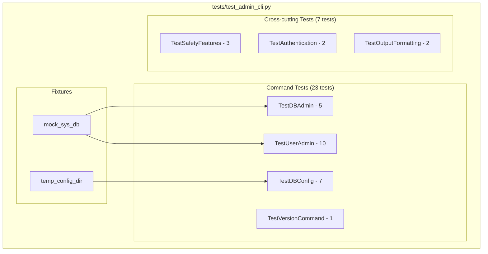

# Admin CLI Test Definition Report

| Attribute | Value |
|-----------|-------|
| **Report ID** | 01-test_definition |
| **Version** | v1 |
| **Date** | 2025-12-03 |
| **Author** | Augment Agent |
| **Status** | Revised - Stakeholder Feedback Incorporated |
| **Related Issue** | [#36 - Task 4.3.2: Test Suite Development](https://github.com/LittleCoinCoin/mcp-arangodb-async/issues/36) |
| **Prerequisite** | [00-cli_design_analysis_v4.md](./00-cli_design_analysis_v4.md) |
| **Supersedes** | [01-test_definition_v0.md](./01-test_definition_v0.md) |

## Changelog

| Version | Date | Changes |
|---------|------|---------|
| v0 | 2025-12-03 | Initial draft - 110 tests across 20 classes |
| v1 | 2025-12-03 | Major revision per stakeholder feedback: reduced to 30 tests (73% reduction), added test prioritization justification, simplified descriptions to pseudo-code, added coverage analysis, applied testing.instructions.md standards |

---

## Table of Contents

1. [Executive Summary](#1-executive-summary)
2. [Test Prioritization and Justification](#2-test-prioritization-and-justification)
3. [Coverage Analysis](#3-coverage-analysis)
4. [Test Scope and Objectives](#4-test-scope-and-objectives)
5. [Test Architecture](#5-test-architecture)
6. [Test Case Specifications](#6-test-case-specifications)
7. [Fixtures and Mock Strategy](#7-fixtures-and-mock-strategy)
8. [Dependencies and Setup](#8-dependencies-and-setup)
9. [Appendices](#9-appendices)

---

## 1. Executive Summary

### 1.1 Purpose

This document defines the test suite for the Admin CLI implementation (Task 4.3.2). It specifies test cases that validate **our implementation**, not framework or library behavior, following the principles in `testing.instructions.md`.

### 1.2 Revision Summary

| Metric | v0 | v1 | Change |
|--------|----|----|--------|
| Total Tests | 110 | 30 | -73% |
| Test Classes | 20 | 8 | -60% |
| Implementation Code Samples | Extensive | None | Removed |
| Test Description Style | Full code | Pseudo-code | Simplified |

### 1.3 Scope

| Command Group | Commands | Tests |
|---------------|----------|-------|
| `version` | 1 command | 1 |
| `db config` | 5 commands | 7 |
| `db` | 3 commands | 5 |
| `user` | 7 commands | 10 |
| Cross-cutting | Safety, Auth, Output | 7 |
| **Total** | **16 commands** | **30 tests** |

### 1.4 Key Decisions

| Decision | Rationale |
|----------|-----------|
| **30 tests for 16 commands** | Aligns with 4:1 to 6:1 test-to-feature ratio (testing.instructions.md §7.4) |
| **No argparse/alias tests** | Trust standard library behavior (testing.instructions.md §2.3) |
| **Consolidated cross-cutting tests** | Safety/auth behavior tested once, not per-command |
| **pytest framework** | Project standard |
| **>90% coverage target** | pytest-cov on critical paths |

### 1.5 Success Criteria (per Issue #36)

- [ ] `tests/test_admin_cli.py` created
- [ ] Admin User Tests: 5 commands (add, remove, list, grant, revoke)
- [ ] Admin Database Tests: 3 commands (add, remove, list)
- [ ] User Self-Service Tests: 2 commands (databases, password)
- [ ] CLI Integration Tests: authentication, safety features
- [ ] >90% code coverage with pytest-cov

---

## 2. Test Prioritization and Justification

### 2.1 Reduction Rationale

Per `testing.instructions.md` §2.3-2.6, tests were evaluated against these criteria:

| Criterion | Action |
|-----------|--------|
| **Tests standard library behavior** | REMOVE - Trust argparse, json, pathlib |
| **Tests third-party library behavior** | REMOVE - Trust python-arango, pyyaml |
| **Tests framework behavior** | REMOVE - Trust pytest |
| **Duplicates another test** | CONSOLIDATE |
| **Tests our implementation logic** | KEEP |
| **Tests our error handling** | KEEP |
| **Tests critical user-facing behavior** | KEEP |

### 2.2 Tests Removed (80 tests)

#### Category: Argparse Behavior (10 tests removed)

| Removed Test | Reason |
|--------------|--------|
| `test_parse_db_add_args` | Tests argparse parsing, not our code |
| `test_parse_user_grant_args` | Tests argparse parsing |
| `test_invalid_command` | Tests argparse error handling |
| `test_missing_required_args` | Tests argparse validation |
| All `*_alias_rm` tests (6) | Tests argparse alias feature |

#### Category: Format/Regex Validation (5 tests removed)

| Removed Test | Reason |
|--------------|--------|
| `test_version_format` | Tests regex matching, not version retrieval |
| `test_add_config_invalid_url` | URL validation is stdlib/library behavior |
| `test_add_user_invalid_username` | ArangoDB validates usernames |
| `test_add_database_invalid_name` | ArangoDB validates names |
| `test_consequence_type_tags` | Trivial string presence check |

#### Category: Consolidated into Cross-cutting (65 tests removed)

Confirmation, dry-run, and --yes tests were repeated for each command. Now consolidated:

- 16 commands × 3 safety tests each = 48 → 3 cross-cutting tests
- 16 commands × 1 help test each = 16 → 1 help test (trust argparse)
- Output format tests per command → 2 cross-cutting tests

### 2.3 Tests Kept (30 tests)

| Category | Count | Justification |
|----------|-------|---------------|
| Command success paths | 16 | One test per command validates our handler logic |
| Critical error handling | 7 | Tests our exception wrapping and user-facing messages |
| Cross-cutting safety | 3 | Dry-run, confirmation, --yes tested once |
| Cross-cutting auth | 2 | env-file and env-var resolution are our implementation |
| Cross-cutting output | 2 | Success/error format validation |

### 2.4 Self-Review Checklist Applied

Each retained test passes all criteria from `testing.instructions.md` §2.4:

- [x] **Implementation Focus**: Tests code we wrote, not libraries
- [x] **Scope Clarity**: Tests our implementation, not existing functionality
- [x] **Failure Criterion**: Would fail if feature code removed
- [x] **Uniqueness**: No duplicate coverage
- [x] **Trust Boundaries**: Does not test stdlib/framework behavior
- [x] **Consolidation**: Cannot be combined without losing coverage
- [x] **Value Addition**: Each test adds unique value

---

## 3. Coverage Analysis

### 3.1 Coverage Strategy

Target: **>90% code coverage** using pytest-cov on `mcp_arangodb_async.admin_cli` module.

```bash
pytest tests/test_admin_cli.py --cov=mcp_arangodb_async.admin_cli --cov-report=term-missing
```

### 3.2 Coverage Mapping

| Code Component | Tests Covering It | Expected Coverage |
|----------------|-------------------|-------------------|
| `handle_version()` | 1 test | 100% |
| `handle_db_config_add()` | 1 success + 1 error | 95%+ |
| `handle_db_config_remove()` | 1 success + shared confirmation | 95%+ |
| `handle_db_config_list()` | 1 success | 90%+ |
| `handle_db_config_test()` | 1 success + 1 error | 95%+ |
| `handle_db_config_status()` | 1 success | 90%+ |
| `handle_db_add()` | 1 success + shared dry-run | 95%+ |
| `handle_db_remove()` | 1 success + 1 error | 95%+ |
| `handle_db_list()` | 1 success | 90%+ |
| `handle_user_add()` | 1 success + 1 error | 95%+ |
| `handle_user_remove()` | 1 success + 1 error | 95%+ |
| `handle_user_list()` | 1 success | 90%+ |
| `handle_user_grant()` | 1 success + 1 error | 95%+ |
| `handle_user_revoke()` | 1 success | 90%+ |
| `handle_user_databases()` | 1 success | 90%+ |
| `handle_user_password()` | 1 success + 1 error | 95%+ |
| Confirmation logic | 1 cross-cutting test | 100% |
| Dry-run logic | 1 cross-cutting test | 100% |
| Auth/env-file logic | 2 cross-cutting tests | 95%+ |
| Output formatting | 2 cross-cutting tests | 90%+ |

### 3.3 Coverage Gaps (Acceptable)

| Gap | Reason Acceptable |
|-----|-------------------|
| Argparse setup code | Framework initialization, not logic |
| Exception re-raise paths | Tested via error handling tests |
| Color code branches | Visual only, no logic |

---

## 4. Test Scope and Objectives

### 4.1 In Scope

| Category | Items |
|----------|-------|
| **Command Handlers** | All 16 CLI command handler functions |
| **Authentication** | `--env-file` loading, environment variable resolution |
| **Safety Features** | `--dry-run`, confirmation prompts, `--yes` bypass |
| **Error Handling** | Our exception wrapping, user-facing error messages |
| **Exit Codes** | 0 (success), 1 (error), 2 (cancelled) |

### 4.2 Out of Scope

| Category | Reason |
|----------|--------|
| Argparse parsing/validation | Trust standard library |
| Command aliases (rm, ls) | Trust argparse aliases |
| python-arango exceptions | Trust library; test our handling |
| YAML parsing | Trust pyyaml |
| Real ArangoDB connections | Unit tests only |
| Help text content | Trust argparse formatting |

### 4.3 Test Objectives

1. **Functional Correctness**: Verify each command handler produces expected outputs
2. **Error Handling**: Validate our exception wrapping and user messages
3. **Safety Verification**: Confirm dry-run and confirmation work correctly
4. **Exit Code Accuracy**: Confirm correct exit codes for all scenarios

---

## 5. Test Architecture

### 5.1 Test Organization Diagram



### 5.2 Test Class Summary

| Class | Tests | Focus |
|-------|-------|-------|
| `TestVersionCommand` | 1 | Version display |
| `TestDBConfig` | 7 | Config add, remove, list, test, status |
| `TestDBAdmin` | 5 | Database add, remove, list |
| `TestUserAdmin` | 10 | User add, remove, list, grant, revoke, databases, password |
| `TestSafetyFeatures` | 3 | Dry-run, confirmation, --yes |
| `TestAuthentication` | 2 | env-file, env-var resolution |
| `TestOutputFormatting` | 2 | Success/error message format |

---

## 6. Test Case Specifications

Test descriptions use single-line comments or brief pseudo-code (3-5 lines max) per stakeholder requirements.

### 6.1 TestVersionCommand (1 test)

| ID | Test | Description |
|----|------|-------------|
| V-01 | `test_version_displays_package_version` | Call handle_version() → assert exit=0, output contains version string from package metadata |

### 6.2 TestDBConfig (7 tests)

| ID | Test | Description |
|----|------|-------------|
| DC-01 | `test_config_add_success` | Add new config to YAML → assert exit=0, file updated, "[ADDED]" in output |
| DC-02 | `test_config_add_duplicate_error` | Add config with existing name → assert exit=1, "[ERROR]" in output |
| DC-03 | `test_config_remove_success` | Remove existing config → assert exit=0, file updated, "[REMOVED]" in output |
| DC-04 | `test_config_list_success` | List configs → assert exit=0, all config names in output |
| DC-05 | `test_config_test_connection_success` | Mock successful connection → assert exit=0, "Connected" in output |
| DC-06 | `test_config_test_connection_failure` | Mock connection error → assert exit=1, "[ERROR]" in output |
| DC-07 | `test_config_status_success` | Mock connections → assert exit=0, status for each config in output |

### 6.3 TestDBAdmin (5 tests)

| ID | Test | Description |
|----|------|-------------|
| DA-01 | `test_db_add_success` | Mock has_database=False, create_database=True → assert exit=0, "[CREATED]" in output |
| DA-02 | `test_db_add_already_exists` | Mock has_database=True → assert exit=1, "already exists" in output |
| DA-03 | `test_db_remove_success` | Mock has_database=True, delete_database=True → assert exit=0, "[DELETED]" in output |
| DA-04 | `test_db_remove_not_found` | Mock has_database=False → assert exit=1, "not found" in output |
| DA-05 | `test_db_list_success` | Mock databases() returns list → assert exit=0, all db names in output |

### 6.4 TestUserAdmin (10 tests)

| ID | Test | Description |
|----|------|-------------|
| UA-01 | `test_user_add_success` | Mock has_user=False, create_user succeeds → assert exit=0, "[CREATED]" in output |
| UA-02 | `test_user_add_already_exists` | Mock has_user=True → assert exit=1, "already exists" in output |
| UA-03 | `test_user_remove_success` | Mock has_user=True, delete_user succeeds → assert exit=0, "[DELETED]" in output |
| UA-04 | `test_user_remove_not_found` | Mock has_user=False → assert exit=1, "not found" in output |
| UA-05 | `test_user_list_success` | Mock users() returns list → assert exit=0, usernames in output |
| UA-06 | `test_user_grant_success` | Mock update_permission succeeds → assert exit=0, "[GRANTED]" in output |
| UA-07 | `test_user_grant_user_not_found` | Mock has_user=False → assert exit=1, "user not found" in output |
| UA-08 | `test_user_revoke_success` | Mock update_permission(none) succeeds → assert exit=0, "[REVOKED]" in output |
| UA-09 | `test_user_databases_success` | Mock permissions() returns dict → assert exit=0, databases in output |
| UA-10 | `test_user_password_success` | Mock replace_user succeeds → assert exit=0, "[UPDATED]" in output |

### 6.5 TestSafetyFeatures (3 tests)

| ID | Test | Description |
|----|------|-------------|
| SF-01 | `test_dry_run_no_side_effects` | Call destructive command with --dry-run → assert exit=0, "[WOULD DELETE]" in output, mock.delete not called |
| SF-02 | `test_confirmation_rejected` | Mock input='no' → assert exit=2, "[CANCELLED]" in output, no side effects |
| SF-03 | `test_yes_flag_skips_confirmation` | Call with --yes → assert no input() call, operation proceeds |

### 6.6 TestAuthentication (2 tests)

| ID | Test | Description |
|----|------|-------------|
| AU-01 | `test_env_file_loading` | Provide --env-file path → assert credentials loaded from file |
| AU-02 | `test_env_var_resolution` | Set PASSWORD_ENV, provide --password-env arg → assert password resolved from env var |

### 6.7 TestOutputFormatting (2 tests)

| ID | Test | Description |
|----|------|-------------|
| OF-01 | `test_success_output_format` | Execute successful command → assert output contains "[CONSEQUENCE]" tag |
| OF-02 | `test_error_output_format` | Execute failing command → assert output contains "[ERROR]" tag, message describes issue |

---

## 7. Fixtures and Mock Strategy

### 7.1 Fixtures Summary

| Fixture | Scope | Purpose |
|---------|-------|---------|
| `mock_sys_db` | function | Mock ArangoDB _system database with common operations |
| `temp_config_dir` | function | Temporary directory for config file testing |

### 7.2 Mock Strategy

**Principle**: Mock at the boundary (ArangoClient), not internal functions.

```text
Test → mock_sys_db → (mocked) ArangoDB operations
                  → Real handler logic executes
                  → Assert on exit code + output
```

**Mocked Operations** (python-arango API):

- `databases()`, `has_database()`, `create_database()`, `delete_database()`
- `users()`, `has_user()`, `create_user()`, `delete_user()`
- `update_permission()`, `permission()`, `permissions()`
- `replace_user()` (password change)

**NOT Mocked** (our implementation):

- Handler functions (under test)
- Confirmation prompt logic
- Dry-run logic
- Output formatting
- Exit code determination

---

## 8. Dependencies and Setup

### 8.1 Required Packages

| Package | Purpose |
|---------|---------|
| `pytest` | Test framework |
| `pytest-cov` | Coverage measurement |
| `unittest.mock` | Mocking (stdlib) |

### 8.2 Test Execution

```bash
# Run all admin CLI tests
pytest tests/test_admin_cli.py -v

# Run with coverage
pytest tests/test_admin_cli.py --cov=mcp_arangodb_async.admin_cli --cov-report=term-missing

# Run specific test class
pytest tests/test_admin_cli.py::TestUserAdmin -v
```

---

## 9. Appendices

### 9.1 Test Summary Matrix

| Category | Class | Tests | Coverage Target |
|----------|-------|-------|-----------------|
| Version | TestVersionCommand | 1 | 100% |
| DB Config | TestDBConfig | 7 | 95%+ |
| DB Admin | TestDBAdmin | 5 | 95%+ |
| User Admin | TestUserAdmin | 10 | 95%+ |
| Safety | TestSafetyFeatures | 3 | 100% |
| Auth | TestAuthentication | 2 | 95%+ |
| Output | TestOutputFormatting | 2 | 90%+ |
| **TOTAL** | **7 classes** | **30 tests** | **>90%** |

### 9.2 Issue #36 Compliance

| Requirement | Status | How Addressed |
|-------------|--------|---------------|
| `tests/test_admin_cli.py` | ✅ | Single test file with 7 classes |
| Admin User Tests (5 cmds) | ✅ | UA-01 through UA-08 (8 tests) |
| Admin Database Tests (3 cmds) | ✅ | DA-01 through DA-05 (5 tests) |
| User Self-Service Tests (2 cmds) | ✅ | UA-09, UA-10 (2 tests) |
| CLI Integration Tests | ✅ | SF-*, AU-*, OF-* (7 tests) |
| unittest.mock or pytest-mock | ✅ | unittest.mock throughout |
| Coverage target | ✅ | >90% with pytest-cov |

### 9.3 v0 → v1 Reduction Summary

| Metric | v0 | v1 | Reduction |
|--------|----|----|-----------|
| Total tests | 110 | 30 | 73% |
| Test classes | 20 | 7 | 65% |
| Argparse tests | 10 | 0 | 100% |
| Alias tests | 6 | 0 | 100% |
| Per-command safety tests | 48 | 3 | 94% |
| Implementation code samples | Many | 0 | 100% |

---

## Document End

**Next Steps:**

1. Review this test definition report (v1)
2. Approve or provide feedback for v2 iteration
3. Proceed to Phase 3: Implementation

**Related Documents:**

- [00-cli_design_analysis_v4.md](./00-cli_design_analysis_v4.md) - CLI Design Specification
- [01-test_definition_v0.md](./01-test_definition_v0.md) - Previous version (superseded)
- [GitHub Issue #36](https://github.com/LittleCoinCoin/mcp-arangodb-async/issues/36) - Task 4.3.2
