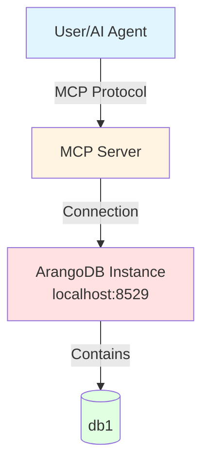

# Scenario 1: Single Instance, Single Database

---

**Concepts covered:**
- Basic ArangoDB setup with Docker
- Admin CLI database configuration
- MCP server connection and testing
- Database resolution fundamentals

**Skills you will practice:**
- Starting ArangoDB with Docker Compose
- Using Admin CLI to configure databases
- Testing database connections
- Executing basic MCP operations

---

**Setup:** 1 user + 1 MCP server + 1 ArangoDB instance (port 8529) + 1 database

**Use Case:** Basic setup for a single project or development environment.

## Architecture Diagram



## Setup Commands

### Step 1: Start ArangoDB with Docker

Create a `docker-compose.yml` file:

```yaml
services:
  arangodb:
    image: arangodb:3.11
    environment:
      ARANGO_ROOT_PASSWORD: ${ARANGO_ROOT_PASSWORD:-changeme}
    ports:
      - "8529:8529"
    volumes:
      - arangodb_data:/var/lib/arangodb3
      - arangodb_apps:/var/lib/arangodb3-apps
    healthcheck:
      test: arangosh --server.username root --server.password "$ARANGO_ROOT_PASSWORD" --javascript.execute-string "require('@arangodb').db._version()" > /dev/null 2>&1 || exit 1
      interval: 5s
      timeout: 2s
      retries: 30
    restart: unless-stopped

volumes:
  arangodb_data:
    driver: local
  arangodb_apps:
    driver: local
```

Start the service:

```bash
docker compose up -d
```

### Step 2: Set environment variable for root password

```bash
export ARANGO_ROOT_PASSWORD="your-secure-password"
```

### Step 3: Create the database using Admin CLI

```bash
maa db add db1 \
  --url http://localhost:8529 \
  --database db1 \
  --username root \
  --password-env ARANGO_ROOT_PASSWORD
```

### Step 4: Verify the configuration

```bash
maa db config list
```

**Expected output:**
```
Configured databases (1):
Configuration file: path/to/config/databases.yaml

  db1:
    URL: http://localhost:8529
    Database: db1
    Username: root
    Password env: ARANGO_ROOT_PASSWORD
    Timeout: 30.0s
```

## Verification Steps

### Test 1: Check database connection

```bash
maa db config test db1
```

**Expected output:**
```
✓ Connection to 'db1' successful
  ArangoDB version: 3.11.14
```

> [!NOTE]
> You need to restart the MCP server for the changes to take effect if it was already running.

### Test 2: List available databases via MCP

Start the MCP server and use the multi-tenancy request using the tool `arango_list_available_databases`.
This will confirm that the MCP server has loaded the expected config file.

**Example prompt:**

```markdown
List the available databases.
```

### Test 3: Create a collection and insert data

Start the MCP server and use the multi-tenancy request using the tool `arango_create_collection` and `arango_insert`. 

**Example prompt:**

```markdown
Create collection "test" in database "db1". Insert the document {"name": "John", "age": 30} into the collection.
```

## Checkpoint: Single Database Setup

**What you've accomplished:**
- Set up ArangoDB with Docker
- Configured your first database using Admin CLI
- Verified MCP server connectivity
- Performed basic database operations

**Key concepts learned:**
- Database configuration with environment variables
- Admin CLI database management
- MCP tool usage for database operations

**Next up:**
- Add a second database to the same ArangoDB instance
- Learn database switching and resolution

> **Next:** [Scenario 2: Single Instance, Multiple Databases](02-single-instance-multiple-databases.md)