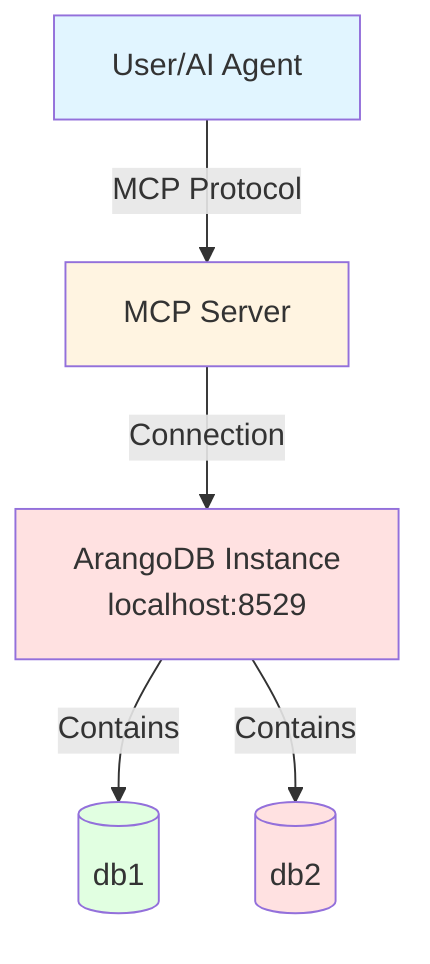

# Scenario 2: Single Instance, Multiple Databases

---

**Concepts covered:**
- Multiple database configuration on single instance
- Database switching and focused database concept
- Cross-database operations without switching
- Password environment variable reuse

**Skills you will practice:**
- Adding databases to existing ArangoDB instance
- Using arango_set_focused_database for context switching
- Performing cross-database comparisons
- Managing multiple database configurations

---

**Setup:** 1 user + 1 MCP server + 1 ArangoDB instance (port 8529) + 2 databases

**Use Case:** Environment separation (development/testing) on the same ArangoDB instance.

**Building on:** [Scenario 1](01-single-instance-single-database.md) (db1 already exists)

## Architecture Diagram



## Setup Commands

### Step 1: Add second database (building on Scenario 1)

```bash
maa db add db2 \
  --url http://localhost:8529 \
  --database db2 \
  --username root \
  --password-env ARANGO_ROOT_PASSWORD
```

**Note:** We use the same `ARANGO_ROOT_PASSWORD` environment variable because it's the same user (root) on the same ArangoDB instance.

### Step 2: Verify both databases are configured

```bash
maa db config list
```

**Expected output:**
```
Configured databases:
  - db1 (http://localhost:8529/db1)
  - db2 (http://localhost:8529/db2)
```

## Verification Steps

### Test 1: Check both database connections

```bash
maa db config test db1
maa db config test db2
```

**Expected output:**
```
✓ Connection to 'db1' successful
  ArangoDB version: 3.11.14

✓ Connection to 'db2' successful
  ArangoDB version: 3.11.14
```

> [!NOTE]
> You need to restart the MCP server for the changes to take effect if it was already running.

### Test 2: List available databases via MCP

Start the MCP server and use the multi-tenancy request using the tool `arango_list_available_databases`.
This will confirm that the MCP server has loaded the expected config file.

**Example prompt:**

```markdown
List the available databases.
```

### Test 3: Switch between databases

**Example prompt:**
```markdown
Set the focused database to db1, then query it to return 'This is db1'. 
Then switch focus to db2 and query it to return 'This is db2'.
```

**Expected behavior:**
- MCP server calls `arango_set_focused_database` to switch contexts
- MCP server calls `arango_query` using the focused database
- Demonstrates database switching without specifying database parameter

### Test 4: Cross-database comparison without switching

**Example prompt:**
```markdown
Query both db1 and db2 directly without switching the focused database. 
Have db1 return 'db1' and db2 return 'db2'.
```

**Expected behavior:**
- MCP server calls `arango_query` with database parameter override
- Demonstrates per-tool database selection

**Expected responses:**
```json
["db1"]
["db2"]
```

### Test 5: Create different data in each database

**Example prompt:**
```markdown
Create a collection called "projects" in db1 and insert a document with name "Project Alpha" and status "active".
Then create a collection called "experiments" in db2 and insert a document with name "Experiment Beta" and phase "testing".
```

**Expected behavior:**
- MCP server creates collections in different databases
- MCP server inserts different data in each database
- Demonstrates database isolation

### Test 6: Verify data isolation

**Example prompt:**
```markdown
List all collections in db1, then list all collections in db2. 
This should show that each database has different collections.
```

**Expected behavior:**
- MCP server lists collections from each database separately
- Shows that db1 has "projects" collection
- Shows that db2 has "experiments" collection
- Demonstrates complete data isolation between databases

**Expected responses:**
```json
// db1 collections
["projects"]

// db2 collections  
["experiments"]
```

## Checkpoint: Multiple Databases

**What you've accomplished:**
- Added a second database to the same ArangoDB instance
- Learned database switching with focused database
- Performed cross-database operations using database parameter
- Verified data isolation between databases

**Key concepts learned:**
- Database parameter override for per-tool database selection
- Focused database for workflow-based database switching
- Password environment variable reuse for same user/instance
- Data isolation between databases on same instance

**Next up:**
- Scale to multiple ArangoDB instances
- Learn complete instance isolation
- Manage different credentials for different instances

> **Previous:** [Scenario 1: Single Instance, Single Database](01-single-instance-single-database.md)  
> **Next:** [Scenario 3: Multiple Instances, Multiple Databases](03-multiple-instances-multiple-databases.md)