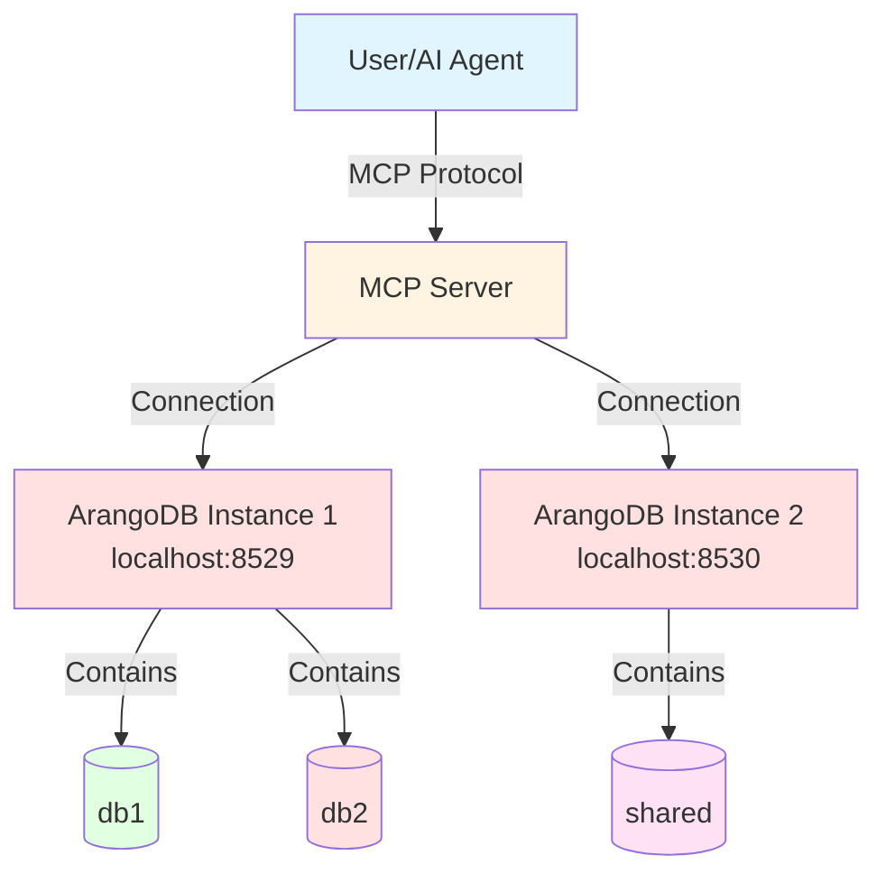

# Scenario 3: Multiple Instances, Multiple Databases

---

**Concepts covered:**
- Multiple ArangoDB instance deployment
- Instance-specific environment variables
- Complete isolation between instances
- Port mapping and network configuration

**Skills you will practice:**
- Configuring multiple Docker services
- Managing separate credentials for different instances
- Testing instance isolation
- Scaling multi-tenancy architecture

---

**Setup:** 1 user + 1 MCP server + 2 ArangoDB instances (ports 8529 & 8530) + 3 databases total

**Use Case:** Complete isolation between environments, different ArangoDB versions, or production/non-production separation.

**Building on:** [Scenario 2](02-single-instance-multiple-databases.md) (db1 and db2 on port 8529)

## Architecture Diagram



## Setup Commands

### Step 1: Start second ArangoDB instance on port 8530

Update your `docker-compose.yml` to include a second instance:

```yaml
services:
  arangodb:
    image: arangodb:3.11
    environment:
      ARANGO_ROOT_PASSWORD: ${ARANGO_INSTANCE2_ROOT_PASSWORD:-changeme}
    ports:
      - "8530:8530"
    volumes:
      - arangodb_data_2:/var/lib/arangodb3
      - arangodb_apps_2:/var/lib/arangodb3-apps
    healthcheck:
      test: arangosh --server.username root --server.password "$ARANGO_INSTANCE2_ROOT_PASSWORD" --javascript.execute-string "require('@arangodb').db._version()" > /dev/null 2>&1 || exit 1
      interval: 5s
      timeout: 2s
      retries: 30
    restart: unless-stopped

volumes:
  arangodb_data_2:
    driver: local
  arangodb_apps_2:
    driver: local
```

Start both services:

```bash
docker compose up -d
```

### Step 2: Set environment variables for both instances

```bash
export ARANGO_ROOT_PASSWORD="instance1-password"
export ARANGO_INSTANCE2_ROOT_PASSWORD="instance2-password"
```

### Step 3: Add shared database on second instance

```bash
maa db add shared \
  --url http://localhost:8530 \
  --database shared \
  --username root \
  --password-env ARANGO_INSTANCE2_ROOT_PASSWORD
```

**Note:** Different ArangoDB instances require different password environment variables, even if using the same username.

### Step 4: Verify all three databases are configured

```bash
maa db config list
```

**Expected output:**
```
Configured databases:
  - db1 (http://localhost:8529/db1)
  - db2 (http://localhost:8529/db2)
  - shared (http://localhost:8530/shared)
```

## Verification Steps

### Test 1: Check all database connections

```bash
maa db config test db1
maa db config test db2
maa db config test shared
```

**Expected output:**
```
✓ Connection to 'db1' successful
  ArangoDB version: 3.11.14
✓ Connection to 'db2' successful
  ArangoDB version: 3.11.14
✓ Connection to 'shared' successful
  ArangoDB version: 3.11.14
```

### Test 2: Verify instance isolation

**Example prompt:**
```markdown
Query each database to verify they're running on different ArangoDB instances:
- Query db1 to return 'Instance 1 - db1'
- Query db2 to return 'Instance 1 - db2'  
- Query shared to return 'Instance 2 - shared'
```

**Expected behavior:**
- MCP server queries databases on different ArangoDB instances (ports 8529 and 8530)
- Demonstrates complete instance-level isolation
- Shows that db1 and db2 are on the same instance, shared is on a different instance

**Expected responses:**
```json
["Instance 1 - db1"]
["Instance 1 - db2"]
["Instance 2 - shared"]
```

### Test 3: List all available databases

**Example prompt:**
```markdown
List all available databases configured for this MCP server.
```

**Expected behavior:**
- MCP server calls `arango_list_available_databases` tool
- Returns all three databases across both instances

**Expected response:**
```json
{
  "databases": [
    {
      "key": "db1",
      "url": "http://localhost:8529",
      "database": "db1"
    },
    {
      "key": "db2",
      "url": "http://localhost:8529",
      "database": "db2"
    },
    {
      "key": "shared",
      "url": "http://localhost:8530",
      "database": "shared"
    }
  ],
  "count": 3
}
```

### Test 4: Test instance-specific operations

**Example prompt:**
```markdown
Create a collection called "instance1_data" in db1 and insert a document with source "instance1" and port 8529.
Then create a collection called "instance2_data" in shared database and insert a document with source "instance2" and port 8530.
```

**Expected behavior:**
- MCP server creates collections on different ArangoDB instances
- MCP server inserts instance-specific data
- Demonstrates operations across multiple instances

### Test 5: Verify complete isolation

**Example prompt:**
```markdown
List collections in db1 (instance 1) and then list collections in shared database (instance 2).
This should show that each instance has completely separate collections.
```

**Expected behavior:**
- MCP server lists collections from each ArangoDB instance separately
- Shows instance-level data isolation
- Confirms that collections exist only on their respective instances

**Expected responses:**
```json
// Instance 1 collections (db1)
["instance1_data"]

// Instance 2 collections (shared)
["instance2_data"]
```

### Test 6: Database status across instances

**Example prompt:**
```markdown
Show the status of all configured databases including their connection status and versions.
```

**Expected behavior:**
- MCP server calls `arango_database_status` tool
- Returns comprehensive status for all databases across both instances
- Shows which databases are connected and their ArangoDB versions

**Expected response:**
```json
{
  "summary": {
    "total": 3,
    "connected": 3,
    "failed": 0,
    "focused_database": null
  },
  "databases": [
    {
      "key": "db1",
      "url": "http://localhost:8529",
      "database": "db1",
      "username": "root",
      "is_focused": false,
      "status": "connected",
      "version": "3.11.0"
    },
    {
      "key": "db2",
      "url": "http://localhost:8529",
      "database": "db2",
      "username": "root",
      "is_focused": false,
      "status": "connected",
      "version": "3.11.0"
    },
    {
      "key": "shared",
      "url": "http://localhost:8530",
      "database": "shared",
      "username": "root",
      "is_focused": false,
      "status": "connected",
      "version": "3.11.0"
    }
  ],
  "session_id": "stdio"
}
```

## Checkpoint: Multiple Instances

**What you've accomplished:**
- Deployed multiple ArangoDB instances with Docker Compose
- Configured databases across different instances
- Verified complete instance isolation
- Managed separate credentials for different instances

**Key concepts learned:**
- Instance-level isolation vs database-level isolation
- Port mapping for multiple services
- Environment variable management for multiple instances
- Network-level separation of data

**Next up:**
- Implement user-based access control
- Create restricted agent users
- Demonstrate content protection patterns

> **Previous:** [Scenario 2: Single Instance, Multiple Databases](02-single-instance-multiple-databases.md)  
> **Next:** [Scenario 4: Agent-Based Access Control](04-agent-based-access-control.md)