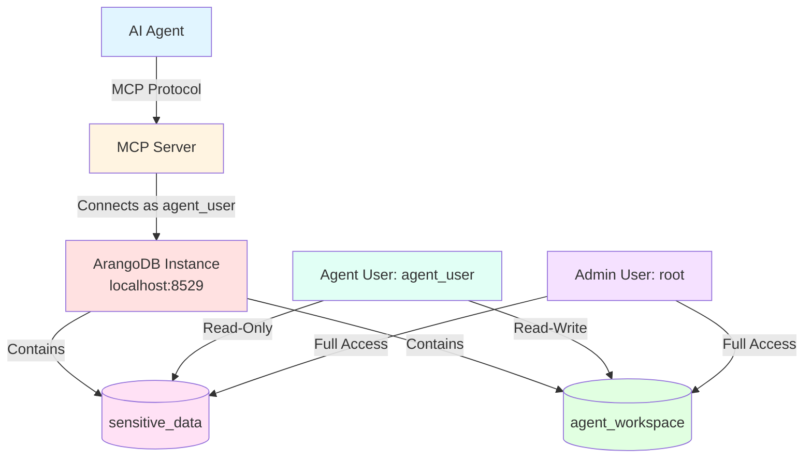

# Scenario 4: Agent-Based Access Control

---

**Concepts covered:**
- User-based access control in ArangoDB
- Read-only vs read-write permissions
- Agent user creation and permission management
- MCP configuration for restricted access
- Content protection strategies

**Skills you will practice:**
- Creating ArangoDB users with specific permissions
- Configuring database access with --with-user flag
- Setting up MCP client with agent credentials
- Testing permission boundaries
- Implementing least-privilege access patterns

---

**Setup:** 1 MCP server + 1 ArangoDB instance + 2 databases + 2 users with different permissions

**Use Case:** Protect sensitive content while allowing controlled agent access. Agent has read-only access to one database and read-write access to another database.

## Architecture Diagram



## Setup Commands

### Step 1: Create databases and agent user atomically

```bash
# Set environment variables
export ARANGO_ROOT_PASSWORD="admin-password"
export AGENT_USER_PASSWORD="agent-secure-password"

# Create sensitive_data database with agent_user (read-only)
maa db add sensitive_data \
  --url http://localhost:8529 \
  --database sensitive_data \
  --arango-password-env AGENT_USER_PASSWORD \
  --with-user agent_user \
  --permission ro

# Create agent_workspace database with agent_user (read-write)
maa db add agent_workspace \
  --url http://localhost:8529 \
  --database agent_workspace \
  --arango-password-env ARANGO_ROOT_PASSWORD \
  --with-user agent_user \
  --permission rw
```

### Step 2: Add agent-accessible database configurations

```bash
# Add sensitive_data config for agent access (read-only)
maa db config add sensitive_data_agent \
  --url http://localhost:8529 \
  --database sensitive_data \
  --username agent_user \
  --password-env AGENT_USER_PASSWORD

# Add agent_workspace config for agent access (read-write)
maa db config add agent_workspace_agent \
  --url http://localhost:8529 \
  --database agent_workspace \
  --username agent_user \
  --password-env AGENT_USER_PASSWORD
```

### Step 3: Verify user permissions

```bash
# List databases accessible to agent_user
maa user databases agent_user \
  --url http://localhost:8529 \
  --password-env AGENT_USER_PASSWORD
```

**Expected output:**
```
Databases accessible to user 'agent_user':
  - sensitive_data (permission: ro)
  - agent_workspace (permission: rw)
```

## MCP Configuration for Agent Access

Configure your MCP client to use the agent user credentials:

```json
{
  "mcpServers": {
    "arangodb": {
      "command": "maa",
      "args": ["server"],
      "env": {
        "AGENT_USER_PASSWORD": "agent-secure-password"
      }
    }
  }
}
```

**Note:** The MCP server will use the database configurations that authenticate as `agent_user`, providing automatic access control.

## Verification Steps

### Test 1: Verify read-only access to sensitive_data

**Setup:** First, populate some sensitive data using admin credentials:

```bash
# Temporarily switch to admin config for setup
maa db config add sensitive_data_admin \
  --url http://localhost:8529 \
  --database sensitive_data \
  --username root \
  --password-env ARANGO_ROOT_PASSWORD
```

**Admin setup prompt:**
```markdown
Using the sensitive_data_admin database, create a collection called "confidential_records" 
and insert a document with type "sensitive" and content "Confidential information".
```

**Agent test prompt:**
```markdown
Set the focused database to sensitive_data_agent, then try to:
1. Read from the confidential_records collection (should succeed)
2. Insert a test document into confidential_records (should fail)
```

**Expected behavior:**
- MCP server sets focus to sensitive_data_agent (agent credentials)
- Read operation succeeds (agent has read-only access)
- Write operation fails with permission error (agent cannot write)

**Expected results:**
- Read succeeds: Returns the confidential records
- Write fails: Error indicating insufficient permissions

### Test 2: Verify read-write access to agent_workspace

**Example prompt:**
```markdown
Set the focused database to agent_workspace_agent, then:
1. Create a collection called "workspace_notes"
2. Read from the workspace_notes collection
3. Insert a document with note "Agent can write here" and current timestamp
4. Update all documents in workspace_notes to add an "updated: true" field
```

**Expected behavior:**
- MCP server sets focus to agent_workspace_agent (agent credentials)
- All operations succeed (agent has read-write access)
- Demonstrates full access to agent workspace

**Expected results:** All operations (create, read, write, update) succeed.

### Test 3: Verify access control prevents unauthorized operations

**Example prompt:**
```markdown
Try to create a collection called "unauthorized_collection" in the sensitive_data database.
Then try to update all documents in confidential_records to add a "modified: true" field.
Both operations should fail due to insufficient permissions.
```

**Expected behavior:**
- MCP server attempts operations on sensitive_data_agent (read-only access)
- Both operations fail with permission errors
- Demonstrates that access control is properly enforced

**Expected results:** Both operations fail with permission errors.

### Test 4: Database resolution with agent credentials

**Example prompt:**
```markdown
Show the current database resolution status and which database is currently focused.
```

**Expected behavior:**
- MCP server calls `arango_get_database_resolution` tool
- Shows the resolution order and current focused database
- Demonstrates how agent credentials affect database resolution

**Expected response:**
```json
{
  "focused_database": "agent_workspace_agent",
  "config_default": null,
  "env_default": null,
  "first_configured": "sensitive_data_agent",
  "fallback": "_system",
  "resolution_order": [
    "1. Tool argument (database parameter)",
    "2. Focused database (session state): agent_workspace_agent",
    "3. Config default (from YAML): Not set",
    "4. Environment variable (MCP_DEFAULT_DATABASE): Not set",
    "5. First configured database: sensitive_data_agent",
    "6. Fallback to '_system'"
  ],
  "current_database": "agent_workspace_agent"
}
```

## Content Protection Benefits

This scenario demonstrates how to:

1. **Protect sensitive data:** Confidential records are read-only for the agent
2. **Enable agent productivity:** Agent can freely work in its own workspace
3. **Maintain audit trail:** All agent operations are logged under `agent_user`
4. **Simplify configuration:** MCP client automatically uses correct credentials
5. **Enforce least privilege:** Agent only has permissions it needs

## Checkpoint: Agent Access Control

**What you've accomplished:**
- Created dedicated agent user with restricted permissions
- Configured read-only access to sensitive data
- Set up read-write workspace for agent operations
- Verified permission boundaries and access control
- Implemented content protection patterns

**Key concepts learned:**
- User-based access control in multi-tenant environments
- Atomic database and user creation with --with-user
- Permission levels (ro, rw) and their enforcement
- MCP configuration for restricted agent access
- Security best practices for AI agent deployments

**Architecture patterns demonstrated:**
- Least privilege access control
- Content protection through database isolation
- Agent workspace separation
- Credential management for different access levels

> **Previous:** [Scenario 3: Multiple Instances, Multiple Databases](03-multiple-instances-multiple-databases.md)  
> **Back to Overview:** [Multi-Tenancy Scenarios](README.md)